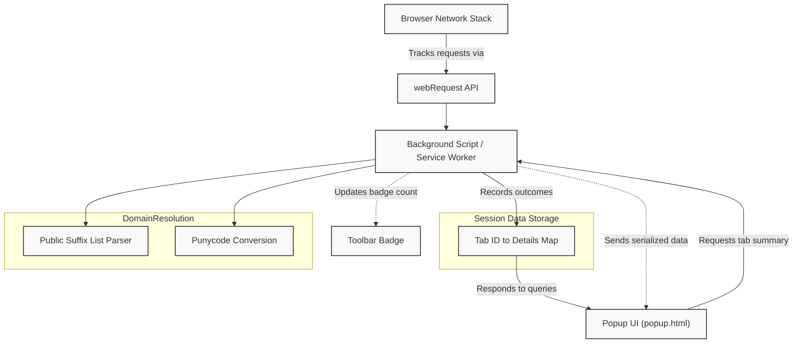

# How uBO Scope Works: Technical Overview

## Introduction

Understanding how uBO Scope operates behind the scenes empowers you to fully leverage its capabilities. This technical overview unpacks uBO Scope's architecture, explaining how it integrates with the browser’s networking system to track and classify network requests in real time. You'll gain insight into how it listens to network activities, categorizes domains based on connection outcomes, and updates both the user interface and toolbar badge seamlessly.

---

## Core Architecture

At its core, uBO Scope is a browser extension built around the browser's `webRequest` API, which provides comprehensive access to network request events such as redirects, errors, and successes. This API is the vital link that enables uBO Scope to observe all requests your browser makes to remote servers.

The extension deploys a background service worker (or background script, depending on the platform) which functions as the central observer and data processor. It listens to network request events, processes relevant details from each request, and updates internal session data accordingly.

The popup UI (`popup.html`) serves as the real-time visualization layer. When you activate the extension's popup, it queries this session data to render a categorized snapshot of network connections associated with the active browser tab.

### How uBO Scope Hooks Into the Browser

- **`webRequest` API listeners:**
  The extension registers listeners for three key network events:
  - `onBeforeRedirect` — Indicates a network request is being redirected.
  - `onErrorOccurred` — Signifies a network request failed.
  - `onResponseStarted` — Denotes a network request has succeeded and started receiving a response.

These listeners fire for every network request matching the host permissions declared in the extension manifest, covering HTTP, HTTPS, WebSockets, and Secure WebSockets.

- **Session tracking:**
  Each tab’s network requests are mapped and stored in a centralized session object, keeping a record of allowed, blocked, and stealth-blocked domains and hostnames.

- **Outcome classification:**
  Network requests are classified into three categories based on the event outcome:
  - **Allowed (not blocked):** Network requests that succeeded.
  - **Stealth-blocked:** Requests that were redirected in a stealthy fashion.
  - **Blocked:** Requests that produced errors, indicating blocking.

- **Public suffix and domain resolution:**
  A crucial step when recording network request outcomes is determining the correct domain for a hostname. uBO Scope uses a highly efficient Public Suffix List (PSL) implementation to parse hostnames and extract the registered domain. This enhances grouping and counting accuracy by collapsing subdomains under their base registered domain.

## Real-Time Data Flow and Update Process

1. **Network Request Interception:**
   The extension’s background script intercepts network requests as they occur using the `webRequest` API.

2. **Event Categorization:**
   Based on the type of event (`redirect`, `error`, `success`), the request is classified accordingly.

3. **Session Data Update:**
   The domain and hostname for the request are extracted and recorded in the session’s respective category maps (`allowed`, `blocked`, `stealth`).

4. **Debounced Processing:**
   Requests are queued and processed in batches every second to optimize performance, avoiding UI thrashing from rapid updates.

5. **Badge Update:**
   After processing a batch, the extension updates the toolbar badge to reflect the current count of distinct allowed third-party domains.

6. **Popup UI Rendering:**
   When the popup is opened, it sends a message to the background script requesting the current tab’s network request summary. The background responds with serialized session data, which the popup deserializes and renders into a categorized, user-friendly view.

## uBO Scope Components and Data Flow Diagram

## Key Processes Explained

### 1. Network Request Listening

The extension listens to the browser’s network events important to understand the fate of resource requests initiated by the page:

- **Redirects:** Sometimes requests are redirected before completion; uBO Scope tracks those separately as stealth blocking potentially happens during redirects.

- **Errors:** Failed requests indicate resources that were actively blocked or failed to connect.

- **Success:** Successful requests with valid IP and HTTP status codes.

### 2. Domain Extraction and Grouping

Many hostnames can appear in network requests, and many are subdomains. To avoid inflated counts and provide clarity, uBO Scope:

- Uses the Public Suffix List to identify the registered base domain for each hostname.

- Aggregates request counts at the domain level for a concise overview.

- Properly supports internationalized domain names by running hostnames through punycode encoding and decoding.

### 3. Session Tracking & Persistence

- A `tabIdToDetailsMap` keeps per-tab data about hosts contacted and their categories.

- Each category (`allowed`, `blocked`, `stealth`) stores domain and hostname counts in Maps.

- Session data is serialized and saved periodically so data survives browser restarts or extension reloads within the session scope.

### 4. Badge Update and Popup Rendering

- The badge shows the number of distinct allowed third-party domains per tab — a key privacy indicator.

- The popup UI fetches current session data for the active tab and displays domains grouped by outcome category, with counts.

- The UI dynamically updates on popup open, reflecting the current tracked connections.

## Practical Example: Tracking a Tab's Network Requests

As you browse:

1. A webpage initiates requests to various remote servers.
2. The background script intercepts these network requests via `webRequest` listeners.
3. Each request passes through a classification:
   - Allowed: Requests that load successfully.
   - Blocked: Requests resulting in errors.
   - Stealth-blocked: Requests redirected silently.
4. Hostnames extracted from URLs are normalized to domains.
5. Counts for each domain are updated and stored per tab.
6. The toolbar badge reflects the count of allowed third parties.
7. Opening the popup shows detailed lists of connected domains by their outcome category.

## Troubleshooting Common Issues

- **No badge or data shown:** Ensure the extension has proper permissions and background script is running.
- **Delayed updates:** Network request processing runs every second to balance accuracy and performance—short delays are expected.
- **Inconsistent domain counts:** Verify your browsing session and network activity; subdomains may appear separately if the PSL cannot resolve them.

## Summary

uBO Scope offers a transparent, real-time view into your browser’s actual network activity by hooking deeply into the network stack using the powerful `webRequest` API. By tracking each network request’s fate, mapping hostnames to domains with precision, and categorizing outcomes, it delivers clarity about which third-party servers your browser truly connects to — an invaluable insight for privacy and performance awareness.

For hands-on use, refer to the [Popup Usage Guide](../guides/getting-started-essentials/review-connections-popup). To understand the meaning behind the badge, see [Understanding Badge Count](../guides/getting-started-essentials/understanding-badge-count). For deep dives into the extension’s components, start with this technical architecture overview and continue exploring core concepts as needed.

---

<Info>
This technical overview complements the user-focused sections like [Product Purpose & Value Proposition](../overview/introduction/product-purpose) and [Who is uBO Scope for?](../overview/introduction/audience-usecases), helping you connect user needs to implementation insights.
</Info>
