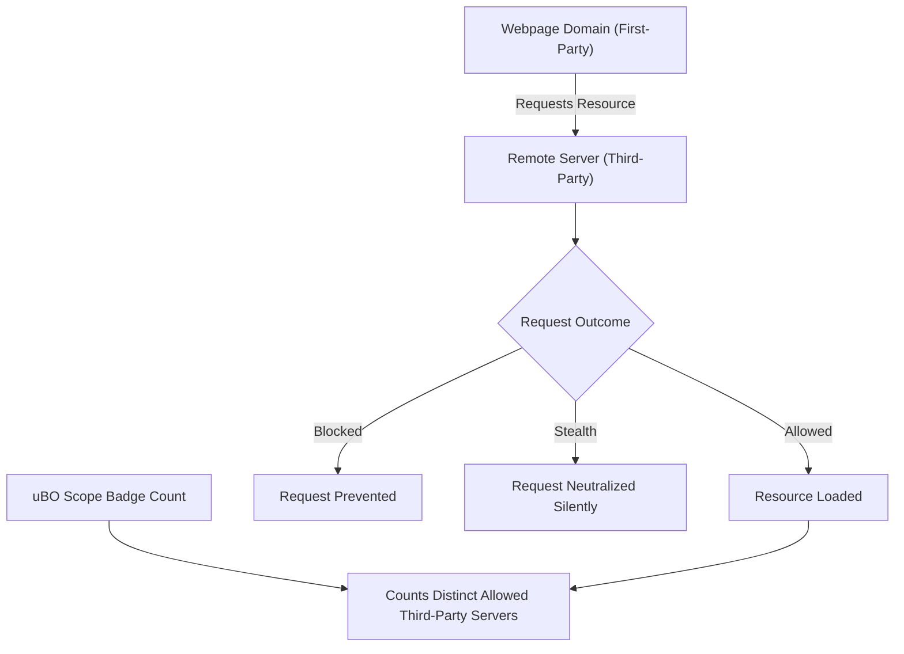

# Core Concepts & Terminology

Understanding the core concepts and terminology behind uBO Scope is essential to make sense of the network activity it reports. This page clarifies key terms, explains the distinctions among connection outcomes, and dispels common misconceptions around block counts and content blockers.

---

## Key Terms Explained

### Remote Server
A remote server is any external endpoint or domain a webpage attempts to communicate with when loading resources or performing background operations. These may include third-party services such as content delivery networks (CDNs), advertising networks, analytics platforms, or embedded widgets.

### Badge Count
The badge count is the number displayed on the uBO Scope toolbar icon. It reflects the number of **distinct third-party remote servers for which there was a connection** during a browsing session or page load. A lower badge count indicates fewer third-party connections, which can imply better privacy or fewer external dependencies.

### Third-Party Connection
A third-party connection is a network request made by a webpage to a domain **different from the website's own domain** (the "first-party domain"). This includes requests for scripts, images, fonts, trackers, and other resources.

### Stealth Blocking
Stealth blocking refers to network requests that are intentionally hidden or redirected by content blockers in such a way that the webpage or network monitoring tools cannot detect that blocking took place. This technique helps avoid webpage breakage or anti-adblock detection but can cause the requests to be stealthily blocked without clear visibility.

### Blocked, Allowed, and Stealth Outcomes
- **Allowed:** The network request was successful and completed without interference.
- **Blocked:** The network request was explicitly denied or failed due to blocking by the extension or content blocking rules.
- **Stealth:** The request was silently manipulated or redirected by the content blocker to avoid detection rather than explicitly blocked. These requests may appear as if they succeeded but were in fact stealthily neutralized.

---

## Distinguishing Connection Outcomes

uBO Scope tracks network requests at the browser level using the `webRequest` API, categorizing each request outcome to help you understand exactly what happened:

| Outcome  | What It Means                                            | Practical Implication                                |
|----------|----------------------------------------------------------|----------------------------------------------------|
| Allowed  | The request reached the remote server and responded.     | Resource was fetched; third-party server load confirmed. |
| Blocked  | The request was prevented from reaching the server.      | Content blocker successfully stopped the request. |
| Stealth  | The request was redirected or disguised so blocking is hidden. | Request appears allowed but was silently neutralized. |

This categorization enables you to see beyond superficial block counts and evaluate true connection outcomes.

---

## Debunking Common Misconceptions

### Myth 1: High Block Counts Mean Better Privacy
Many users assume that a content blocker with more blocked requests is more effective. This is false because the number of blocked requests does not correlate with fewer connections to third-party servers. A blocker with a high block count might still allow connections to more distinct servers, increasing privacy risk.

### Myth 2: Ad Blocker Test Pages Accurately Reflect Blocking
Test pages designed to evaluate ad blockers often make artificial network requests not found on real-world websites. Moreover, stealth blocking hides blocking mechanisms from these test pages, rendering their results misleading.

### Why uBO Scope's Approach Matters
Unlike typical block counters or test pages, uBO Scope records actual network connection outcomes reported by the browser. This real-world insight reveals which third-party remote servers were truly contacted, allowed, or blocked — independently of content blocker stealth techniques or DNS configurations.

---

## How These Terms Fit in Your Workflow

When browsing the web using uBO Scope:

1. **You see the badge count representing the distinct third-party servers loaded by webpages.**
2. **You review the popup UI showing detailed lists of allowed, stealth-blocked, and blocked domains.**
3. **You interpret connection types accurately — understanding stealth blocking helps avoid false assumptions about requests being actually allowed.**
4. **You assess the real effectiveness of your content blocker beyond simple block counts or test pages.**

---

## Practical Tips & Best Practices

- **Focus on the badge count of allowed third-party connections** — a smaller count generally indicates reduced exposure.
- **Use the popup's detailed domain lists to investigate unknown or suspicious remote servers.**
- **Beware that blocked requests alone do not paint the full picture; stealth blocking can mask some blocked requests as allowed ones.**
- **Consider the legitimacy of third-party servers; not all are harmful or trackers — for example, CDNs and essential external resources.**

---

## Troubleshooting Common Confusions

<AccordionGroup title="Common User Questions and Issues">
<Accordion title="Why does the badge count sometimes not reflect my content blocker's block count?">
uBO Scope's badge count reflects distinct third-party servers connected, not the number of blocked requests. Different content blockers use various blocking techniques including stealth that can hide block counts or result in more open third-party servers despite high block numbers.
</Accordion>
<Accordion title="What if I see many stealth-blocked domains?">
Stealth blocking is a normal, intentional part of advanced content blocking. It means requests are being neutralized silently to avoid detection. This does not mean your privacy is compromised but helps you understand the blocking is not overt.
</Accordion>
<Accordion title="How can I distinguish which third-party domains are safe or necessary?">
Review the domain's purpose carefully, considering legitimate services like CDNs. uBO Scope helps by showing counts and categorization, but domain reputation requires external knowledge or tools.
</Accordion>
<Accordion title="Does uBO Scope work with all types of content blockers and DNS-based blockers?">
uBO Scope operates at the browser's network request API level, so it can detect outcomes even if content blockers or DNS configurations manipulate traffic, as long as requests are visible via the browser's `webRequest` API.
</Accordion>
</AccordionGroup>

---

## Seeing Core Concepts in Action

Here is a visual overview of the primary terms as they relate to webpage network events:

This flow illustrates how requests are categorized and how uBO Scope reports meaningful badge counts based on third-party connections.

---

## Next Steps

Having a clear grasp of these core concepts ensures you can interpret uBO Scope's reports meaningfully. To advance your knowledge:

- Visit [What is uBO Scope?](/overview/intro_product_value/product_overview) to understand the product purpose and UI.
- Explore [Understanding Connection Data and Badge Count](/guides/analyzing-connections/understanding-data) to deepen your insight into how outcomes are captured.
- Check [Best Practices: Interpreting Stealth and Blocked Connections](/guides/best-practices/interpreting-stealth) for practical advice on working with stealth blocking.

---

For full source and deeper technical details, visit the [uBO Scope GitHub repository](https://github.com/gorhill/uBO-Scope).