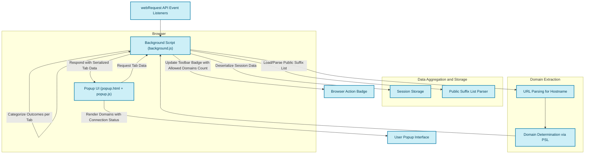

# How uBO Scope Works: Extension Architecture

## Understanding uBO Scope’s Data Flow and System Design

uBO Scope is engineered to provide clear visibility into the network connections that web pages attempt or successfully establish. This page offers a detailed walkthrough of how the extension observes browser network requests, processes these observations, categorizes outcomes, and updates the browser action badge accordingly. Understanding this flow empowers users and filter list maintainers with insights into the real-time tracking of third-party connections.

---

### The Core Workflow: From Network Traffic to User Feedback

At its heart, uBO Scope operates by leveraging the browser’s `webRequest` API. This API exposes network requests made by web pages, including their status — whether allowed, blocked, or redirected stealthily. The extension monitors these requests continuously and organizes the data per browser tab.

- **Observation:** The background script listens to three key webRequest events:
  - **onBeforeRedirect:** Detects when requests are redirected to other URLs.
  - **onErrorOccurred:** Catches failed or blocked requests.
  - **onResponseStarted:** Indicates successful network requests.

- **Data Recording:** Each request event is queued briefly for batch processing to optimize performance and avoid excessive overhead.

- **Categorization:** Requests are classified into three outcomes:
  - **Allowed:** Requests successfully connected to remote servers.
  - **Blocked:** Requests that failed or were explicitly blocked.
  - **Stealth-blocked:** Redirected requests that have been silently blocked or rerouted without typical failure signals.

- **Tab-Level Aggregation:** Network connection details are stored and aggregated by browser tab, with domains and hostnames tracked separately to provide granular insights.

- **Badge Update:** The browser toolbar badge reflects the number of distinct allowed third-party domains for the active tab, giving immediate feedback on third-party exposure.

- **Popup Interface:** When the user clicks on the toolbar icon, the popup displays detailed summaries of domains categorized by their connection status (allowed, stealth-blocked, blocked).

---

### Components Involved in the Architecture

| Component | Role |
|-----------|------|
| **Background Script** (`background.js`) | Core listener and data processor for network requests. Maintains tab-wise connection details and updates the browser badge. |
| **Popup UI** (`popup.html` & `popup.js`) | Presents connection summaries to the user in an organized, actionable manner. Fetches data from the background script when opened. |
| **Session Storage** | Persists session data for requests and the public suffix list, enabling continuity and consistent domain parsing across sessions. |
| **Public Suffix List** | Utilized to correctly determine registered domains from hostnames, critical for proper aggregation of third-party domains. |

---

### Detailed Flow of Network Request Tracking

This simplified flowchart depicts how network request events funnel into the background script where data is processed, stored, and served to the popup interface.

---

### Key Data Structures

- **TabDetails Entity:** Maintains three categories of outcomes (`allowed`, `blocked`, `stealth`) tracked with domain and hostname maps storing counts, enabling detailed insight per browsing context.
- **Network Request Journal:** A queue that batches incoming network requests events for efficient processing.

---

### How Domains Are Determined and Grouped

uBO Scope uses the [Public Suffix List](https://publicsuffix.org/) to accurately extract the registered domain from each request’s hostname. This approach avoids misinterpretation of subdomains or higher-level domains, ensuring third-party domains are consistently identified.

For example, if a request’s hostname is `ads.example.co.uk`, the extension will consider `example.co.uk` as the registered domain, rather than grouping it incorrectly by `co.uk` or just the full hostname.

---

### Practical User Experience

When you visit a web page, uBO Scope silently records all attempted remote server connections linked to that page's tab. The badge on the browser toolbar shows the count of distinct third-party domains with allowed connections, offering a concise privacy snapshot.

Opening the popup reveals the fine-grained detail:

- A list of domains from which resources were successfully fetched (`not blocked`).
- Domains that were stealth-blocked by content blockers or other mechanisms.
- Domains whose requests were explicitly blocked or resulted in errors.

This classification helps users differentiate between allowed third-party connections, stealth blocking, and outright blocked requests, breaking down often confusing browser and extension blocking metrics.

---

### Best Practices and Tips

- Ensure your browser supports the `webRequest` API fully, as uBO Scope depends on it to observe network traffic.
- Recognize that the badge count reflects distinct allowed third-party domains, which is often more meaningful for privacy than a simple block count.
- Use this architecture to cross-check content blocker effectiveness, not based on raw block counts but on what third-party connections remain enabled.

---

### Troubleshooting

- **No Data in Popup:** Ensure the active tab's data has been fully processed and the extension has permission to read network requests for that tab.
- **Incorrect Domain Counts:** Verify that the Public Suffix List loads correctly; session storage issues can occasionally disrupt domain parsing.
- **Badge Does Not Update:** Make sure the extension background script is running and watch for browser policy conflicts or permission issues.

If problems persist, consult the [Troubleshooting Common Installation Issues](../getting-started/first-use-configuration/troubleshooting-common-issues) page.

---

### Further Reading

- [What is uBO Scope?](../overview/intro_value_props/what_is_ubo_scope)
- [Key Terminology & Metrics](../overview/core_concepts_architecture/terms_and_metrics)
- [Understanding the Popup UI: Domains & Connection Status](../../guides/getting-started/interpret-popup)

---

By grasping how uBO Scope captures, categorizes, and presents network connection data, users gain clarity and control over their browsing privacy with transparent, actionable insight.

---