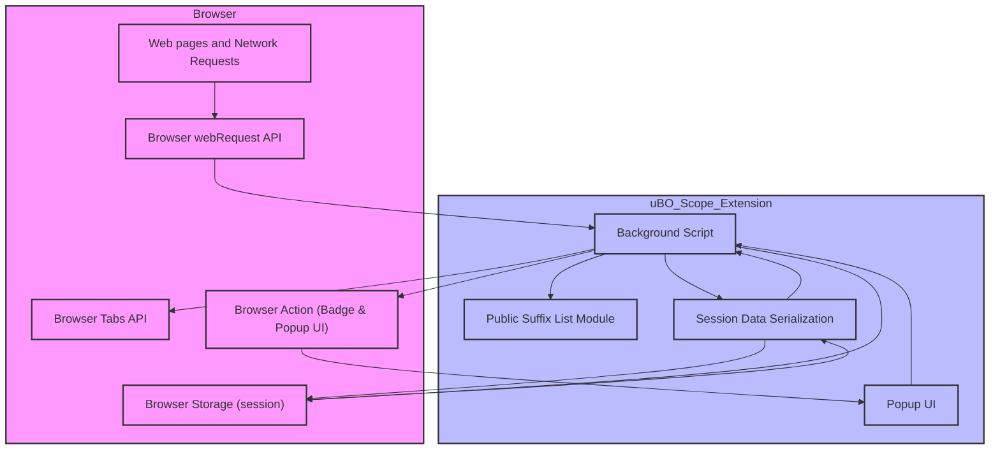

# How uBO Scope Works: Architecture Overview

Dive into the high-level architecture of uBO Scope to understand how its components work in harmony to provide insightful reports of your browser’s network connections. This page breaks down the interaction between the background script, browser APIs, data storage, and the popup UI—showing you how requests are monitored, processed, and presented.

---

## Overview: Tracking Network Connections in Real Time

When you load a webpage, dozens of network requests may happen behind the scenes—some allowed, some blocked, others redirected stealthily. uBO Scope’s architecture is crafted to capture these events efficiently and deliver meaningful summaries directly to your browser’s toolbar and popup interface.

At its core, the extension leverages the browser's `webRequest` API to listen to network activity across tabs, processes these records to classify connection outcomes, stores this session data smartly, and updates the user interface dynamically for immediate visibility.

### Key Components at a Glance

- **Background Script:** The heart of uBO Scope’s monitoring mechanism
- **Browser API:** Provides hooks (`webRequest`, `storage`, `tabs`) to capture and manage network data
- **Session Data Store:** Records tab-specific connection details persistently during the browsing session
- **UI Popup:** Displays detailed domain lists and counts, reflecting the current tab’s network footprint

---

## How the System Works: Component Interactions and Data Flow

### 1. Capturing Network Events

The background script registers listeners on the `webRequest` API for key network events such as:

- **onBeforeRedirect:** Tracks redirects to new URLs
- **onErrorOccurred:** Captures network failures or blocked requests
- **onResponseStarted:** Notes successful HTTP responses

Each event triggers a queueing of the request details, including URL, tab ID, request type, and outcome (`redirect`, `error`, `success`). The background script batches these captured requests briefly (debouncing with a 1-second timer) to process them efficiently.

### 2. Processing Network Request Outcomes

During processing, each request's URL hostname and domain are extracted and analyzed using the Public Suffix List to accurately identify the registered domain portion—key for summarizing counts and categorizing connections.

Each request is classified into one of three outcome buckets per tab:

- **Allowed (Not Blocked):** Resources successfully loaded
- **Stealth:** Redirected requests that are stealth-blocked
- **Blocked:** Requests that failed or were blocked explicitly

The tab-specific data structure organizes domain and hostname counts within these categories for detailed insights.

### 3. Session Data Management

To maintain continuity, uBO Scope stores this session data using the browser's `session` storage, serializing data for quick reads and writes. It tracks information dynamically as tabs open, update, and close, resetting details for new main-frame navigation.

### 4. User Interface Update

When the processed data indicates changes, the extension updates:

- **Toolbar Badge:** Shows the count of distinct allowed third-party domains per tab, offering at-a-glance awareness
- **Popup Panel:** On demand, the popup requests the current tab’s session data and renders classified lists (allowed, stealth, blocked), including domain names and connection counts.

This design keeps the user informed in real time while presenting granular details easily accessible with a click.

---

## Real-World Example: User Workflow

Imagine you open a news website:

1. The background script begins listening as network requests are made.
2. Some requests load content successfully from the news site's domain and a few third-party CDNs.
3. Other requests are redirected or blocked silently by your existing content blocker.
4. uBO Scope aggregates these network outcomes per tab.
5. The badge count on the extension icon displays the number of distinct allowed third-party servers.
6. When you open the popup, you see categorized lists of all domains contacted, letting you quickly identify if any unexpected third parties were involved.

This workflow transforms your browser into a transparent window showing network activity impacts, giving you confidence and control.

---

## Practical Tips & Best Practices

- **Badge Counts Represent Distinct Allowed Domains:** A lower badge count signifies fewer third-party connections, indicating tighter control over remote resource loading.
- **Session Data Updates on Navigation:** Each time you load a new page in a tab, uBO Scope resets and recalculates domain data, ensuring accurate per-page context.
- **Stealth vs. Blocked Classification:** Understanding these categories can help diagnose if connections were allowed through redirects or blocked outright, aiding privacy evaluation.
- **Public Suffix List Usage:** uBO Scope uses the official Public Suffix List to reliably extract registered domains, avoiding confusion from subdomains or third-level domains.

## Troubleshooting Common Issues

<AccordionGroup title="Troubleshooting">
<Accordion title="Badge Count Not Updating">
If the badge does not update:
- Ensure your browser supports the `webRequest` API properly.
- Verify that uBO Scope has the required permissions to observe network traffic.
- Check that relevant URLs are within host permissions (e.g., `http://*/*`, `https://*/*`).
- Reload the tab or browser to reset the session data.
</Accordion>
<Accordion title="Session Data Not Persisting">
- Confirm your browser supports session storage.
- Look for errors in background script console logs that might indicate serialization or storage access failures.
</Accordion>
<Accordion title="Popup Displays No Data">
- The popup fetches session data for the active tab via message passing.
- If no data appears, try refreshing the page or closing and reopening the popup.
- Make sure the tab is allowed for monitoring by uBO Scope.
</Accordion>
</AccordionGroup>

---

## System Architecture Diagram

---

## Summary

uBO Scope’s architecture centers around efficient background monitoring of network events scoped per tab, leveraging the browser’s native APIs for event listening, storage, and UI updates. It smartly uses the Public Suffix List to categorize domains, batching request processing to minimize overhead, and delivers clear, actionable data to users via badge counts and detailed popup reports.

Understanding this flow empowers users to have immediate, trustworthy transparency into the connections their browser makes, aiding privacy and security insight.

---

## Next Steps

- Explore [Core Concepts & Terminology](/overview/core_concepts_architecture/core_concepts) to learn how connection outcomes are defined and interpreted.
- See [Using the Popup: Domain Lists and Details](/guides/analyzing-connections/using-popup) for practical UI walkthroughs.
- Begin with the [Getting Started Quick Tour](/overview/user_journeys_usecases/quickstart_overview) to install and start using uBO Scope.

---

## References

- Source Code: [`js/background.js`](https://github.com/gorhill/uBO-Scope/blob/main/js/background.js)
- Public Suffix List: Included for accurate domain parsing

---

*This documentation is based on the current stable release code and manifest files as of version 1.0.1.*
