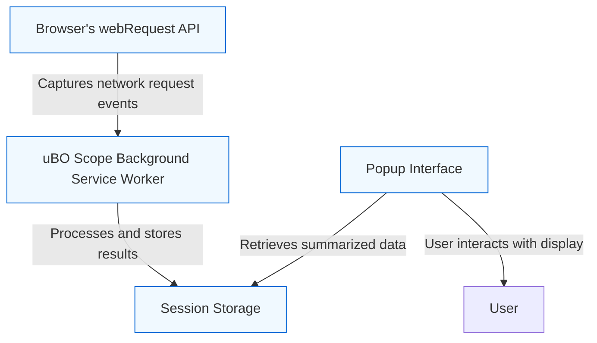

# Browser Integration & Supported Environments

## Seamless Operation Across Major Browsers

uBO Scope is designed with broad compatibility in mind, ensuring reliable performance across the three major browser environments: Chromium-based browsers, Mozilla Firefox, and Apple Safari. This cross-browser support allows users to benefit from consistent functionality regardless of their preferred platform.

### Supported Browsers

- **Chromium-based browsers** (Google Chrome, Microsoft Edge, Brave, etc.)
- **Mozilla Firefox** (desktop and Android)
- **Apple Safari** (macOS, iOS)

Each environment uses platform-optimized packaging and integration mechanisms to maximize uBO Scope's operational stability and feature set.

## Architecture and Browser Integration

Underneath the hood, uBO Scope leverages the browser’s `webRequest` API to observe and record network requests initiated by webpages. This API offers a standardized method to monitor HTTP(s) and WebSocket connections, enabling uBO Scope to gather real-time data about third-party domains your browser interacts with.

The integration involves the following key components:

- **Background Service Worker / Script**: Listens to network events, processes outcomes (allowed, blocked, stealth-blocked), and manages session data.
- **Popup Interface**: Queries the background for summarized network details and displays domain connection statistics.

This setup ensures that network activity monitoring occurs efficiently in the background, with a responsive user interface offering immediate insights.

### Browser-Specific Considerations

| Browser      | Manifest Type                         | Permissions Required           | Host Permissions Supported               |
|--------------|-------------------------------------|-------------------------------|------------------------------------------|
| Chromium     | Manifest v3 with background service worker | `activeTab`, `storage`, `webRequest` | HTTP, HTTPS, WS, WSS URLs                 |
| Firefox      | Manifest v3 with background module script  | `activeTab`, `storage`, `webRequest` | HTTP, HTTPS, WS, WSS URLs                 |
| Safari       | Manifest v3 with background scripts | `activeTab`, `storage`, `webRequest` | HTTP, HTTPS URLs (WebSocket support limited by Safari API) |

Nuances such as WebSocket support and storage scopes are managed internally to maintain uniform user experience.

## Compatibility and Design Highlights

- **WebRequest API Utilization:** uBO Scope listens to network request lifecycle events such as redirects, errors, and responses. This enables accurate tracking of connection outcomes irrespective of other content blockers in use.

- **Third-Party Domain Awareness:** The extension harnesses a robust Public Suffix List parser to distinguish registered domains effectively across all supported browsers.

- **Session Management:** Browser session storage APIs are leveraged for transient, efficient data saving without bloating disk storage or impacting startup time.

- **Badge Updates:** Integration with browser action APIs allows uBO Scope to show the count of distinct third-party connections directly on the toolbar icon, consistent across supported browsers.

- **Extensibility:** Code structure respects platform-specific constraints while sharing a common core, simplifying maintenance and future enhancements.

## How to Confirm Browser Support

When installing uBO Scope, you can inspect the following for confirmation:

- **Browser Add-on Store Listing:** Each browser’s official add-on store clearly labels compatibility.
- **Manifest Files:** Found in the `platform` directories of the source code, these JSON files ([Chromium](platform/chromium/manifest.json), [Firefox](platform/firefox/manifest.json), [Safari](platform/safari/manifest.json)) reveal the exact permission and integration setups.

- **Runtime Behavior:** On supported browsers, uBO Scope will activate immediately after installation and display connection metrics without extra setup.

## Practical Benefits of Cross-Browser Support

For users, this means:

- **Consistent Privacy Insights:** Your data about third-party connections is reliably reported regardless of browser choice.

- **Unified User Experience:** Similar UI elements, badges, and interaction patterns across browsers minimize learning curves.

- **Future-Proofing:** The extension’s design anticipates changes in browser APIs by modularizing platform-specific components.

## Troubleshooting Browser Integration

If you encounter issues related to browser support:

- Verify your browser version meets minimum requirements (e.g., Chrome 122+, Firefox 128+).
- Confirm that permissions for `webRequest`, `storage`, and `activeTab` are properly granted.
- For Safari, check if WebSocket support limitations affect your usage scenario.
- Consult the [Troubleshooting Initial Setup](https://docs.uboscope.com/getting-started/first-steps-and-validation/troubleshooting-setup) guide.

---

## Diagram: Core Component Interaction with Browser APIs

## Next Steps

- For a detailed explanation of how uBO Scope operates and its key capabilities, see [How Does uBO Scope Work? (Intuitive Explanation)](/overview/product-intro/how-it-works-intuitively).

- To understand the broader system architecture and data flow, refer to [System Overview: Components & Data Flow](/overview/architecture-core-concepts/system-overview-diagram).

- For practical uses and interpretation of uBO Scope's data in everyday browsing, consult [Who is it For? Common Use Cases](/overview/product-intro/target-audience-usecases).

---

<u>Note:</u> This documentation covers browser integration aspects only. For installation instructions and permissions setup on your specific browser, please visit the [Getting Started](/getting-started/installation-and-setup) section.