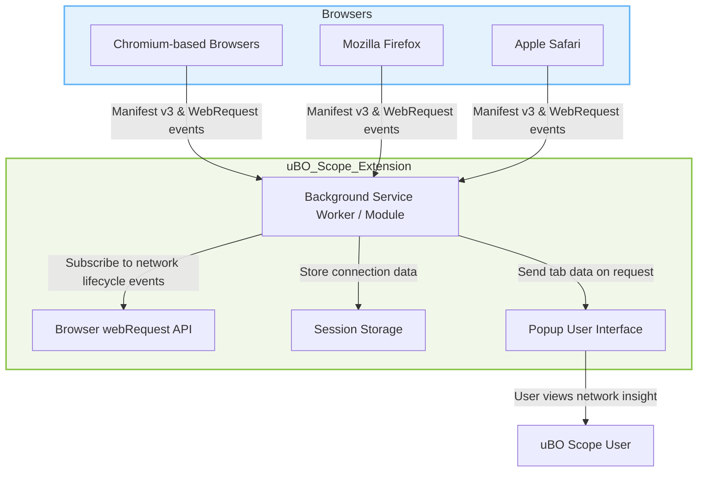

# Browser Support & Integration

## Unlocking Network Visibility Across Browsers

uBO Scope stands out by working intimately with browser APIs to provide you a transparent view of all network connections that happen behind the scenes during your browsing sessions. This page details exactly which browsers uBO Scope supports and explains how it leverages browser integration to capture network events. Understanding these details empowers you to know what to expect from uBO Scope and how it delivers its insights.

---

## Supported Browsers at a Glance

uBO Scope is designed with broad compatibility in mind, focusing on the three most popular browser platforms:

- **Chromium-based browsers** (e.g., Google Chrome, Microsoft Edge)
- **Mozilla Firefox**
- **Apple Safari**

Each platform has nuances in how extensions operate and how network data can be accessed, but uBO Scope ensures consistent functionality by tailoring its integration to their specifics.

| Browser    | Minimum Version / Notes                     |
|------------|--------------------------------------------|
| Chromium   | Version 122.0 or later (manifest v3, service worker background) |
| Firefox    | Version 128.0 or later (manifest v3, module background script) |
| Safari     | Version 18.5 or later (manifest v3, module background script)  |

This coverage ensures you can rely on uBO Scope in your preferred browsing environment without losing key monitoring capabilities.

## How uBO Scope Integrates with Browsers

uBO Scope’s core strength is its ability to observe network requests accurately and in real-time. It achieves this by integrating deeply with the browser's `webRequest` API. This API allows extensions to listen to detailed lifecycle events of network requests, such as when they're initiated, redirected, succeeded, or failed.

### The Role of the `webRequest` API

- It provides granular event hooks:
  - `onBeforeRedirect`
  - `onErrorOccurred`
  - `onResponseStarted`

- These event listeners enable uBO Scope’s background script to track every network connection attempt, classify outcomes (allowed, blocked, or stealth-blocked), and keep data associated with specific browser tabs.

- This integration is the foundation of uBO Scope's accuracy, allowing it to report network events independent of any content blocker or DNS filtering running in your browser.

### Manifest Permissions and Setup

For uBO Scope to function, it requests the following key permissions in the browser manifest:

- **`webRequest`**: To monitor network requests
- **`activeTab`**: To interact with the currently active tab
- **`storage`**: To save session data such as connection details

The extension also declares host permissions broadly:

- `http://*/*`, `https://*/*`, `ws://*/*`, `wss://*/*` (WebSocket protocols vary slightly per browser)

These permissions are essential to ensure no network request goes unnoticed during your browsing.

## Platform-Specific Distinctions

### Chromium

- Runs the background logic as a **service worker** (declared in manifest v3)
- Supports broad host permissions including WebSocket URLs
- Efficient event handling ensures timely and reliable network event recording

### Firefox

- Uses a **module-based background script** with manifest v3
- Requires strict minimum version 128 due to manifest v3 adoption
- Supports similar host permissions and APIs as Chromium

### Safari

- Uses a **module-type background script**
- Strict minimum version 18.5 ensures access to required APIs
- Permissions are slightly reduced (no WebSocket hosts explicitly listed)

## Scope and Limitations

### What uBO Scope Can Do

- Capture network events for HTTP, HTTPS, and WebSocket protocols as exposed by the `webRequest` API
- Track connection attempts initiated by all tabs
- Maintain detailed maps of allowed, blocked, and stealth-blocked domains per tab
- Display real-time badge counts on the extension icon representing distinct connected third-party domains

### Where It Falls Short

- **Does not capture network requests made outside the `webRequest` API scope**: For example, some browser internal requests or certain WebRTC-related protocols are not visible.
- **Will not see requests blocked or initiated at the OS or DNS level** that do not reach browser network layers
- **Limitations imposed by specific browser APIs or permissions**, such as Safari’s slightly narrower host permissions

## Visualizing Browser Integration

## Practical Example: What Happens When You Load a New Tab

1. You navigate to a new website in a tab.
2. uBO Scope's background script listens to `webRequest.onBeforeRequest` and related events through the browser-provided API.
3. It identifies the main frame's hostname and domain by parsing network request URLs.
4. Each network request triggered by the webpage is observed and classified as allowed, blocked, or stealth-blocked based on response events.
5. Connection counts per third-party domain are updated and saved in session storage.
6. The browser action badge updates to reflect the current number of distinct third-party domains connected.
7. When you interact with the extension popup, it requests relevant tab data and displays detailed domain lists and counts.

## Best Practices & Tips

- **Use latest supported browsers** to ensure seamless manifest v3 and API compatibility.
- **Grant required permissions**, especially `webRequest`, to unlock full functionality.
- **Understand limitations** regarding unseen network events and filtering outside the browser scope.
- **Regularly check for browser updates**, as underlying API changes can affect extension behavior.

## Troubleshooting Integration Issues

<AccordionGroup title="Common Integration Questions and Fixes">
<Accordion title="Why am I not seeing network events in uBO Scope?">
Ensure your browser version meets the minimum requirement and that the extension has been granted the `webRequest` permission. Some browsers may disable such permissions if installed from untrusted sources.
</Accordion>
<Accordion title="Does uBO Scope show WebSocket connections?">
Yes, for browsers supporting `webRequest` events over `ws://` and `wss://` (Chromium and Firefox). Safari currently does not request these hosts explicitly, which may limit WebSocket visibility.
</Accordion>
<Accordion title="Are all network requests captured?">
No. Requests outside the `webRequest` API scope (such as some browser internal requests) are not captured. This is a limitation of the browser's extension APIs, not uBO Scope.
</Accordion>
</AccordionGroup>

## Summary

This page has provided a detailed look at how uBO Scope supports Chromium, Firefox, and Safari browsers through integration with their respective `webRequest` APIs. The extension's effectiveness hinges on these APIs to capture every relevant network event reliably. Understanding this integration clarifies the extension’s capabilities and boundaries, helping you set realistic expectations when analyzing network activities.

---

For a comprehensive introduction to uBO Scope and its value, please visit [What is uBO Scope?](../introduction-and-value/what-is-ubo-scope).

To get started with usage, see [Installing uBO Scope](../../getting-started/prerequisites-installation/installing-ubo-scope).

For understanding the detailed data output, refer to [Core Concepts and Terminology](../core-concepts-overview/core-concepts-terminology) and [System Architecture & Data Flow](../core-concepts-overview/architecture-data-flow).

---

*Repository and Code Reference:* [uBO Scope GitHub](https://github.com/gorhill/uBO-Scope)  
*Manifest and integration code examples are available in the repository under platform-specific manifests.*

---
