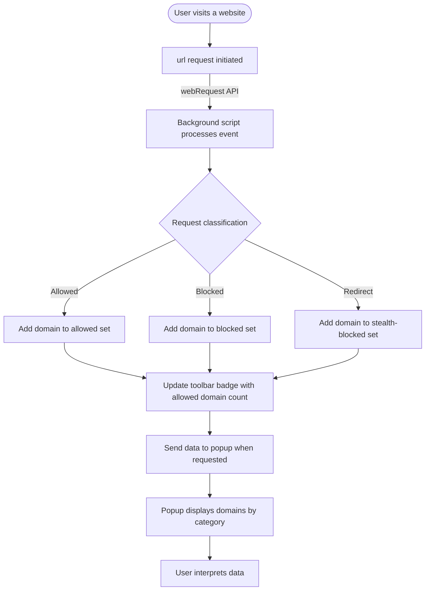

# Key Features and User Workflow

## Unlocking Real-Time Visibility into Network Connections

uBO Scope empowers you with clear, real-time insight into every domain your browser connects to while browsing. Whether a connection is allowed, stealth-blocked (subtly prevented or redirected), or explicitly blocked, uBO Scope tracks and categorizes these network interactions accurately and presents them for easy, at-a-glance analysis.

### Why This Matters
Most content blockers focus only on counts of blocked requests, which can be misleading when comparing effectiveness. uBO Scope shifts the focus to the number of distinct third-party domains your browser communicates with—offering an objective, transparent perspective on your network exposure.

### Who Benefits?
- Privacy-conscious users eager to monitor third-party connections
- Filter list maintainers who need granular data on allowed or blocked domains
- Developers verifying content blocker impact on network requests

---

## Real-Time Domain Connection Reporting

### How uBO Scope Tracks Connections
uBO Scope listens to every network request your browser attempts and sorts them into three clear categories:
- **Allowed Domains:** Domains from which your browser successfully fetched resources
- **Blocked Domains:** Domains where requests were explicitly blocked or failed
- **Stealth-Blocked Domains:** Domains where requests were redirected or silently intercepted without visible blocking

All this information is gathered live for each active browser tab and instantly presented in the extension’s popup and toolbar badge.

### What You See in the Popup UI
When you open uBO Scope’s popup for the active tab, you get a detailed snapshot of all domains involved in making network connections for that page:
- A header showing the current tab’s hostname and domain
- A total count of distinct connected domains for the tab
- Separate sections listing domains under **Not Blocked**, **Stealth-Blocked**, and **Blocked** categories

Each domain entry shows the exact domain name and the number of requests made to it, helping you gauge the intensity and nature of these connections.

### Domain Breakdown Example
Imagine visiting a news website:
- The **Not Blocked** section lists content delivery networks, analytics, or advertisements that loaded successfully
- The **Stealth-Blocked** section reveals third-party trackers quietly redirected or hidden by your content blocker
- The **Blocked** section highlights connections your blocking software prevented outright

This precise breakdown aids you in understanding the real network footprint of web pages you visit.

---

## The Diagnostic Badge: Your Toolbar Status Indicator

uBO Scope’s toolbar icon features a badge that dynamically displays the count of distinct third-party domains successfully connected to in the active tab. A key indicator, this badge reflects your browser’s exposure to these external servers in real time.

**What the badge tells you:**
- A **lower count** indicates fewer third-party connections—generally desirable from a privacy standpoint
- A **higher count** suggests a greater number of external domains accessed, which highlights a larger network surface

This immediate visual feedback allows you to monitor the impact of your content blocking and privacy settings across sites.

---

## Typical User Workflow: Step-by-Step

Understanding how to interact with uBO Scope will help you use it effectively to monitor and interpret your browsing’s network behavior.

<Steps>
<Step title="Activate uBO Scope on a Tab">
Install the extension and click its toolbar icon while visiting any webpage. The popup will open showing network connection data for that tab.
</Step>
<Step title="Review the Header and Summary Count">
At the top, confirm the tab's hostname, and note the total number of distinct domains connected.
</Step>
<Step title="Examine Allowed Domains">
See which domains delivered content without restriction, indicating successful fetches.
</Step>
<Step title="Check Stealth-Blocked Domains">
Identify any domains that were subtly blocked or redirected, providing insight into hidden content blocker activity.
</Step>
<Step title="Analyze Blocked Domains">
Understand which domains had their requests blocked outright, helping evaluate the effectiveness of your blocking solution.
</Step>
<Step title="Use Domain Counts for Context">
Look at the request counts next to each domain to understand how frequently your browser interacts with them.
</Step>
</Steps>

---

## Practical Tips and Best Practices

- **Regularly monitor the badge count** to stay aware of unexpected increases in third-party connections.
- Use uBO Scope alongside your preferred content blockers to verify their real-world performance rather than relying on block counts alone.
- Investigate daunting numbers in the Stealth-Blocked section—it may indicate trackers or ads that evade blatant blocking.
- When troubleshooting, use the domain lists to isolate problematic third parties causing privacy or performance issues.

---

## Common Pitfalls and Troubleshooting

### Why Some Requests May Not Appear
- Network requests initiated outside the browser’s `webRequest` API (such as certain fetches internal to extensions or apps) remain invisible to uBO Scope.
- Requests filtered by non-extension-based methods (e.g., system-level DNS filtering) may still show as blocked or allowed if browser reports them.

### Popup Not Loading Data
- Make sure the active tab is fully loaded.
- Check that the extension has necessary permissions enabled.

### Badge Count Seemingly Incorrect
- The badge only counts distinct domains for the active tab.
- Switching tabs or refreshing pages may temporarily cause discrepancies until data refreshes.

---

## Visualizing the User Interaction Flow

This flow captures how network requests translate into actionable data for you, closing the loop from browsing to insightful analysis.

---

## Next Steps

Ready to dive deeper? Explore the [Core Concepts and Terminology](/overview/core-concepts-overview/core-concepts-terminology) to understand the key foundations of how uBO Scope interprets and presents network data. Once comfortable, proceed to [Interpreting the Badge and Popup Data](/getting-started/first-run-setup/interpreting-badge-popup) and start analyzing your browsing connections with confidence.

For installation steps and requirements, see [Installing uBO Scope](/getting-started/prerequisites-installation/installing-ubo-scope).

---