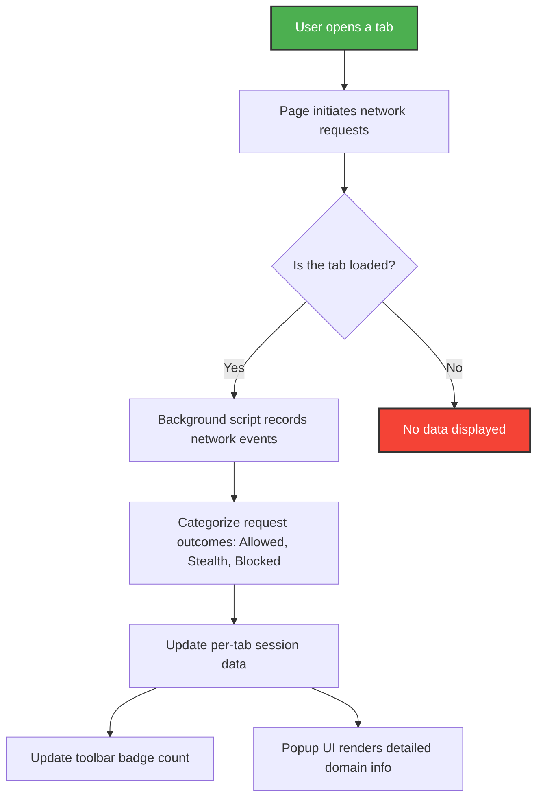

# Feature Quickstart

Welcome to uBO Scope's Feature Quickstart guide. This page offers a clear, high-level tour of the core user interface elements, familiarizes you with badge icon behaviors, and explains how session tracking works behind the scenes. By understanding these essentials, you’ll be able to interpret uBO Scope’s feedback swiftly, even when using it alongside other content blockers.

---

## Understanding the Popup Interface

The popup interface is your primary window into uBO Scope's real-time reporting of network connections made by the active browser tab.

- **Tab Hostname Display:** At the top, the popup shows the hostname and domain of the current tab clearly, with international domain names rendered in Unicode for easy recognition.

- **Domain Connection Summary:** A summary section provides the count of distinct third-party domains the current tab connected to during the session.

- **Connection Outcome Sections:** The interface breaks down domains by category:
  - **Not Blocked:** Domains where connections were successful and allowed.
  - **Stealth-Blocked:** Domains where connections were redirected or silently blocked to prevent tracking.
  - **Blocked:** Domains where connection attempts failed or were denied explicitly.

Each domain entry lists the domain name and the number of connection attempts or hits, helping you spot which third parties are communicating most actively.

### How This Helps You

Imagine visiting a website and wanting to know which third-party servers your browser actually connected to — regardless of what content blocker you use. The popup’s organized view delivers this insight precisely, categorizing connections so you can quickly assess exposure.

---

## Toolbar Badge Behavior

The browser toolbar icon next to the address bar provides an at-a-glance indicator of third-party connection activity per tab.

- **Badge Number Meaning:** The badge shows the count of distinct third-party remote servers for which there was a network connection in the active tab. A lower number means fewer third-party connections, which usually indicates tighter privacy.

- **Dynamic Updates:** As you browse and the page initiates network requests, uBO Scope updates the badge dynamically, reflecting new connections allowed or blocked.

- **No Badge Display:** If no relevant third-party connections are detected yet or the page data isn’t available (e.g., inactive tabs), the badge remains empty for clarity.

### Why It Matters

The badge's focus on distinct third-party domains gives a truer sense of your browsing privacy than just counting blocked requests. It lets you understand your actual network exposure regardless of filtering or blocking tactics used.

---

## Session Tracking Explained

uBO Scope tracks network requests per tab session, maintaining a detailed record of connection outcomes.

- **Per-Tab Detail Storage:** Each tab’s network activity is stored individually, including domains and hostnames categorized as allowed, stealth-blocked, or blocked.

- **Outcome Categorization:** 
  - **Allowed:** Connections that succeeded.
  - **Stealth:** Redirected or silently blocked requests designed to obscure tracking.
  - **Blocked:** Directly blocked or failed connections.

- **Persistence:** Session data is serialized and saved, ensuring that removals or navigations reflect promptly in your popup and badge updates.

- **Automatic Reset:** When a tab’s main frame reloads or navigates, previous session details reset to maintain accuracy.

### Practical Benefits

This tracking ensures that your insights always pertain to the current browsing context without stale or confusing data. It enables a timely and precise view of your browser’s network interactions.

---

## Working Seamlessly with Other Blockers

uBO Scope functions independently of other content blockers, measuring network connections regardless of their presence or blocking methods.

- **No Conflict:** It observes the browser’s network activity rather than interfering or managing it, so it works harmoniously alongside any other extension or DNS-based blocker.

- **Truthful Reporting:** Because it listens at the browser network level, uBO Scope reveals the reality of your network connections post-blocking decisions made elsewhere.

This design empowers you to verify and audit your content blocker’s effectiveness with an accurate, third-party domain-focused perspective.

---

## Quick Tips for Interpretation

- **Focus on the distinct domain count in the badge** as it gives the clearest view of third-party exposure.
- **Use the popup’s domain lists** to identify which third parties are active and how they’re handled.
- **Remember stealth-blocked domains** represent subtle blocking techniques and are key to understanding nuanced privacy protection.
- **Reload pages to refresh session data** and see current network connection states.

---

## Summary Diagram of User Flow

This flow highlights the core interactions: from your browsing actions to how uBO Scope tracks, categorizes, and reports back to you.

---

## Getting Started

1. **Open the uBO Scope popup** by clicking the browser toolbar icon anytime you want to investigate the active tab’s network connections.
2. **Review the badge count** to get a quick sense of third-party domain activity.
3. **Explore connection categories in the popup** for granular insights.
4. **Reload pages** to see updated network activity with fresh session tracking.

For deeper dives on interpretation and practical use cases, consult the guides on [Exploring the Popup UI](/guides/getting-started/exploring-the-popup-ui) and [Interpreting Badge Counts](/guides/getting-started/interpreting-badge-counts).

---

## Troubleshooting

<AccordionGroup title="Common Issues and Solutions">
<Accordion title="Why is the badge count empty even on active sites?">
This happens when there are no third-party connections or if the tab is not properly loaded yet. Try reloading the tab or switching to it and back.
</Accordion>
<Accordion title="Popup shows 'NO DATA'">
Ensure you have selected an active tab with network activity. The extension resets data on navigation; open the popup after the page loads.
</Accordion>
<Accordion title="Sessions do not update in real time">
uBO Scope batches network events and updates at short intervals. Wait a few seconds or reload the tab for immediate refresh.
</Accordion>
</AccordionGroup>

---

Harness the focused, real-time insights provided by uBO Scope's popup and badge to see exactly which third-party servers your browser connects to — empowering your privacy decisions with unmistakable clarity.

---

## Related Documentation

- [What is uBO Scope?](/overview/product-introduction/what-is-ubo-scope) — Understand the product purpose.
- [Core Value Proposition](/overview/product-introduction/core-value-proposition) — Why this specific approach matters.
- [System Architecture](/overview/architecture-and-core-concepts/system-architecture) — Technical aspects behind the scenes.
- [Exploring the Popup UI](/guides/getting-started/exploring-the-popup-ui) — Detailed user interface guide.
- [Interpreting Badge Counts](/guides/getting-started/interpreting-badge-counts) — Making sense of the toolbar badge numbers.

---

## Source Code Reference

You can explore the complete implementation details of the popup interface and background session tracking at the project's GitHub repository:

- [Popup UI logic in `js/popup.js`](https://github.com/gorhill/uBO-Scope/blob/main/js/popup.js)
- [Background session and request tracking in `js/background.js`](https://github.com/gorhill/uBO-Scope/blob/main/js/background.js)

Feel free to review the code for deeper understanding or to contribute improvements.

---

Thank you for choosing uBO Scope. This quickstart empowers you to start leveraging the extension’s unique insights immediately.

