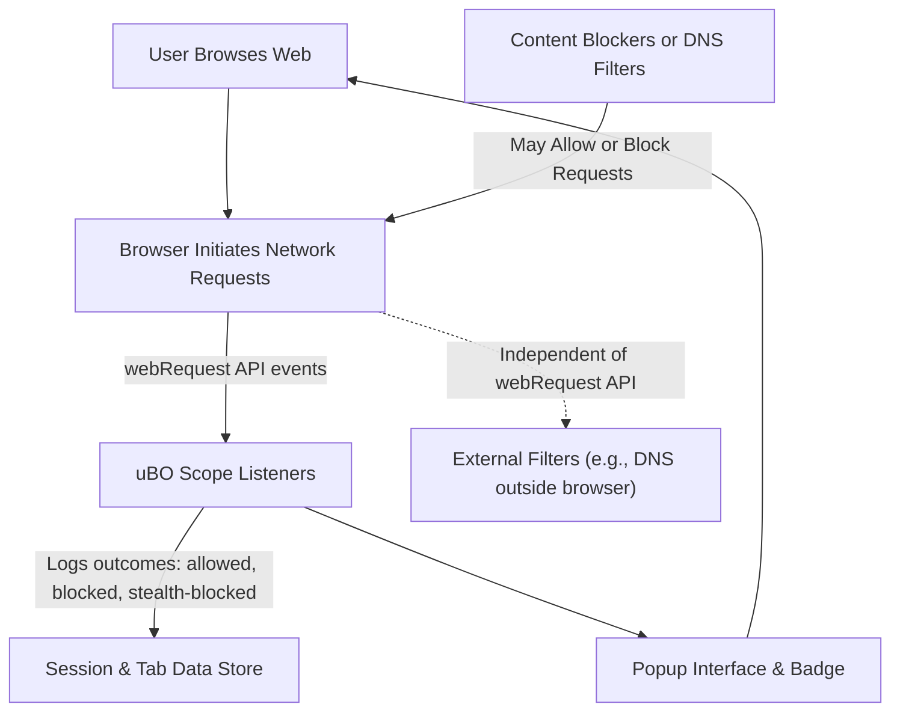

# Integration & Compatibility

## Seamless Operation Alongside Content Blockers

uBO Scope is specifically designed to provide accurate visibility into all network connections your browser makes, regardless of any content blockers or DNS-based blocking you may have enabled. Unlike other monitoring tools affected by the presence or configuration of content blockers, uBO Scope relies exclusively on the browser’s native networking APIs to detect traffic. This approach guarantees that what you see reflects the actual network activity, not filtered or altered counts influenced by blocking layers.

By leveraging the browser’s `webRequest` API, uBO Scope intercepts network request events — including successful connections, blocked attempts, errors, and redirects — to build a comprehensive and unbiased picture of all third-party remote servers contacted during your browsing session.

> **What this means for you:** Whether you use popular content blockers like uBlock Origin, browser-integrated trackers, DNS-level filters, or even stealth blocking techniques, uBO Scope reports the real connections independently, ensuring trustworthy data for privacy advocacy or filter list maintenance.

## Browser Compatibility and Permission Requirements

uBO Scope’s network visibility depends on permissions and capabilities of the browser environment. Supported major platforms include Chromium-based browsers, Firefox, and Safari — each requiring the extension’s manifest permissions to register webRequest listeners across HTTP(S) and WebSocket(s) protocols.

### Required Permissions

- `webRequest` permission enables interception of network request lifecycles.
- `host_permissions` covering `https://*/*`, `http://*/*`, and for browsers supporting WebSockets, `wss://*/*`, `ws://*/*`.
- `storage` permissions to maintain session request data.
- `activeTab` to associate monitoring with your currently active browser tab.

### Platform-Specific Notes

| Browser        | Minimum Version           | Special Notes                                   |
| -------------- | ------------------------ | ---------------------------------------------- |
| Chromium       | 122.0+                   | Requires manifest version 3, service worker background script. |
| Firefox        | 128.0+                   | Uses module background scripts, supports stealth and error event monitoring. |
| Safari         | 18.5+                    | Limited to http(s) host permissions. WebSocket monitoring not supported yet. |

## Limitations and Considerations on Network Visibility

While uBO Scope aims for comprehensive network visibility, it is constrained by the browser’s capabilities and permissions:

- **Network requests outside `webRequest` API reach:** Some internal or low-level network actions, such as certain WebRTC peer-to-peer traffic or DNS-based blocking handled completely external to the browser, will not be visible.
- **Browser permission restrictions:** Without appropriate permission to intercept all HTTP(s) and WebSocket connections, requests outside permitted hosts will be missed.
- **Incognito or private browsing modes:** Session data may be limited or isolated.

## How uBO Scope Maintains Accurate and Trustworthy Data

uBO Scope organizes collected data per tab, tracking each third-party domain's connection outcomes independent of the blocking mechanisms involved. It classifies requests into:

- **Allowed:** Network requests that successfully connected.
- **Blocked:** Connections prevented from completing.
- **Stealth-blocked:** Requests intercepted without triggering page breakage or detection (e.g., silently blocked redirects).

This classification is possible because uBO Scope registers event listeners on the entire request lifecycle:

- `onBeforeRedirect`
- `onErrorOccurred`
- `onResponseStarted`

Combined with a real-time internal session store, this ensures badge counts and popup UIs reflect true network exposure, not just superficial blocked event counts.

## Typical User Flow: Integration with Other Blockers

1. **User installs uBO Scope alongside content blockers like uBlock Origin.**
2. **Upon browsing, all network requests pass through the browser’s webRequest API, regardless of blockers.**
3. **uBO Scope records every distinct third-party domain contacted, categorizing by whether the request was finally allowed, blocked visibly, or stealth-blocked.**
4. **User views accurate counts and detailed network connection breakdowns in uBO Scope’s popup interface, seeing true exposure beyond block counts shown by blockers.**

## Best Practices for Maximizing Compatibility

- Always grant the necessary permissions during installation to cover all network protocols you want to monitor.
- Use uBO Scope side-by-side with content blockers rather than replacing them — it is a diagnostic and auditing tool, not a blocker.
- Recognize that some network traffic may be out of reach due to browser or platform technical limitations.

## Troubleshooting Common Issues

<AccordionGroup title="Common Integration & Compatibility Issues">
<Accordion title="Why am I not seeing WebSocket connections on Safari?">
Safari currently does not support WebSocket URL permissions (`wss://` or `ws://`) in the manifest. Therefore, uBO Scope cannot monitor WebSocket connections on this platform. This is a known limitation due to Safari’s extension APIs.
</Accordion>
<Accordion title="Badge count not updating when using certain content blockers">
uBO Scope relies on the browser’s webRequest API, which may have restricted access or altered behavior with some blocking extensions or privacy settings. Make sure:
- You granted all permissions.
- The blocking extensions do not block or interfere with the webRequest API events.
- You are running supported browser versions.
</Accordion>
<Accordion title="Network requests are missing or incomplete in popup details">
Some network requests do not appear if they occur outside the scope of the browser’s webRequest API, such as DNS filtering done outside the browser, or in private/incognito sessions with restricted data access. Additionally, some error or redirect events may not be reported if blocked at a network layer below the browser.
</Accordion>
</AccordionGroup>

## Summary

uBO Scope’s integration model consciously embraces agnostic, permission-based network interception to provide clear, reliable visibility irrespective of any content blocking or filtering layers in place. Recognizing browser API boundaries and platform differences empowers users to fully trust what uBO Scope shows about their browsing network exposure.

---

# Browser Networking & Permission Flow

---

## Getting Started with Integration & Compatibility

To ensure you're maximizing the value of uBO Scope alongside your content blockers:

- Confirm permissions during install cover all desired URL schemes.
- Use supported browsers and versions (see compatibility table above).
- Reference the [Feature Quickstart](/overview/feature-overview-and-integration/feature-quickstart) guide for understanding the popup UI.
- Explore [System Architecture](/overview/architecture-and-core-concepts/system-architecture) for deeper understanding of event flows.

<Tip>
Always remember that uBO Scope complements, rather than replaces, your content blockers. It provides the data you need to verify network exposure with absolute trust.
</Tip>