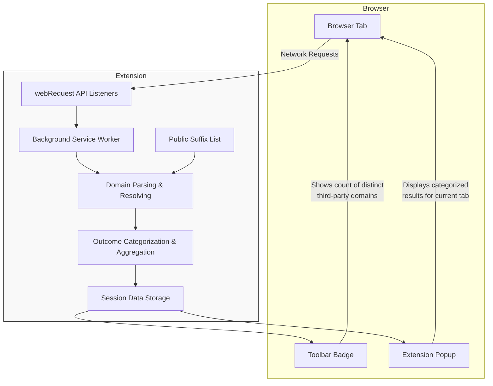

# Features at a Glance

Discover uBO Scope’s primary capabilities that bring clarity and actionable insights to your browser’s network activity. This page highlights the key features such as real-time network monitoring, detailed domain categorization, and compatibility with other blockers — all surfaced through an intuitive popup interface and the toolbar badge. Understand what these features mean for you and why they matter for privacy and network transparency.

---

## Real-Time Network Monitoring

uBO Scope continuously listens to your browser’s network requests using the `webRequest` API, tracking connections to remote servers as they happen. It captures every relevant network event, including successful requests, redirects, and errors. This enables you to see exactly which third-party domains are contacted by each open tab:

- **Live updates** in the popup interface reflect the current tab’s third-party connections.
- **Outcomes grouped by type:** allowed, stealth-blocked, and blocked connections.
- **Badge count updates dynamically** to indicate the number of distinct third-party domains contacted.

Imagine you’re browsing a website and want to instantly verify which external servers it reaches out to. The popup UI shows this data seamlessly without needing to dive into complex developer tools.

## Clear Domain Categorization

Understanding third-party connections at a domain level is essential. uBO Scope leverages a comprehensive domain parsing methodology that utilizes the Public Suffix List (PSL) to accurately group hostnames by their base domain.

- Hostnames are resolved to their effective registered domains using PSL,
- All network requests are categorized by their outcome: `allowed`, `stealth-blocked` (redirected silently by content blockers), and `blocked` (failed requests).
- Domains are displayed with counts for requests made.

This clear breakdown helps you grasp how many unique third-party domains your current tab communicates with and the nature of these connections.

## Badge Indicator for Quick Insight

The toolbar badge presents an at-a-glance summary of your browsing tab’s exposure:

- Shows the **number of distinct third-party domains** contacted.
- This count is a **direct privacy indicator** — a higher number means more external connections, thus potentially a higher privacy risk.
- An empty badge means no third-party connections have been made.

Remember, a **lower count on the badge signifies better privacy**; it reflects fewer distinct third-party servers contacted on the current tab.

## Cross-Blocker Compatibility

uBO Scope monitors network request outcomes independently of which content blocker is active in your browser.

- It reports network events **regardless of active blocking methods**, including DNS-based and extension-based filters,
- This functionality enables consistent tracking even alongside stealthy blockers,
- Helps you debunk myths about blocker effectiveness by focusing on real 3rd-party connections rather than just block counts.

## Intuitive Popup Interface

The extension popup is designed for fast, clear understanding of all network outcomes for the current tab:

- Summary section highlights the total number of unique third-party domains connected.
- Separate sections for **not blocked**, **stealth-blocked**, and **blocked** domains,
- Domains and their connection counts are shown in a neat, scrollable list,
- Color cues: green for allowed, red for stealth and blocked domains, enabling quick visual parsing.

This interface guides you effortlessly from summary to detailed inspection, supporting both quick checks and deeper analysis.

## Why These Counts Matter

Every third-party domain contacted by a webpage potentially exposes you to tracking or privacy risks. uBO Scope’s focus on unique domain counts and request outcomes empowers you to:

- Identify the real extent of external connections,
- Evaluate how content blockers affect your browsing privacy,
- Detect stealth blocking behavior that might not be obvious otherwise,
- Make informed decisions about which websites or blockers to trust.

---

## Practical Example

Imagine opening the popup while browsing an online news site:

- The summary indicates 5 unique third-party domains connected.
- Under "not blocked," you see CDN providers and a social media widget’s domains.
- The "stealth-blocked" section lists domains silently redirected by your blocker, indicating stealth blocking in action.
- The "blocked" section is empty, showing no domains were denied outright.

This detailed view reveals transparency into network activity, letting you audit your web experience in real time.

---

## Tips and Best Practices

- **Use the popup regularly** while browsing privacy-sensitive sites to monitor their external connections.
- Interpret the badge count as a privacy metric — lower counts equal fewer third-party exposures.
- Combine usage with your existing content blocker for enhanced insight.
- Recognize that some common third parties (e.g., CDN providers) are normal and usually low-risk.

## Common Pitfalls

- Do not confuse **block counts** with the privacy impact: a high block count does not necessarily mean better privacy.
- Avoid relying on fabricated “ad blocker test” pages; real-world network monitoring like uBO Scope provides accurate insight.
- The extension only monitors requests observable through the browser's webRequest API; network activity outside this scope may not be captured.

---

## Next Steps

- To learn how to use the popup interface in action, see [Understanding the Popup Interface](/guides/getting-started-essentials/understanding-the-popup-interface).
- Explore workflows for monitoring third-party connections in the [Monitoring Third-Party Connections: A Basic Workflow](/guides/getting-started-essentials/basic-usage-tutorial) guide.
- For deeper understanding of the extension’s architecture, see the [How uBO Scope Works (Architecture Overview)](/overview/architecture-concepts/system-architecture-diagram) page.

---

<AccordionGroup title="Feature Details & Additional Information">
<Accordion title="Real-Time Network Monitoring">
Uses browser webRequest API listeners to capture all web requests and their outcomes, including redirects, errors, and successful loads.
Provides immediate, tab-specific aggregation.
</Accordion>
<Accordion title="Domain Parsing via Public Suffix List">
Resolves hostnames to base domain names using the up-to-date Public Suffix List.
Accurate grouping minimizes confusion between subdomains and distinct entities.
</Accordion>
<Accordion title="Popup Interface Structure">
Features separate outcome sections:
- Allowed (not blocked) connections
- Stealth-blocked connections (redirected without user-visible blocking)
- Blocked connections (failed requests)
Each section lists domains along with request counts.
</Accordion>
<Accordion title="Cross-Blocker Compatibility">
Observes request outcomes independently of other blockers, covering DNS-based and extension-based content filters.
Helps analyze blocker efficacy and real privacy exposure.
</Accordion>
</AccordionGroup>

---

### Source
See the complete source and additional implementation details on [GitHub](https://github.com/gorhill/uBO-Scope).

