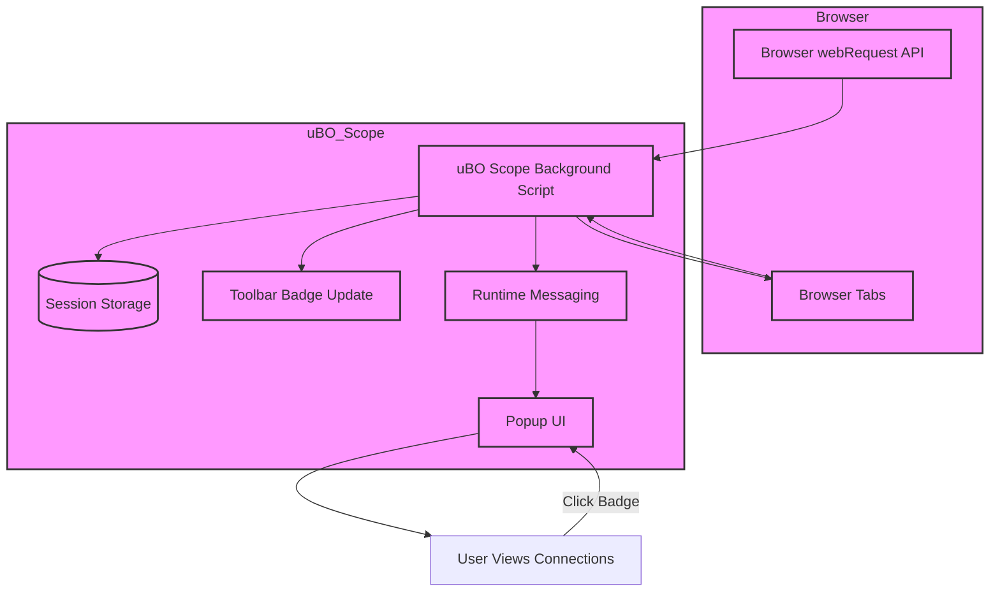

# How uBO Scope Integrates with Your Browser

---

## Unlocking Browser Network Transparency with uBO Scope

uBO Scope seamlessly hooks into your browser's native APIs, unveiling network activity that often remains hidden beneath layers of content blocking and privacy shields. By integrating directly with the `webRequest` API, it offers a rich, real-time view of all remote server connections attempted or made by the browser — bridging gaps left by conventional content blockers.

### Why This Matters

Browsers mediate an enormous amount of network communication to render webpages, often connecting to dozens of distinct third-party servers without clear user visibility. uBO Scope leverages browser internals to capture these connections regardless of the content blocker in use, empowering you with an accurate, broad-spectrum understanding of your browser’s network footprint.

---

## Core Browser APIs Leveraged

### 1. webRequest API

- **Purpose:** Monitors and intercepts network requests initiated by web pages.
- **uBO Scope Uses:**
  - Listens to key events like `onBeforeRedirect`, `onErrorOccurred`, and `onResponseStarted` to capture the full lifecycle of network requests.
  - Collects detailed data on each request's outcome — whether allowed, blocked, or stealth-blocked — for precise reporting.

### 2. Storage APIs (Session and Local Storage)

- **Purpose:** Maintain persistent and session-based data across browser sessions.
- **uBO Scope Uses:**
  - Stores observed network session data, including tab-specific domain connection details.
  - Caches the Public Suffix List for fast domain parsing and grouping.

### 3. Runtime Messaging

- **Purpose:** Facilitates communication between service workers (background scripts) and UI components like the popup.
- **uBO Scope Uses:**
  - Exchanges messages to retrieve tab-related network summaries dynamically when users open the popup interface.

### 4. Tabs API

- **Purpose:** Tracks active browser tabs and their lifecycle events.
- **uBO Scope Uses:**
  - Cleans up stored data when tabs close.
  - Queries active tabs to update the badge and popup with current data.

---

## Cross-Browser Compatibility and Support

uBO Scope is designed to work consistently across major browsers, adapting to their particular manifest and API nuances:

| Browser | Support Details |
|----------|----------------|
| Chromium (Chrome, Edge, Brave) | Uses `service_worker` background with Manifest V3 compliance. Full support for webRequest and storage APIs. |
| Firefox | Uses module-based background scripts compliant with Firefox's web extension system. Supports additional `ws://`/`wss://` URLs in host permissions. |
| Safari | Supports module-based background scripts with stricter minimum version requirements. |

> All supported browsers provide the `webRequest` API hooks necessary for uBO Scope’s core functionality.

---

## Working Alongside Other Content Blockers

uBO Scope is architected to report all network requests irrespective of what content blocker is active. This means:

- It **does not** interfere with blocking decisions; it only observes outcomes.
- It can detect network requests blocked by DNS-based or stealth blocking methods that typical content blockers use.
- The badge count shows unique third-party servers contacted after all blocks are applied, making your privacy exposure measurable in a meaningful way.

This impartial approach helps debunk false assumptions that higher block counts imply better blocking. Instead, uBO Scope illuminates **distinct remote servers actually reached**, not just blocked requests.

---

## Limits of What Can Be Reported

### Based on Browser API Capabilities

- **WebRequest Coverage:**
  - uBO Scope depends entirely on browser events emitted via the `webRequest` API. If a browser or its extension framework does not report certain types of network activities, those will be invisible.
  - For example, requests made outside the browser process or missing from the API (like some DNS prefetching or low-level OS network activities) cannot be tracked.

- **Blocked Requests Detectability:**
  - While uBO Scope detects blocked, allowed, and stealth-blocked requests reported by the browser, it cannot log requests blocked before they reach the browser’s network stack.

---

## Typical User Workflow with uBO Scope and Browser APIs

1. You open a webpage in your browser.
2. The browser emits `webRequest` events for every network request related to that tab.
3. The background service worker of uBO Scope intercepts those events, categorizes outcomes, and aggregates them per tab using persistent session data.
4. The toolbar icon updates its badge to show how many unique third-party remote domains the page contacted (allowed connections).
5. When you click the toolbar icon, the popup queries the background script for the current tab’s data, which is then rendered for you, showing allowed, stealth-blocked, and blocked domains.
6. If you close the tab, uBO Scope cleans up stored data related to it, maintaining a lean footprint.

---

## Practical Tips for Users

- **Know Your Browser Version:** To benefit from full feature support, ensure your browser version meets the extension’s minimum requirements (e.g., Chrome 122+).

- **Understand Badge Counts:** The badge number does not report blocked requests—it shows distinct allowed third-party domains contacted after blocking.

- **Use Alongside Blockers:** Run uBO Scope alongside any content blocker without conflict as it only observes network outcomes.

- **Respect Browser Privacy Policies:** Some privacy-focused browsers might limit `webRequest` API capabilities, reducing the amount of data uBO Scope can collect.

---

## Summary Diagram: Integration Flow

---

## Additional Resources

For further insight into uBO Scope’s broader architecture and usage:

- [Features at a Glance](../overview/feature-overview-integration/feature-snapshot) — Understand what the extension offers in terms of monitoring and UI.
- [How uBO Scope Works (Architecture Overview)](../overview/architecture-concepts/system-architecture-diagram) — Explore the internal design and data flow.
- [Understanding the Popup Interface](../../guides/getting-started-essentials/understanding-the-popup-interface) — Learn how to interpret the visual network data.

Finally, visit the [official GitHub repository](https://github.com/gorhill/uBO-Scope) for source code, issue tracking, and community discussions.

---

## Troubleshooting Common Issues

<AccordionGroup title="Troubleshooting uBO Scope Integration Issues">
<Accordion title="No Badge Updates or Popup Data">
- Verify your browser supports and enables the `webRequest` API.
- Ensure uBO Scope has required permissions (activeTab, storage, webRequest).
- Confirm that your browser version meets extension requirements.
</Accordion>
<Accordion title="Inaccurate or Missing Connections">
- Check if other extensions or browser settings restrict network request monitoring.
- Understand some network activities might be excluded due to browser privacy policies.
- Restart the browser and reload the extension to reset session data.
</Accordion>
<Accordion title="Compatibility with Other Extensions">
- uBO Scope is read-only and passive; conflicts are rare but keep other extensions up to date.
</Accordion>
</AccordionGroup>

---

Empowered with this integration knowledge, you can confidently use uBO Scope to objectively assess the network relationships your browser maintains and make informed decisions about your privacy and content blocking strategies.

---