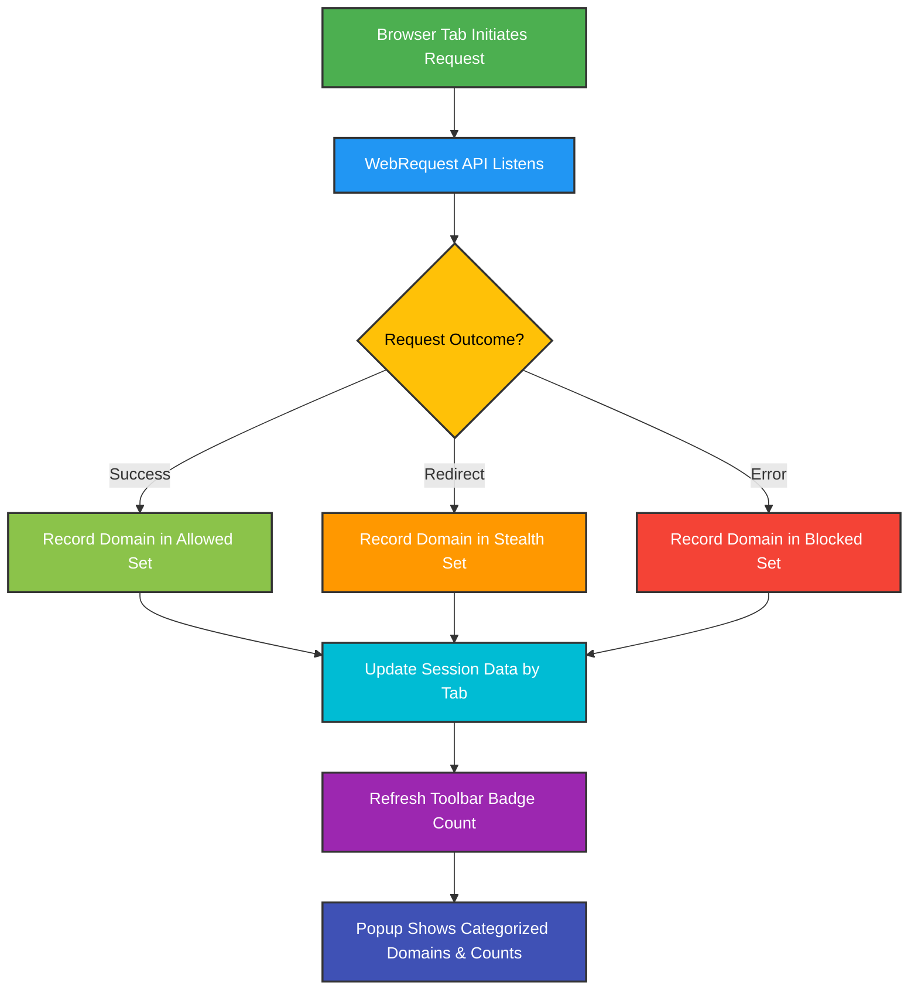

# Key Features at a Glance

Discover at a glance how uBO Scope empowers you with transparent, real-time insights into all network connections made by your browser, independent of any content blockers. Seamlessly integrated into your browsing experience, it monitors third-party requests, highlights distinct connection counts, and offers a detailed breakdown to clarify what’s truly happening behind the scenes.

---

## Immediate Visibility into Third-Party Network Requests

uBO Scope constantly monitors web pages as they load and run, capturing every attempted or successful connection to remote servers. Unlike traditional content blockers that focus solely on blocking content, uBO Scope reveals the full story — showing exactly which third-party servers your browser attempts to reach and whether those requests succeed, fail, or get stealth-blocked.

- **Live Tracking:** Observe network requests in real-time as sites interact with third-party servers.
- **Third-Party Focus:** Concentrate on distinct remote servers, helping you identify unnecessary or suspicious connections.

This empowers privacy-conscious users, developers, and maintainers of filter lists to make informed decisions based on accurate network activity, not just block counts.

## Toolbar Badge: Your at-a-Glance Indicator

The extension's toolbar icon dynamically displays a badge count representing **the number of distinct third-party domains with successful connections for the active browser tab**.

- **Clear, Immediate Insight:** The badge updates live as you browse, providing a concise snapshot of network exposure.
- **Actionable Metric:** A lower number means fewer third-party connections and typically better privacy.

Unlike other blockers that show block counts or complex stats, uBO Scope’s badge directly reflects the scope of third-party communication, making it easy to grasp risk levels instantly.

## Categorized Outcomes in a User-Friendly Popup

Clicking the toolbar icon opens a detailed popup UI that breaks down network connection outcomes into three intuitive categories:

- **Not Blocked (Allowed):** Domains successfully connected without interference.
- **Stealth-Blocked:** Domains suffering from stealth blocking, where requests are blocked subtly to avoid detection or webpage breakage.
- **Blocked:** Domains explicitly blocked by any content blocker or network filter.

Each category lists domains along with the number of requests made, providing a granular view of network activity for the current tab.

### Practical Example:

When visiting a complex website, the popup might show:

| Category        | Description                             | Example Use                          |
|-----------------|-------------------------------------|------------------------------------|
| Not Blocked     | Legitimate third-party services (like CDN or analytics) | Confirm low exposure to third-party trackers |
| Stealth-Blocked | Network requests blocked silently to maintain seamless browsing | Identify hidden blocking behaviors |
| Blocked         | Known trackers or ads that were explicitly blocked | Verify your filters are working as expected |

This detailed classification helps users understand *how* their content blockers interact with network requests beyond what basic stats reveal.

## Detached Evaluation Independent of Content Blockers

uBO Scope’s core strength lies in its unbiased observation of network requests, regardless of which content blocker or DNS filter you’re using.

- It leverages the browser's WebRequest API to listen to every network request outcome — success, failure, or redirection.
- This separation enables accurate counting and insight unaffected by the complexity or stealth mechanisms of blockers.

This approach ensures you get comprehensive, reliable information to assess your browsing privacy realistically.

## Summary of Key Features

- **Real-Time Monitoring:** Automatically captures network request outcomes as you browse
- **Distinct Third-Party Badge Count:** Easy-to-understand toolbar indicator of unique third-party connections
- **Outcome Breakdown in Popup UI:** Clear categorization of allowed, stealth-blocked, and blocked domains
- **Independent of Content Blockers:** Provides objective insights unaffected by blocker stealth or complexity
- **User-Friendly Interface:** Intuitive popup listing domains with request counts for effortless analysis

---

## Why This Matters to You

Imagine browsing a news site known for embedding dozens of third-party trackers. Without uBO Scope, you see your blocker’s block count but lack clarity if trackers still slip through stealthily or if the count accurately reflects exposure. With uBO Scope, you:

1. *Open the popup* and immediately know exactly which third-parties connected and how many times.
2. *Assess the badge count* to compare connection loads between sites instantly.
3. *Distinguish stealth blocking* from explicit blocking to understand content blocker behavior.

This knowledge enables confident browsing decisions, filter list tuning, and debunking myths around blocker effectiveness.

---

## Getting Started Preview

To experience these powerful features:

1. **Install uBO Scope** from your browser’s official extension store.
2. **Browse your favorite websites** and watch the badge dynamically update reflecting distinct remote server connections.
3. **Click the toolbar icon** to view detailed breakdowns of third-party domains and their connection outcomes.

<Tip>
For best results, ensure your browser supports the WebRequest API and grant uBO Scope necessary permissions during installation.
</Tip>

Next, explore the [Installation and Setup](https://github.com/gorhill/uBO-Scope#installation) guide and the [Understanding Connection and Domain Counts](../guides/core-workflows/understanding-domain-counts) page for deeper insight into interpreting these connection metrics.

---

## Visual User Flow: How uBO Scope Works

This flow emphasizes uBO Scope's seamless integration with browser APIs to deliver transparent network visibility.

---

Explore the complementary documentation to deepen your mastery:
- [What is uBO Scope?](../product-introduction/what-is-ubo-scope)
- [Product Value & Use Cases](../product-introduction/value-and-use-cases)
- [Core Concepts & Terminology](../architecture-and-concepts/core-concepts-terminology)

Unlock full visibility into your browser’s network activity today with uBO Scope’s streamlined, user-focused feature set.
