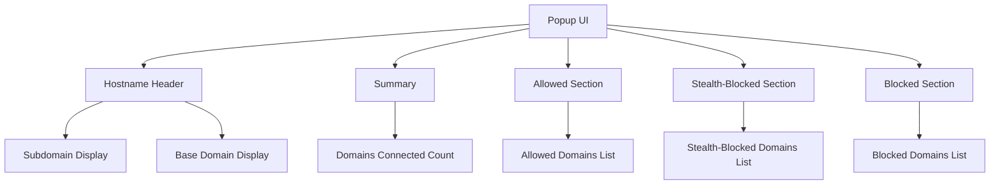

# Quick Tour: The Popup UI

Welcome to the uBO Scope popup UI, your real-time gateway to understanding every third-party server connection your browser tab attempts or establishes. This guide walks you through what you see immediately when you open the popup, helping you interpret domain connection statuses and overall network activity with clarity and confidence.

---

## At a Glance: What the Popup Shows You

When you click the uBO Scope toolbar icon, the popup displays a snapshot of the current active browser tab's remote server connections, organized for effortless comprehension.

### 1. Domain Connection Count Summary

At the top of the popup, right below the hostname header, you'll find the **domains connected** summary, indicating the total number of distinct third-party domains contacted during the current session of the active tab. This figure reflects the variety of remote servers involved—not just raw request counts—and is critical for quickly gauging the breadth of your network exposure.

### 2. Hostname Display

The header displays the domain of the active tab prominently, decoded from any punycode (internationalized domain names) to readable Unicode form. It splits the hostname and the registered domain, so you can differentiate the full hostname (e.g., `sub.example.com`) from the base domain (e.g., `example.com`).

### 3. Connection Outcome Sections

The core of the popup presents three categorized sections that group remote domains by their connection outcomes:

- **Not Blocked:** Domains where connections were allowed successfully.
- **Stealth-Blocked:** Domains where network requests were silently blocked without alerting the webpage.
- **Blocked:** Domains where network requests were explicitly blocked or failed.

Each section lists domains along with the number of connection attempts recorded.

### 4. Dynamic Domain Lists

Domains within each category are sorted alphabetically for easy scanning. Beside each domain is a badge showing the count of requests made to that domain during the current tab session. This helps you quickly identify where most network activity concentrates.

---

## How to Use the Popup Effectively

### Understanding Connection Status Categories

- **Not Blocked:** Indicates domains that your browser connected to without any blocking enforcement. This list reveals exactly which third-party servers your visited webpage is loading resources from.

- **Stealth-Blocked:** These are connections prevented silently by content blockers or the browser before the webpage could even notice. Tracking this lets you see what was blocked behind the scenes.

- **Blocked:** Requests that were actively blocked and resulted in errors or failures. This information helps verify that your blocking rules or extensions are functioning as expected.

### Interpreting Domain Counts

The count next to a domain represents how many network requests were attempted or realized for that domain. High counts might indicate heavy usage or potentially privacy-intrusive activity.

### Limitations and Data Scope

- The popup reflects data only for the **active tab** in your current browser window.
- Data updates after page loads or as connections complete.
- If no data is available yet (e.g., just opened the tab), the display will indicate "NO DATA".

---

## Practical Example

Imagine you open a news website. Clicking the uBO Scope icon reveals:

- The active tab's domain in the header.
- A summary count showing "domains connected: 12".
- Under **Not Blocked**, domains like `cdn.news.com` and `analytics.partner.net` appear alongside their request counts.
- **Stealth-Blocked** lists domains silently stopped by your blockers.
- **Blocked** shows domains explicitly blocked due to your rules or extensions.

This immediate visibility helps you understand the third-party landscape of the site and assess your privacy exposure.

---

## Tips for Success

- **Regularly check the popup during browsing** to monitor changes in network activity per tab.
- **Compare allowed and blocked domains** to evaluate if your content blockers are working as intended.
- **Use the domain counts to identify unexpected or excessive connections**, which may hint at trackers or unwanted content.

---

## Troubleshooting Common Issues

- If the popup shows "NO DATA" persistently:
  - Verify uBO Scope is installed and enabled.
  - Reload the active tab to trigger data collection.
  - Confirm that the site is using HTTP(S) URLs (necessary for network request visibility).

- If counts seem unexpectedly low:
  - Some requests might occur outside the browser context or beyond what the webRequest API can monitor.
  - Certain browser settings or other extensions could interfere with uBO Scope's data.

- The popup dynamically adapts to viewport size; if content looks clipped, resize the popup window for full visibility.

---

## What's Next?

Familiarizing yourself with the popup UI is the first step in mastering uBO Scope. To deepen your understanding:

- Explore [Interpreting the Badge Count and Popup Panel](../guides/core-workflows/interpreting-badge-popup) for detailed insights into the badge and popup data.
- Learn more about [How uBO Scope Reveals Connections](../overview/core-concepts-architecture/network-visibility-model) to understand the network monitoring model behind the scenes.
- For practical setup guidance, refer to [First Launch and Verifying Installation](../../getting-started/setup-overview/first-launch).

Unlock the full potential of uBO Scope by integrating this real-time network transparency into your daily browsing habits.

---

## Visual Reference of Popup Structure

This breakdown helps you visualize how the popup organizes information for quick user comprehension.
