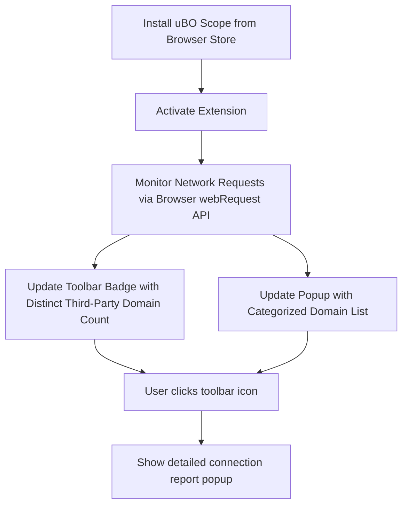

# Quick Install & Explore

Discovering the full extent of your browser's remote connections should be straightforward and immediate. This guide helps you swiftly install uBO Scope from official browser extension stores and guides you through viewing your very first domain connection report. Along the way, you’ll understand what to expect in the popup and badge displays right after installation, setting you up for a transparent browsing experience.

---

## Installing uBO Scope

To begin uncovering the network activity in your browser, start by installing uBO Scope from your browser’s official extension store:

- **Chrome:** Install from the [Chrome Web Store](https://chrome.google.com/webstore/detail/ubo-scope/bbdpgcaljkaaigfcomhidmneffjjjfgp)
- **Firefox:** Install from [Firefox Add-ons](https://addons.mozilla.org/firefox/addon/ubo-scope/)

> uBO Scope is designed to work seamlessly across supported browsers, ensuring you get consistent insights regardless of platform.

<Info>
Always install from official stores to ensure you receive the authentic, up-to-date extension.
</Info>

## What Happens After Installation?

Once installed, uBO Scope immediately begins monitoring your browser’s network connections. You’ll notice two key interface elements:

- **Toolbar Badge**: A small number displayed on the uBO Scope icon indicating the count of distinct third-party domains your browser successfully connected to on the current tab.
- **Popup Window**: Clicking the toolbar icon opens a detailed report listing third-party domains categorized by their connection outcome.

### Understanding the Toolbar Badge

The badge number reflects how many unique third-party remote servers were connected to from the active tab.

- **Lower numbers indicate fewer third-party connections**, which typically means better privacy and less tracking.
- **Higher numbers signal more third-party activity**. Not all third parties are bad (e.g., legitimate Content Delivery Networks), but large counts merit attention.

### The Popup Report

The popup divides domains into three categories, helping you quickly assess connection outcomes:

- **Not blocked (Allowed):** Domains connected without interference.
- **Stealth-blocked:** Domains where connections were attempted but stealthily blocked.
- **Blocked:** Domains successfully blocked from connecting.

Each domain entry includes a count of connection attempts, giving you insight into the intensity of interaction.

## Viewing Your First Domain Connection Report

After installation, navigate to any website and follow these steps:

1. **Open a New Tab and Visit a Website:** Navigate to your favorite site or one you want to analyze.
2. **Click the uBO Scope Icon:** The toolbar badge will show the number of connected third-party domains.
3. **Open the Popup Window:** Click the icon to view detailed categories of connections.

The popup will display the hostname of the current tab at the top and list all detected domains with their respective counts under appropriate categories.

The domain names are presented in a user-friendly format that supports internationalized domain names, ensuring clarity even with non-ASCII domains.

## What to Expect in the Popup and Badge

- **Dynamic Updates:** As you browse, the badge and popup update to reflect the active tab’s network activity.
- **Clear Categorization:** Domains are sorted by connection outcome, allowing quick identification of potentially unwanted connections.
- **Domain Counts:** Precise connection counts help you understand the volume of third-party interactions.

## Practical Tips for Early Exploration

- Start with websites you frequently visit to understand their third-party ecosystem.
- Use the badge counts as a quick privacy health indicator for each tab.
- Regularly open the popup to explore detailed connection information and spot unexpected domains.

## Common Pitfalls & How to Avoid Them

<Warning>
- If you see no data in the popup or badge remains empty, ensure you have recently loaded or reloaded the tab after installing uBO Scope.
- The tool relies on browser `webRequest` APIs, so network activity outside the browser or private browsing modes might not be tracked.
</Warning>

<Check>
- Confirm you have installed the extension with active permissions.
- Reload your tabs to allow uBO Scope to begin capturing network data.
- Verify your browser version meets the minimum requirements.
</Check>

## Next Steps

With uBO Scope installed and your first domain connection report explored, deepen your understanding:

- Visit **[Understanding the Badge & Popup](../setup-usage/interpreting-results.md)** to learn how to fully interpret the information you see.
- Check out **[Prerequisites & System Requirements](../installation-quickstart/prerequisites-system-requirements.md)** if you face issues with data not showing.
- Refer to **[Installing uBO Scope](../installation-quickstart/installation-multiplatform.md)** for detailed installation guides across different platforms.

---

## Summary

By following this guide, you gain fast access to real-time insights into your browser’s connection footprint. uBO Scope’s easy install process combined with an informative badge and popup lets you transparently monitor third-party domains as you browse.

---

## Appendix: Quick Example Walkthrough

Suppose you visit `example.com`:

1. The toolbar badge shows "3", indicating three unique third-party domains are connected.
2. Clicking the icon reveals:
   - Allowed domains: `cdn.example.net` (5 connections), `analytics.example.org` (2 connections)
   - Stealth-blocked domains: none
   - Blocked domains: `ad.example.com` (4 connections)

This information helps you decide which connections are expected and which might warrant further scrutiny.

---

For full source code and further insights, visit the [official uBO Scope GitHub repository](https://github.com/gorhill/uBO-Scope).

---

# Visual Overview: How uBO Scope Works After Installation

---

This simple flow encapsulates user interaction moments after installation, highlighting the instant value uBO Scope delivers by revealing real-time network connection transparency with minimal setup.

