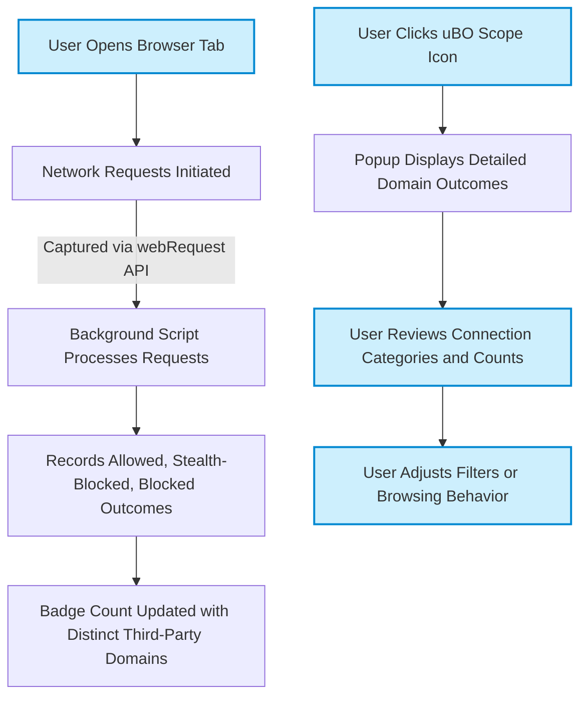

# Main Features at a Glance

Discover the core strengths of uBO Scope — a browser extension designed to provide unparalleled transparency into every network connection your web browser makes. This page highlights uBO Scope's standout features, focusing on how they empower you to understand, monitor, and trust your browsing experience with real-time insights.

---

## Real-Time Badge Counts: Instant Visibility of Third-Party Connections

At a glance, uBO Scope keeps you informed through its toolbar badge, which displays the current number of unique third-party remote servers that your browser has connected to during a browsing session.

- **Why It Matters:** This count enables you to immediately assess how many distinct external servers your active tab communicates with, an essential metric when evaluating your online privacy and security.
- **Dynamic Updates:** The badge updates live as network requests succeed or fail, reflecting the most current state without any manual refresh.
- **Low is Better:** Remember, a lower badge count indicates fewer third-party connections, often correlating with reduced tracking and improved privacy.

## Granular Popup UI: Deep Dive Into Each Connection Outcome

Clicking the uBO Scope icon opens a detailed popup panel that breaks down your third-party connections into three distinct outcome categories. This classification simplifies understanding what happens to each connection:

- **Not Blocked:** Domains from which network requests were allowed and successfully completed.
- **Stealth-Blocked:** Domains whose requests were redirected stealthily by content blockers, unseen by the requesting webpage.
- **Blocked:** Domains whose connection attempts were explicitly blocked or failed (e.g., due to content blockers or network errors).

### What You See in the Popup

- **Domain Lists:** Each outcome section lists the connected domains alongside the number of requests associated with each.
- **Counts & Totals:** A summary section tallies the total distinct domains connected, offering a clear snapshot.

### Practical Example

Imagine visiting a news website:

- The popup immediately shows which advertising networks were blocked,
- Which content delivery networks (CDNs) were allowed,
- And any stealth-blocked trackers that operated silently.

This insight equips you to evaluate the real-world effectiveness of your content blockers and privacy tools.

## Comprehensive Reporting Regardless of Other Content Blockers

uBO Scope tracks the fate of all network requests captured by the browser's `webRequest` API. This means:

- It reports **all** attempted connections, whether blocked, allowed, or redirected stealthily.
- Your existing content blockers or DNS-level blocking solutions cannot hide connection outcomes from uBO Scope.
- It provides a truth-teller perspective, even when other tools obscure details.

## How These Features Fit Your Workflow

Whether you are a privacy enthusiast, filter list maintainer, or simply curious about the web’s behind-the-scenes activity, uBO Scope's main features support your goals by:

1. **Immediate awareness:** The badge counts alert you instantly if a webpage connects to more third parties than expected.
2. **Informed analysis:** The popup UI enables step-by-step examination of connections per category, supporting research or troubleshooting.
3. **Validation of blockers:** Accurately seeing which domains are blocked or allowed helps you fine-tune blockers or debunk myths about ad blockers’ performance.

---

## Practical Tips & Best Practices

- **Monitor badge counts regularly** while browsing to catch unexpected third-party connections early.
- **Use the detailed popup** to verify if stealth blocking is occurring as expected without webpage detection.
- **Cross-reference with content blockers** to understand discrepancies between blocking counts and actual network connections.
- **Reload tabs after configuration changes** to see fresh connection data reflected in the badge and popup.

## Troubleshooting Common Scenarios

<AccordionGroup title="Troubleshooting Connection Reporting Issues">
<Accordion title="Badge Not Updating">
If you notice the badge count does not update:

- Ensure uBO Scope has required permissions and is active.
- Refresh the active tab to trigger new network requests.
- Check browser’s `webRequest` API is enabling event tracking.
</Accordion>
<Accordion title="Unexpected Domains in Popup Results">
- Confirm your other content blockers or DNS filters are active.
- Some domains are essential CDNs and expected to appear under 'Not Blocked.'
- Stealth-blocked domains might indicate invisible redirections or tracker circumventions.
</Accordion>
</AccordionGroup>

---

## Summary

uBO Scope’s main features strategically expose the hidden world of network connections your browser makes, providing:

- **Real-time badge counts** that quantify distinct remote servers contacted.
- **A comprehensive popup UI** categorizing connection outcomes into allowed, stealth-blocked, and blocked.
- **Guaranteed visibility** of connection outcomes regardless of other blocking tools.

Together, these capabilities empower you to monitor privacy in motion and validate your content blocking effectiveness with real data—not assumptions.

---

_For detailed guidance on getting started and interpreting these features, see the [Your First Run](/getting-started/first-use-validation/your-first-run) and [Reading the Popup: Domains and Outcome Types](/guides/getting-started/first-look-popup) pages._

---

## References

- [What is uBO Scope?](./introduction-value/what-is-ubo-scope) — Introduction and value proposition
- [Who Should Use uBO Scope?](./introduction-value/target-audience-use-cases) — Identifying ideal users and use cases
- [Key Concepts & Terminology](./core-concepts-architecture/key-concepts-terminology) — Understanding core definitions
- [System Architecture Overview](./core-concepts-architecture/system-architecture) — How uBO Scope operates internally

---

## Example Workflow: Seeing One Tab’s Connections

1. **Open a tab** with a website you want to inspect.
2. **Look at the uBO Scope toolbar badge:** The number shows how many distinct third-party domains the tab has connected to.
3. **Click the icon:** The popup shows categorized connections under "not blocked," "stealth-blocked," and "blocked."
4. **Examine counts per domain:** Identify trackers or CDNs; verify your blockers’ actions.
5. **Use insights to adjust filters or browsing behavior.**

---

<Info>
For advanced users: uBO Scope continuously monitors and updates connection states in the background, ensuring your badge and popup reflect live, accurate data synchronized with the browser’s network activity.
</Info>

---

### Visualization of Main Feature Flow

