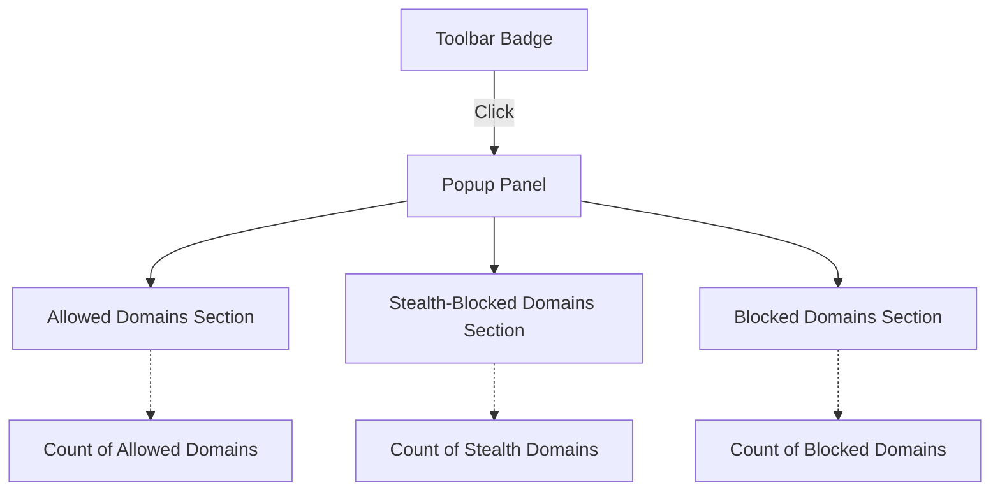

# Features at a Glance

## Unlock Complete Transparency Into Your Network Connections

uBO Scope is designed to bring you full visibility of all network connections initiated by your active browser tab. Whether a connection was allowed, blocked, or concealed through stealth blocking, uBO Scope reveals this clearly in its intuitive popup interface and toolbar badges — no complex setup needed.

### What You See — and Why It Matters

- **Full Tracking of Network Requests:** Every network connection made by the active webpage, successful or otherwise, is tracked.
- **Clear Outcome Categorization:** Domains are distinguished by outcome — _allowed_, _blocked_, or _stealth-blocked_ — so you immediately understand what your browser is connecting to.
- **Informative Badge Counts:** The toolbar badge dynamically displays the number of distinct third-party domains successfully connected, encouraging you to keep this count low for better privacy.
- **Content Blocker Agnostic:** Works independently of any installed content blockers, reflecting true network activity even when other layers of blocking are present.
- **Cross-Browser Compatibility:** Seamlessly supports Chromium-based browsers, Firefox, and Safari, offering consistent insights no matter your platform.

## How Features Surface in the User Interface

### The Popup Panel

When you click the uBO Scope icon, a panel opens, breaking down network connections into three distinct sections:

- **Not Blocked (Allowed):** Shows domains your browser successfully connected to, along with badge counts for how many times connections occurred.
- **Stealth-Blocked:** Lists domains where connections were stealthily redirected or otherwise silently blocked, helping you detect hidden filtering.
- **Blocked:** Displays hosts where connections failed due to explicit blocking or errors.

Each section lists domains neatly with real counts, enabling granular understanding and quick assessments.

### Toolbar Icon Badge

The numeric badge on the toolbar icon is a powerful at-a-glance summary:

- Indicates the _number of distinct third-party remote domains_ your browser connected to for the current tab.
- A lower badge count means fewer third-party connections, a key indicator of improved privacy and reduced third-party tracking.
- This count reflects actual network traffic regardless of other content blockers' block counts or configurations.

## Real-World Scenario: Assessing a News Website

Imagine visiting a major news outlet. Without uBO Scope, you only see the page. With uBO Scope open:

- The popup shows **allowed** third-party domains like content delivery networks (CDNs) that deliver images and scripts.
- You notice a few stealth-blocked domains, indicating some trackers were silently blocked.
- Blocked domains confirm that certain ads or trackers were explicitly prevented from loading.
- The toolbar badge number gives you a quick sense of how many distinct third parties were involved in the page load.

This transparency empowers you to validate if your content blocker setup is effectively limiting unwanted connections.

## Practical Tips to Maximize Value

- **Regularly check the popup after loading important sites** to understand all third-party activity.
- **Monitor your badge counts over time** — unusually high counts may signal additional tracking or changed site behavior.
- **Use stealth-blocked listings** to uncover trackers that operate beneath conventional blocking layers.
- **Cross-verify with installed content blockers** to debunk misleading block count claims and understand true network exposure.

## Why uBO Scope's Features Matter

- It is the **only reliable way to see every network connection outcome** your browser processes, bypassing guesswork around content blockers.
- By highlighting stealth-blocked domains, it **exposes hidden filtering mechanics** that typical tools miss.
- The **badge count’s focus on distinct remote domains** is a meaningful privacy metric far superior to opaque block counts.
- Its **independent operation across browsers** lets you maintain consistent network awareness regardless of platform.

## Exploring the Popup UI: Structure and Flow

The popup panel organizes data intuitively:

## Getting Started Preview

To explore these features yourself:

1. **Install uBO Scope** from your browser's official extension store (Chrome Web Store, Firefox Add-ons, Safari Gallery).
2. **Click the uBO Scope icon** in your toolbar after loading any webpage.
3. **Review the popup panel** to see allowed, stealth-blocked, and blocked domains per tab.
4. **Watch the badge count** as sites load to monitor your distinct third-party connections.

For detailed installation and quickstart instructions, refer to [Quickstart: Your First Minute with uBO Scope](../feature-summary/quickstart-experience).

---

## Troubleshooting

If the popup shows 'NO DATA' or a zero count unexpectedly:

- Ensure you have uBO Scope properly installed and enabled.
- Check that your browser supports the `webRequest` API; some private browsing modes or restrictive settings may block this access.
- Reload the page and open the popup again to refresh connection data.

For further assistance, consult [Troubleshooting Installation & Setup](../../getting-started/first-use-and-validation/troubleshooting-setup).

---

## Summary

"Features at a Glance" captures the core capabilities that empower uBO Scope users to achieve full transparency into network connections. Understanding these features is your first step to leveraging uBO Scope for privacy insights, content blocker evaluation, and network monitoring across browsers.

---

_Last updated: June 2024_

---

Documentation source: <a href="https://github.com/gorhill/uBO-Scope/blob/main/README.md">uBO Scope README</a>, <a href="https://github.com/gorhill/uBO-Scope/blob/main/popup.html">popup.html</a>, <a href="https://github.com/gorhill/uBO-Scope/blob/main/js/popup.js">popup.js</a>, <a href="https://github.com/gorhill/uBO-Scope/blob/main/js/background.js">background.js</a>

