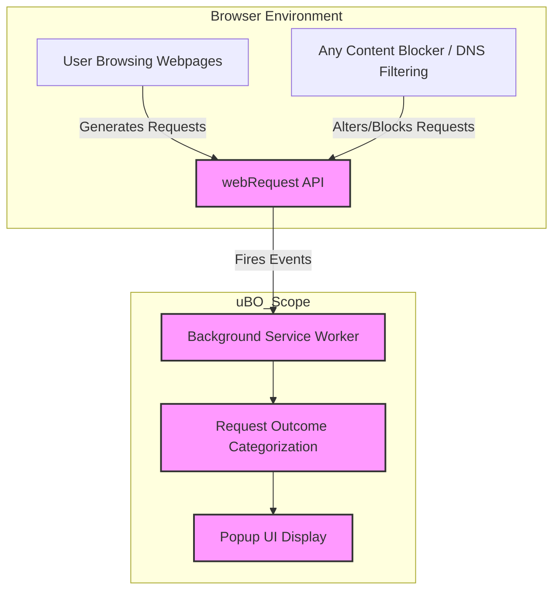

# Integration & Extensibility

## Unlocking Seamless Analytics Across Browsers and Blockers

uBO Scope’s analytics are designed with future-proof independence, thriving beyond any single content blocker or DNS filtering solution. This page explains how the extension integrates effortlessly into a wide range of browsing environments while delivering consistent, transparent network request insights.

### Why Integration Matters

When measuring network connections, limiting yourself to specific blockers or DNS configurations restricts your visibility. uBO Scope breaks free from those constraints by leveraging the browser's native webRequest API to track all network activity — regardless of which content blocker is running or even if none is active.

This architecture means whether you use uBlock Origin, another blocker, or none at all, uBO Scope remains an unbiased observer. It provides a clear window into every request, allowed or blocked, without depending on any particular filter or DNS interception mechanism.

---

## What Is This Page About?

This page details uBO Scope’s integration strategy that ensures broad compatibility and reliability. It explains why uBO Scope does not tie itself to any content blocker or DNS filtering specifics and focuses on how it works smoothly across major browsers using the webRequest API.

You will learn:

- How uBO Scope implements browser-agnostic monitoring
- Why the webRequest API is critical to its function
- Which browsers and environments are supported out of the box

This is essential reading for users interested in understanding the extensibility and technical compatibility that empower uBO Scope’s analytics.

---

## Integration Strategy and Browser Compatibility

### Agnostic to Content Blockers and DNS Solutions

uBO Scope operates independently from any content blocker, such as uBlock Origin or others, and also does not depend on DNS-based blocking. This means it can report on all network requests regardless of what mechanism or combination of mechanisms a browser or user employs to block content.

This approach guarantees to privacy-conscious users and filter list maintainers that the analytics they see in uBO Scope accurately reflect the true outcome of network requests as recognized by the browser.

### Reliance on the webRequest API

Central to this strategy is the use of the standardized `webRequest` API, a browser-provided interface that exposes detailed information about network requests initiated by webpages.

- **Consistent Data Source:** The `webRequest` API unifies data capture from network activity across browsers.
- **Outcome Visibility:** It reports request outcomes such as success, redirection, or errors, enabling uBO Scope to categorize connections as allowed, stealth blocked, or fully blocked.
- **Wide Browser Support:** The API is supported by major browsers including Chrome, Firefox, Edge, and Safari (with manifest permissions).

### Supported Browsers and Permissions

uBO Scope ships with manifest files tailored for multiple browsers, reflecting the supported platforms and their permissions requirements:

| Browser   | Minimal Version | Permissions                      | Host Permissions                         |
|-----------|-----------------|---------------------------------|------------------------------------------|
| Chromium  | 122.0+          | `activeTab`, `storage`, `webRequest` | `http://*/*`, `https://*/*`, `ws://*/*`, `wss://*/*` |
| Firefox   | 128.0+          | `activeTab`, `storage`, `webRequest` | Same as Chromium                        |
| Safari    | 18.5+           | `activeTab`, `storage`, `webRequest` | `http://*/*`, `https://*/*`             |

This broad compatibility means users across all mainstream browsers can seamlessly install and use uBO Scope without additional configuration or dependency.

---

## How It Works in Practice

### Network Request Monitoring Flow

uBO Scope registers listeners for network activity events exposed by the `webRequest` API:

- `onBeforeRedirect`
- `onErrorOccurred`
- `onResponseStarted`

Each event carries rich metadata about the request outcome and destination, allowing uBO Scope to log whether the request was:

- **Allowed:** A successful network request
- **Blocked:** A request that failed
- **Stealth-blocked:** A request redirected away while hidden from normal observations

This comprehensive logging is aggregated per active tab, delivering real-time analytics that can be explored interactively in the popup interface.

### Independence from Content Blocker Internals

Because uBO Scope employs these generic webRequest events, it does not rely on or track the inner workings of any content blocker. This abstraction means it:

- Works with any or no content blocker installed
- Observes DNS-based blocking indirectly through the resulting network errors
- Provides an unbiased, holistic view of network behavior

---

## Real-World Example: Cross-Browser Integration

Consider a user browsing with Chrome and running a custom DNS-based ad blocker alongside no extension-based content blockers. uBO Scope will still detect and log all outcomes using webRequest, including network failures caused by the DNS filtering.

Switching to Firefox with uBlock Origin active, uBO Scope continues to function identically, capturing requests filtered by uBlock Origin or allowed through.

This consistent behavior across environments makes uBO Scope a uniquely valuable tool for analytics, research, and filter list validation.

---

## Tips for Extending and Customizing uBO Scope

While uBO Scope is optimized for broad compatibility and robustness, its modular design enables advanced users and developers to:

- Adapt or build upon the existing webRequest listeners for extended data capture
- Customize manifest files to tailor permissions or support emerging browsers
- Utilize the open-source codebase to integrate with other privacy or monitoring tools

These extensibility points empower filter list maintainers and privacy researchers to leverage uBO Scope as a foundation for deeper network analysis.

---

## Troubleshooting Integration Issues

- **Missing Data or Incomplete Analytics:** Ensure the browser version is supported (Chromium 122+, Firefox 128+, Safari 18.5+).
- **Permissions Denied:** Verify your browser’s extension settings grant the listed permissions (especially `webRequest` and `host_permissions`).
- **Blocked APIs on Browsers:** The extension depends on `webRequest`; some browsers or future versions may limit or modify this API’s availability.

If network requests do not appear in uBO Scope, confirm no restrictive policies block `webRequest` event listeners and that uBO Scope is properly installed and enabled.

---

## Summary

uBO Scope's analytics unify network request observations across browsers and content blockers by relying on the standardized `webRequest` API. Its independent, permission-aware design ensures transparency and reliability regardless of blocking method or platform. This architecture empowers users to confidently interpret connection data and supports filter maintainers with accurate, unfiltered insights.

---

## Additional Resources

- [How uBO Scope Works (System Architecture)](/overview/architecture-concepts/system-architecture) — To understand the full data flow and processing logic.
- [Supported Browsers & Requirements](/getting-started/setup-installation/prerequisites-browsers) — For environment setup and compatibility details.
- [Quick Feature Overview](/overview/feature-usecases/feature-overview) — To see how integration benefits translate into user-facing features.
- [GitHub Repository](https://github.com/gorhill/uBO-Scope) — Open-source code to explore or contribute.

---

## Code Reference Example: Manifest Permissions Across Browsers

Below is an illustration of the permissions granted in uBO Scope’s manifests, enabling it to tap into network request streams required for analytics:

```json
{
  "permissions": ["activeTab", "storage", "webRequest"],
  "host_permissions": [
    "https://*/*",
    "http://*/*",
    "wss://*/*",
    "ws://*/*"
  ]
}
```

This permission set combined with the background script listeners ensures comprehensive coverage of HTTP and WebSocket traffic.

---

## Mermaid Diagram: Integration Flow Overview



This diagram highlights that uBO Scope listens at the webRequest API level, independent of any blocking logic, feeding processed outcomes into the user-facing popup interface.

---

## Next Steps

Ready to see uBO Scope in action? Proceed to explore the [Quick Feature Overview](/overview/feature-usecases/feature-overview) to understand how these integration benefits translate to practical network connection analytics. For setup details, visit [Supported Browsers & Requirements](/getting-started/setup-installation/prerequisites-browsers) to confirm your environment compatibility.

---

<u><i>End of Integration & Extensibility Documentation</i></u>
