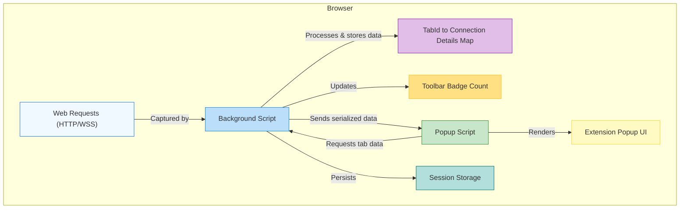

# How uBO Scope Works (with Architecture Diagram)

Experience a clear, step-by-step walkthrough of how uBO Scope monitors and reports network connections in your browser. This documentation explains the internal flow from intercepting web requests to updating the user interface, and clarifies the roles played by background and popup scripts alongside data handling and integration with browser APIs.

---

## Overview: Understanding uBO Scope’s Internal Workflow

uBO Scope operates as a browser extension designed to transparently observe and report all network connections initiated by webpages — whether these connections succeed, are blocked, or are stealth-blocked by content blockers or DNS filtering. 

This page focuses on dissecting the internal flow sequence that makes this possible, making it easier for users and maintainers to grasp how uBO Scope collects data, maintains state, and interacts dynamically with the browser environment.

## Core Workflow: From Network Request to UI Display

The primary goal of uBO Scope's internal flow is to efficiently record network requests and accurately report the distinct third-party domains connected by each tab, updating the UI badge and popup information in real-time.

Here is how the flow unfolds for every web request:

1. **Intercept Web Requests:**
   - The **background script** listens to network events via the browser’s `webRequest` API.
   - These events include:
     - Redirects
     - Response starts (successful requests)
     - Errors (failed or blocked requests)

2. **Batch and Queue Processing:**
   - Requests are queued momentarily to batch updates for performance reasons.
   - A timer ensures these queued requests are processed at regular intervals (every 1 second).

3. **Categorize Connection Outcomes:**
   - Each request is analyzed to record its outcome into one of three categories:
     - **Allowed:** Successful connections.
     - **Stealth-blocked:** Redirects indicating silent or hidden blocking.
     - **Blocked:** Direct errors or failures.

4. **Aggregate Data per Tab:**
   - The background script maintains a detailed map of domains and hostnames per browser tab.
   - It tracks counts of distinct domains connected, crucial for the badge count and detailed popup reporting.
   - Special attention is given to the main frame navigation to reset data and track the top-level domain.

5. **Update UI Components:**
   - The badge count on the extension icon updates to show the number of distinct third-party domains allowed.
   - The **popup script** fetches detailed data for the active tab on popup open, displaying categorized connection lists and counts.

6. **Persist Session Data:**
   - State data is serialized and persisted in browser session storage to survive browser or extension reloads.

## Roles of Background and Popup Scripts

- **Background Script:**
  - Acts as the core data collector and session manager.
  - Listens to and queues network events.
  - Processes connection outcomes and updates data structures.
  - Updates the badge on tabs dynamically.
  - Handles persistence of session data.

- **Popup Script:**
  - Triggered when a user clicks the extension icon.
  - Retrieves current tab's detailed data from the background.
  - Renders categorized lists of connected domains with counts.
  - Translates domain names to user-friendly unicode format.

## Browser Integration Points

- Uses the browser’s `webRequest` API for real-time monitoring of HTTP(S) and WebSocket requests.
- Utilizes `browser.action` (or equivalent) API to set badge text reflecting domain count.
- Communicates between background and popup scripts using `runtime.sendMessage` messaging.
- Stores session data using the browser's local/session storage APIs.

## Practical Example: What Happens When You Load a Webpage

- You navigate to `https://example.com`.
- Background script intercepts all associated network requests:
  - The main frame request is identified; previous tab data is cleared.
  - For each third-party request, domain and hostname data is updated with success, redirect, or error status.
  - After processing, the extension badge updates showing distinct domains connected.
- When clicking the extension icon:
  - Popup script requests the background script for domain details.
  - The popup displays clear, grouped lists of allowed, stealth-blocked, and blocked domains.

## Performance and Data Handling Tips

- Network requests are batched to minimize UI thrashing and improve performance.
- Domain counting uses Maps for quick lookups and aggregation per tab.
- Domain and hostname extraction uses a public suffix list for accuracy.
- Unicode domain rendering ensures internationalized domain names appear user-friendly.

## Troubleshooting Common Flow Scenarios

- **Badge Not Updating:** Ensure network events are firing and session data is intact. Reload the extension if necessary.
- **Popup Shows No Data:** Verify active tab has recorded connection data; refresh tab or navigate to a new site.
- **Persistent Data Loss:** Check browser permission for storage and session persistence.

---

## Simple Architecture Diagram

---

## Next Steps

Explore how uBO Scope fits into your privacy toolkit by visiting [What is uBO Scope?](/overview/intro-core/product-value-prop) for foundational concepts and [Quick Feature Overview](/overview/features-arch/feature-summary) for a benefits-driven feature summary.

Dive into installation and first-use guides to get uBO Scope up and running with ease.

---

_Last updated on the main branch._

---