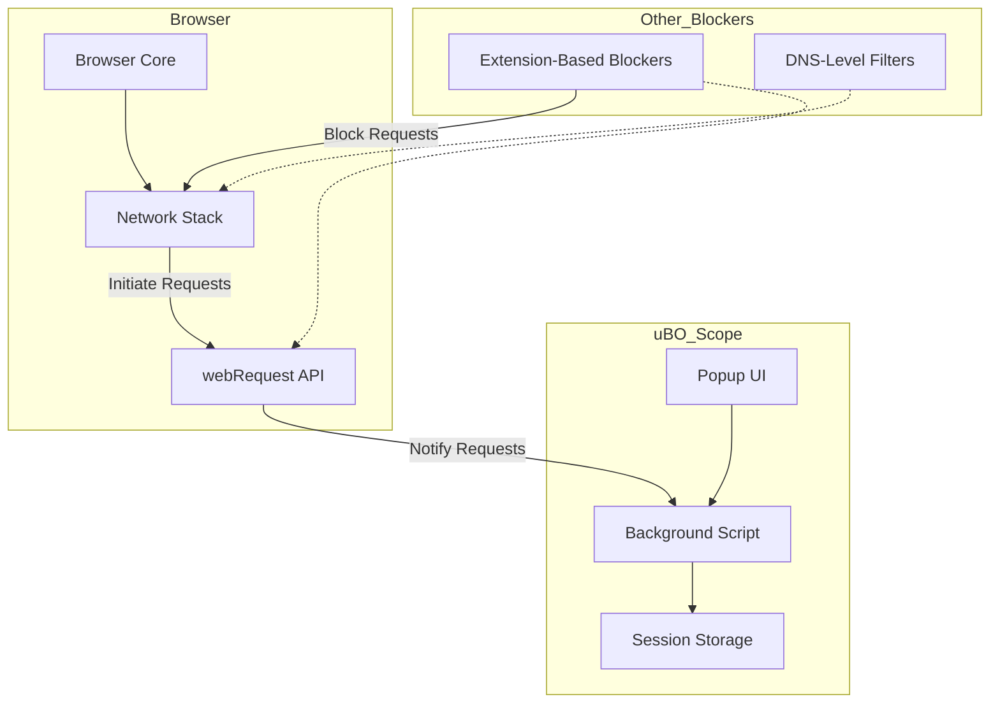

# Integration & Compatibility

Discover how uBO Scope works seamlessly alongside other privacy-focused tools and content blockers, enabling you to gain clear, actionable insights without interference or confusion. This page unveils the interplay between uBO Scope and other blockers or DNS filters, explains which network requests are monitored, and illuminates technical limitations affecting data reporting.

---

## Understanding uBO Scope's Role in Your Privacy Toolbox

uBO Scope is designed to be a companion tool, not a replacement or competitor, to your existing content blockers or privacy extensions. Its unique value lies in revealing the real network connections your browser attempts or blocks, regardless of what other tools may be active.

- **Works Side-by-Side:** uBO Scope monitors network activity even when other blockers are filtering content.
- **Non-Interfering:** It does not block or alter connections itself, ensuring that it does not conflict with your configured blocking setups.
- **Reliable Reporting:** Uses browser `webRequest` APIs to monitor network requests as reported by the browser, reflecting the actual state your other blockers create.

## What Types of Network Requests Does uBO Scope Report?

uBO Scope uses the browser's `webRequest` API listeners to track network activity. Understanding which requests can be reported and which cannot clarifies what you see in the extension's interface and badge.

- **Reported Requests:**
  - HTTP(S) requests initiated by webpages (e.g., images, scripts, XHR, WebSocket connections) captured by `webRequest` API.
  - Requests that result in either being allowed, blocked by content blockers, or stealth-blocked.

- **Non-Reported Requests:**
  - Requests initiated outside the browser's network stack (e.g., DNS filtering at the OS or network level) that the browser’s `webRequest` API does not see.
  - Requests made by browser internals or extensions that bypass the standard webRequest listeners.

## Impact of Content Blockers and DNS-Level Filters on uBO Scope Data

Since uBO Scope observes network requests through the browser’s reported channels, the presence of other blockers affects what it sees but not how it operates.

| Type of Blocking       | How It Affects uBO Scope                            | What You See in uBO Scope                                         |
|-----------------------|----------------------------------------------------|------------------------------------------------------------------|
| Extension-Based Blockers  | Requests blocked by other extensions are reported as _blocked_ or _stealth-blocked_ if the blocking is stealthy.  | These requests appear in the **blocked** or **stealth-blocked** sections, showing you what your other blockers are handling. |
| DNS-Level Filtering    | Requests blocked by DNS filtering may not show up in `webRequest` because the browser never issues the request. | Such blocked requests do not appear in uBO Scope, which means some request outcomes are technically invisible to it.       |

## Why This Matters: Avoid Common Misinterpretations

Because uBO Scope relies on the browser’s network reporting via `webRequest`, your extension ecosystem’s complexity affects interpretation:

- A **lower badge count** indicates fewer distinct remote servers were connected to successfully.
- A **higher block count** in another blocker may correlate with more network requests attempting to reach distinct servers, so comparing badge or block counts directly between tools can mislead.
- DNS-level blocking efficiency will reduce visible connections uBO Scope can detect, but this does not mean those connections were allowed by uBO Scope – they simply never occurred at the browser level.

<Tip>
Always interpret the uBO Scope data as a reflection of the **browser-level network activity observed** by the extension, which integrates seamlessly but does not replace other privacy and blocking mechanisms.
</Tip>

## Real-World User Workflow

Imagine you use uBO Scope alongside your favorite content blocker and a DNS filter configured on your network:

1. You browse to a website.
2. The DNS filter blocks some trackers at the network level—these never show up in the browser's network logs.
3. Your content blocker further blocks scripts and resources stealthily detected and filtered by itself.
4. uBO Scope listens to the browser’s network events, reporting all connections allowed or blocked at this stage.
5. You open uBO Scope’s popup to see the categorized connection outcomes:
   - Distinct domains that were allowed.
   - Domains blocked stealthily by your blocker.
   - Domains explicitly reported as blocked.
6. You recognize differences between uBO Scope's reporting and other tools' stats, and understand these arise from the scope and level at which blocking happens.

## Best Practices for Using uBO Scope with Other Privacy Tools

- Use uBO Scope as a **transparent monitor** of network activity in your browser rather than a separate blocking solution.
- Avoid relying solely on badge counts to judge the effectiveness of other blockers.
- Be aware that network-level tools complement uBO Scope by blocking before the browser even issues requests.
- Combine insights from uBO Scope with your content blockers' dashboards or logs for a holistic picture.

## Common Pitfalls & Troubleshooting

<AccordionGroup title="Common Questions about Integration & Compatibility">
<Accordion title="Why don’t some blocked connections appear in uBO Scope?">
Requests blocked at the DNS or network level are not visible to the browser’s `webRequest` API and thus do not show in uBO Scope. This is expected behavior.
</Accordion>
<Accordion title="Can uBO Scope interfere with my current content blocker?">
No—uBO Scope is purely observational and does not block or alter network requests. It coexists peacefully with all other extensions.
</Accordion>
<Accordion title="What does stealth-blocked mean?">
Stealth blocking is when a request is blocked silently by other blockers without triggering a visible failure or error. uBO Scope tracks these to give you visibility.
</Accordion>
<Accordion title="Why does the badge count differ from other extension’s block counts?">
Badge count in uBO Scope reflects the number of distinct allowed connections made, which may differ from other blockers that report counts of blocked requests or all attempted requests.
</Accordion>
</AccordionGroup>

## Technical Snapshot: How uBO Scope Collects Data Alongside Other Blockers

## Next Steps

- To explore more about how uBO Scope presents data, see the [Quick Feature Tour](../features-at-a-glance/quick-feature-tour).
- Learn foundational concepts and terminology in [Core Concepts & Terminology](../concepts-architecture/core-concepts-and-terminology).
- For installation guidance and first use, visit [Getting Started](../../getting-started/installation-setup/prerequisites).

---

Understanding uBO Scope’s integration with other tools empowers you to confidently use its insights alongside your preferred blockers, unlocking a clearer picture of your browser’s network activity and enhancing your privacy strategy.
