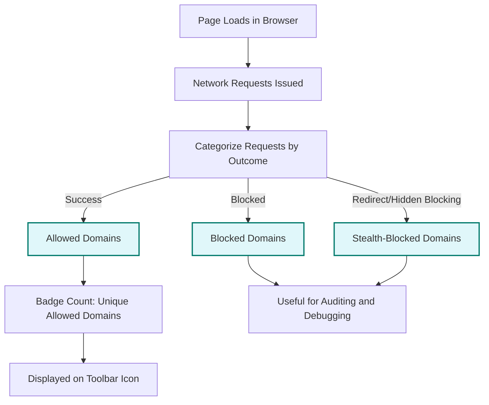

# Core Concepts & Terminology

Understanding the core concepts behind uBO Scope is essential to fully grasp how it reveals third-party network connections, distinguishes between allowed, blocked, and stealth-blocked domains, and interprets the badge count you see in your browser. This knowledge empowers you to make informed privacy and content-blocking decisions based on concrete network outcomes.

---

## What Is a Third-Party Connection?

A third-party connection occurs when a website you are visiting initiates a network request to a domain different from the site’s own domain. For example, if you visit `example.com` but your browser requests resources from `cdn.example.net` or `tracker.some-ad.com`, these are third-party connections.

Third-party connections are often used to deliver content such as ads, analytics, scripts, or styles, but they can also raise privacy concerns if they enable tracking across sites.

<u>**Why This Matters:**</u> Knowing which third parties your browser contacts helps you audit your exposure to tracking, assess content blockers’ effectiveness, and identify unexpected or unwanted connections.

---

## Remote Server Connections Explained

When your browser loads a webpage, it makes multiple HTTP(S) or WebSocket requests to remote servers. Each remote server corresponds to a network endpoint identified by a domain name or hostname.

- **Remote Server:** Any server outside of your local machine that responds to your web browser’s requests.
- **Hostname:** The full domain name used in the URL (e.g., `ads.foo.com`).
- **Domain:** The registered domain or site root (e.g., `foo.com`), determined using the Public Suffix List (PSL) to isolate the part of the hostname that belongs to the website owner.

uBO Scope tracks these connections and categorizes them based on the outcome of the request.

---

## Outcomes: Allowed, Blocked, and Stealth-Blocked Domains

uBO Scope classifies third-party remote server connections into three distinct groups based on the observable network events reported by the browser’s `webRequest` API:

### 1. Allowed (Not Blocked)

These are domains where network requests have successfully connected and received a positive response. 

- **User Benefit:** You see exactly which third parties your browser connects to without interference from blocking.
- **Example:** A CDN domain delivering site images or scripts passes this category.

### 2. Blocked

Domains where network requests have failed due to explicit blocking—usually by content blockers, privacy settings, or network-level DNS blocking.

- **User Benefit:** Identifies where connections were actively prevented.
- **Example:** An ad provider domain blocked by uBlock Origin or similar extensions.

### 3. Stealth-Blocked

This subtle category tracks domains that appear through redirect or other indirect network events where blocking behavior is not overtly visible to the webpage or requester. This often corresponds to advanced stealth blocking where requests never fully materialize or get silently redirected.

- **User Benefit:** Helps detect blockers that work silently to avoid detection and webpage breakage.
- **Example:** A request silently redirected or canceled so the webpage cannot detect the block.

<Note>
Stealth-blocked requests require nuanced interpretation; they are vital clues to blocker effectiveness without alerting the webpage.
</Note>

---

## The Badge Count: What Does It Mean?

The badge on the uBO Scope toolbar icon displays the "number of distinct third-party remote servers connected to" on the current tab. This count represents only the **allowed** remote servers—the ones that actually completed a connection or a successful request.

**Key points:**
- The badge reflects **domains**, not individual requests — so multiple requests to the same domain count as one.
- A **lower badge count** indicates fewer third-party connections, which generally signals a leaner, more privacy-respecting page load.
- The count excludes blocked and stealth-blocked domains.

<u>**Why focus on domains rather than requests?**</u> Because filtering effectiveness is more meaningfully measured by how many distinct remote entities are contacted, not how many individual requests were blocked.

<Warning>
Do not confuse the badge count with "block count" or other metrics reported by common content blockers; the badge shows unique third-party domains allowed, not the number of blocked elements.
</Warning>

---

## Relationship Between Terms

Here’s a quick explanation of how the main concepts relate, from page load to badge display:

This flow clarifies that the badge count solely reflects successful third-party connections and excludes blocked or stealth-blocked domains, enabling accurate assessment of a page's third-party footprint.

---

## How These Concepts Impact Your Use of uBO Scope

- Understanding what a **third-party connection** is helps you contextualize what uBO Scope reports.
- Grasping the distinction between **allowed**, **blocked**, and **stealth-blocked** domains enables better interpretation of your popup interface and reported data.
- Knowing the meaning of the **badge count** prevents common misunderstandings and supports realistic evaluation of content-blocking efficacy.

<u>Practical tip:</u> Always correlate badge count readings with the popup’s detailed list of domains to spot unexpected or unintended third-party connections.

---

## Summary of Terms

| Term                 | Description                                                                 | User Impact                                      |
|----------------------|-----------------------------------------------------------------------------|--------------------------------------------------|
| Third-Party Connection | A network request from a site to a domain other than the site’s own domain   | Spot potential privacy tracking or resource loaders |
| Remote Server        | The external server endpoint that handles a network request                 | Understand where your traffic goes                 |
| Allowed Domain       | A third-party domain whose requests succeeded                                | Shows actual connections made                       |
| Blocked Domain       | Domains where requests were explicitly blocked                              | Indicates where content blocking is active         |
| Stealth-Blocked Domain | Domains blocked or redirected without webpage detection                     | Helps detect silent blocking methods                |
| Badge Count          | Number of distinct allowed third-party domains for the current tab          | Measure third-party network footprint               |

---

## Next Steps

With these concepts clear, you are ready to:
- Deepen your understanding of the [uBO Scope Popup Interface](https://docs.example.com/getting-started/first-run-and-validation/understanding-the-popup) where these terms come to life.
- Explore practical [Use Cases](https://docs.example.com/overview/product-intro/use-cases) to see how this terminology informs real-world workflows.
- Learn about the [Extension Architecture & Data Flow](https://docs.example.com/overview/foundation-architecture/high-level-architecture) to see how data is tracked through the extension.

For source code and the latest updates, visit the official [GitHub repository](https://github.com/gorhill/uBO-Scope).

---

<Info>
If you encounter inconsistencies or unexpected behaviors related to these concepts, please consult the Troubleshooting guides and be sure to fully reload or reinstall the extension to ensure tracking works correctly.
</Info>
