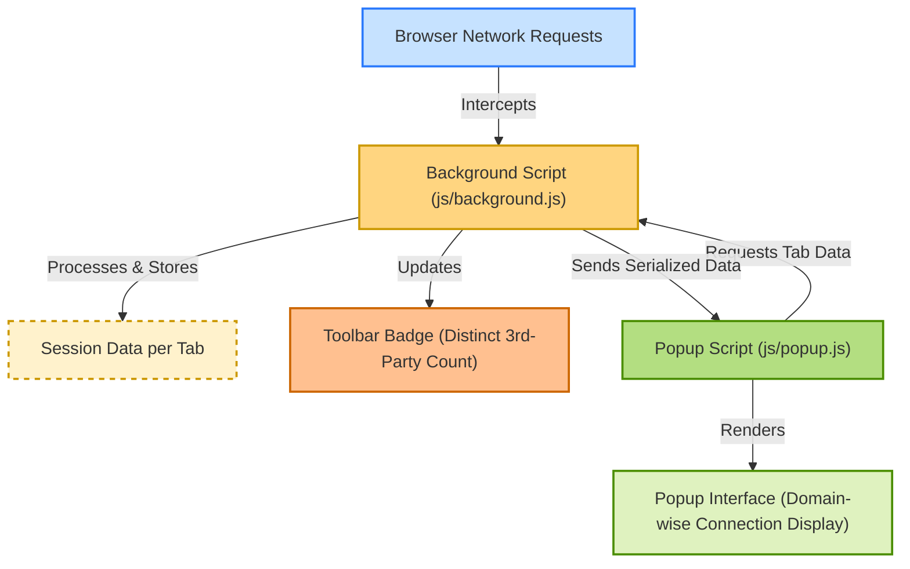

# Quick Feature Overview

uBO Scope offers clear insights into the network activity of your browser on a per-tab basis, focusing on third-party remote server connections. This page succinctly introduces the core features you’ll interact with and explains how these components work together to provide transparency beyond typical content blockers.

---

## Real-Time Domain-Wise Connection Display

When you open uBO Scope's popup interface for any active tab, you'll see a detailed breakdown of remote server domains that your browser has interacted with. These domains are grouped into three distinct categories based on the network requests’ outcomes:

- **Not Blocked (Allowed):** Domains from which your browser successfully fetched resources.
- **Stealth-Blocked:** Domains where requests were silently blocked by content blockers without direct visibility to the page.
- **Blocked:** Domains where requests were explicitly blocked or resulted in errors.

Each domain entry includes a count of distinct occurrences, helping you quickly understand which third parties are most active per web page.

Real-world example: Visiting a news website may show several CDN domains under ‘Not Blocked’ representing allowed content delivery, while trackers or ad servers appear under ‘Blocked’ or ‘Stealth-Blocked’ categories.

## Distinct Third-Party Badge Count

The uBO Scope toolbar icon features a dynamic badge number that represents the **number of distinct third-party remote servers successfully connected to by the current tab**. This count updates automatically as you browse, allowing you to instantly gauge the level of third-party network activity.

- Lower badge counts indicate fewer distinct third-party connections, generally signifying better privacy or stricter content blocking.
- Higher counts reveal more numerous third-party domains reached in a session.

This feature offers a quick, at-a-glance assessment without needing to open the popup.

## Network Request Outcome Reporting Independent of Content Blockers or DNS Interventions

uBO Scope uniquely monitors all network requests via the browser’s native `webRequest` API, independently of any content blockers or DNS-level filters active on your system.

- It tracks connections regardless of whether content blockers choose to block, allow, or stealth-block requests.
- Even network requests blocked by DNS or system-level tools can be detected if reported by the browser.

This approach ensures you receive a comprehensive and accurate picture of your browser’s network connections.

---

## Where Each Feature Comes From

- **Toolbar Badge:** Updated by the background script (`js/background.js`) that tracks all network request outcomes and maintains session data per tab.

- **Popup Interface:** Rendered by the popup script (`js/popup.js`), retrieving summarized per-tab domain data (allowed, blocked, stealth) and visually presenting it in categorized sections.

- **Data Storage and Processing:** Handled through a combination of background session storage and utilities parsing domain details, ensuring persistent and accurate measurement during browsing.

---

## Quick Tips for Using These Features

- Monitor the badge count to get immediate feedback on third-party connections as you navigate sites.
- Use the popup report to dive deeper into which specific domains are active and under what status.
- Remember that a lower badge count generally means fewer external connections, but not all third-party domains are harmful—some are essential such as CDN providers.
- When comparing content blockers, rely on uBO Scope’s distinct server counts rather than block counts for a more truthful perspective.

---

## Next Steps

- To understand the detailed workings behind these features, refer to the [Extension Architecture & Data Flow](https://docs.uBO-Scope/overview/foundation-architecture/high-level-architecture) documentation.
- Learn to interpret the badge count accurately in [Interpreting the Badge Count](https://docs.uBO-Scope/guides/core-workflows/badge-count-explained).
- For a hands-on introduction, see [Understanding the Popup Interface](https://docs.uBO-Scope/getting-started/first-run-and-validation/understanding-the-popup).

Together, these resources will help you maximize your understanding and use of uBO Scope's transparent third-party connection reporting.

---

## Diagram: Simplified Data Flow Behind Quick Features

---

This concise feature overview connects you with the heart of uBO Scope’s practical value — offering immediate, actionable insights into which third-party domains your browser contacts, plus the outcomes of those requests. For comprehensive browsing transparency, this is your foundational destination.

---

For in-depth discussions and how to validate and troubleshoot these features, please consult the other sections in this documentation set.
