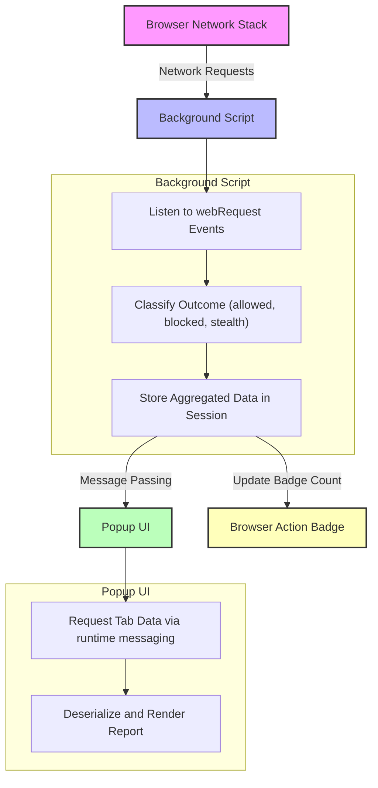

# Extension Architecture & Data Flow

Understand how uBO Scope orchestrates the complex interaction between the browser's network handling, background processing, and the user interface. This page offers a clear visualization and explanation of how request data flows from the browser's network stack, through the background script to the popup display.

---

## Overview

At its core, uBO Scope is a browser extension designed to monitor and report on all third-party remote server connections initiated by web pages. To achieve this ideally seamless transparency, it leverages several browser APIs and architecture patterns rooted in modern browser extension standards.

This architecture ensures that the detailed connection data users are shown is accurate, timely, and resource-efficient.

---

## Key Components

- **Browser Network Stack:** The browser initiates and manages network requests generated by web pages.
- **Background Script:** Acts as a persistent (or service worker) script that listens to network events via the `webRequest` API, recording outcomes such as successes, redirects, or errors.
- **Popup UI:** When users click the extension icon, this interface fetches processed data held by the background script and presents it in a clear, categorized report.

---

## Data Flow

uBO Scope carefully tracks each network request from initiation to final outcome and classifies them to better inform the users. The following flow diagram illustrates this journey.

---

## Step-by-Step Workflow

1. **Network requests occur in the browser:** As you browse, the browser initiates HTTP/S and WebSocket requests.

2. **Background script listens to network events:** The extension’s background script monitors the lifecycle of each request, receiving events for redirects, successful responses, or failures.

3. **Request outcome classification:** Based on the event type, the background script categorizes requests into "allowed," "blocked," or "stealth-blocked" (redirected silently).

4. **Data aggregation per browser tab:** Outcomes are aggregated and stored in a session data map keyed by each tab's ID.

5. **Badge update to reflect activity:** The background script updates the toolbar badge with the total count of distinct allowed third-party domains per tab, providing instant insight.

6. **Popup UI queries data on demand:** When you click the extension’s icon, the popup requests the latest tab-specific data from the background script.

7. **Rendering detailed report:** The popup deserializes the data and renders a categorized list showing connected domains, clearly separating allowed, stealth-blocked, and blocked entries.

---

## Practical Example

Imagine browsing to a news article. As the page loads:

- The browser fires several network requests: some first-party to the news domain, others to third-party CDNs or ad servers.
- The background script notes which requests succeed, which are blocked, and which are silently redirected by other blockers.
- The badge shows, say, “3,” indicating three distinct third-party domains allowed.
- When you open uBO Scope’s popup, you'll see those domains listed under "not blocked", any that were stealth-blocked, and those fully blocked.

This direct, data-driven insight helps you audit the network behavior on each tab.

---

## Best Practices & Tips

- **Minimal impact on browser performance:** The background script batches network events and processes them asynchronously every second to avoid excessive resource consumption.

- **Session persistence:** Data is serialized and saved to browser storage, so your session metrics are retained even if you close and reopen tabs.

- **Robust hostname and domain parsing:** Uses the Public Suffix List and Punycode libraries for accurate domain extraction that handles international domains correctly.

- **Error handling on message passing:** The extension tries multiple times to send runtime messages if transient failures occur due to service worker lifecycle.

- **Badge count reflects distinct allowed domains:** This simplification provides a cleaner, meaningful indicator rather than raw request counts.

---

## Troubleshooting

- **Popup shows 'NO DATA' or empty report:** Make sure the background script has fully loaded (usually within a few seconds of opening your browser) and the active tab has made network requests.

- **Badge count stuck or not updating:** Try reloading the tab or disabling and re-enabling the extension. Extensions in Manifest v3 use service workers that might be evicted sometimes.

- **Network requests not reported:** Confirm your browser version meets the extension's minimum requirements and that the `webRequest` permission is granted.

---

For a detailed understanding, consult the source code [on GitHub](https://github.com/gorhill/uBO-Scope), especially `background.js` which performs the core logic, and `popup.js` which handles the UI rendering.
