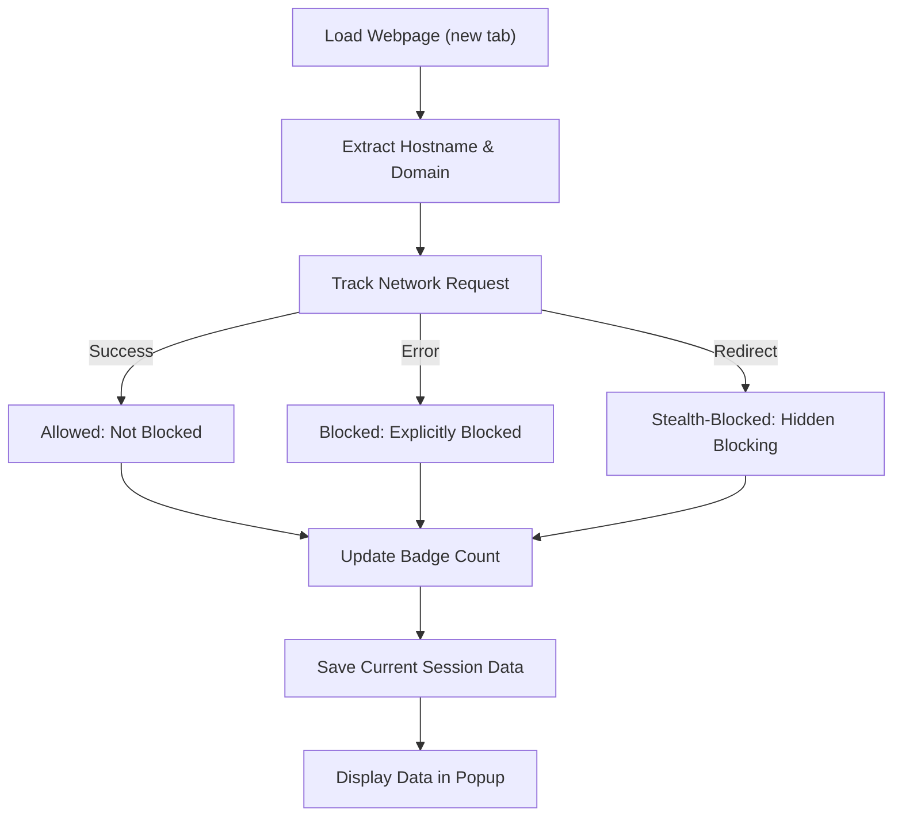

# Core Concepts and Terminology

Understanding the key concepts and terminology used by uBO Scope is essential to making sense of the data it provides and interpreting the behavior of your browser’s network activity. This page demystifies fundamental terms such as _third-party connections_, _badge count_, and the nature of _allowed_, _blocked_, and _stealth-blocked_ requests. It also explains how uBO Scope tracks, categorizes, and reports network requests in the context of your browsing sessions.

---

## What is a Third-Party Connection?

A **third-party connection** occurs when a web page you visit loads resources—such as images, scripts, or ads—from a different domain than the primary website’s domain. For example, if you navigate to `example.com` but the page requests an image from `cdn.example.net`, this represents a third-party connection.

Third-party connections are critical to understand because they often reveal external services your browser contacts, which may affect your privacy and security.

<u>**Key points:**</u>

- A connection is **first-party** if its domain matches the domain of the website you are actively visiting.
- A connection is **third-party** if its domain differs from the active website’s domain.
- Monitoring third-party connections helps detect tracking, ad networks, and other external resources.

## The Badge Count: What Does It Represent?

The badge count, displayed on the uBO Scope toolbar icon, shows the **number of distinct third-party domains your browser connected to while loading the current tab's page**.

<u>**Why is this important?**</u>

- It provides a quick snapshot of how many unique external servers your browser reached.
- A lower badge count generally indicates fewer third-party connections and potentially better privacy.
- It counts connections regardless of whether they were _allowed_, _blocked_, or _stealth-blocked_.

## Categories of Network Request Outcomes

uBO Scope classifies every network request associated with a tab into one of three categories, helping you understand how different connections were handled:

1. **Allowed Requests (Not Blocked)**
   - These are requests that successfully connected to remote servers.
   - They represent resources that were permitted to load, either because they were first-party or deemed safe by your content blocker.

2. **Blocked Requests**
   - Requests that the content blocker explicitly prevented from loading.
   - These represent connections your browser attempted, but your blocker stopped completely.

3. **Stealth-Blocked Requests**
   - Requests that were blocked by stealth techniques used by the content blocker or browser internals.
   - These are invisible blocking events where requests never reach the webRequest API, making them undetectable by traditional monitoring—except by uBO Scope’s strategies.

## How uBO Scope Tracks Requests

uBO Scope employs the browser's `webRequest` API to monitor all network requests your browser attempts to make for each open tab. Key points about its tracking methodology:

- **Session-Based Tracking:** uBO Scope keeps organized details per tab, associating each request with its originating tab.
- **Domain and Hostname Mapping:** For every request URL, it extracts both the hostname (e.g., `cdn.example.net`) and the registered domain (e.g., `example.net`) using the Public Suffix List. This helps report and summarize at multiple granularity levels.
- **Categorizing Outcomes:** Requests are queued and later processed to classify them as allowed, blocked, or stealth-blocked, based on their success, redirection, or failure status.
- **Badge Updates:** The extension updates the badge count once requests have been classified to reflect the current tab's third-party contact count.

## Defining Domains and Hostnames in uBO Scope

- **Hostname:** The full host portion from the URL; e.g., `sub.cdn.example.com`.
- **Domain:** The registered domain based on public suffix rules; e.g., from the hostname `sub.cdn.example.com`, the domain might be `example.com`.

This distinction is vital because third-party connections are often aggregated at the registered domain level to avoid overcounting related subdomains.

## Practical Scenario: How uBO Scope Works in Action

1. You load a webpage in a new tab (tabId = 12) on `example.com`.
2. uBO Scope records the tab’s main domain and hostname.
3. As the page loads, your browser initiates network requests to various remote servers.
4. For each request, uBO Scope:
  - Extracts the hostname and domain.
  - Tracks whether it was allowed, blocked, or stealth-blocked.
  - Updates internal tallies grouped by outcome.
5. Requests are processed in batches, then the badge count is updated to display the number of distinct third-party domains contacted.
6. Opening the extension’s popup shows detailed categorized lists of these domains under **not blocked**, **stealth-blocked**, and **blocked** sections.

## Common Pitfalls and Clarifications

- **Badge Count Misinterpretation:** The badge count reflects the number of distinct third-party domains your browser connected to, not the number of blocked requests. A low badge count signifies fewer external servers contacted.

- **Not All Third Parties Are Malicious:** Many legitimate third-party connections exist, such as content delivery networks (CDNs) hosting essential assets.

- **Stealth Blocking Is Invisible:** Because stealth-blocked requests are blocked before the API sees them, many simple network monitors won't detect these — making uBO Scope uniquely valuable.

## Tips for Interpreting Network Connection Data

- Use the domain-level aggregation to identify major third-party service providers.
- Compare allowed vs. blocked to evaluate your content blocker's effectiveness.
- Monitor stealth-blocked entries to understand blocking that is opaque to other tools.

## How This Fits Into Your uBO Scope Workflow

Understanding these core concepts prepares you to accurately interpret information shown in the popup UI and make informed privacy decisions.

For step-by-step guides on interpreting these details in context, see the [Interpreting the Popup and Domain Connections](/guides/getting-started/first-insights) documentation. For a broader overview, refer to the [What is uBO Scope?](/overview/introduction/what-is-ubo-scope) page.

---

## Mermaid Diagram: Request Tracking Flow

---

## References and Further Reading

- [What is uBO Scope?](/overview/introduction/what-is-ubo-scope) — Introduction to the product’s purpose and overview.
- [Why Use uBO Scope?](/overview/introduction/value-proposition) — Understand the value proposition behind monitoring third-party connections.
- [Interpreting the Popup and Domain Connections](/guides/getting-started/first-insights) — Practical guidance for exploring your tab’s network data.

---

This foundational understanding of terminology empowers you to better safeguard your privacy, analyze browsing activity, and use uBO Scope to its fullest potential.