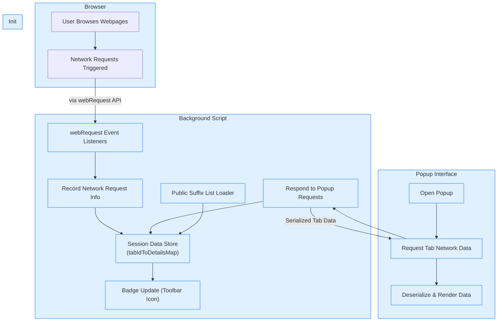

# System Architecture Overview

Gain a clear understanding of how uBO Scope orchestrates its core components to deliver a transparent view of your browser’s network activity. This section breaks down the interactions between the background script, webRequest listeners, persistent session data, and the popup user interface. Through this lens, you’ll see how uBO Scope independently tracks all web connections, regardless of any content blockers in place.

---

## How uBO Scope Works: A High-Level View

At its core, uBO Scope operates as a companion extension to content blockers like uBlock Origin, but with a specialized mission — to **measure and report all network connections from your browser tabs**. Unlike typical blockers, it does not block or modify requests, but purely observes and categorizes them.

This architecture overview explains the flow of data and control:

1. The browser’s **webRequest API** notifies the extension’s background script of network request events.
2. The background script records, categorizes, and manages network outcomes per tab.
3. Network data is persisted session-wise to maintain current tab statistics.
4. When requested (e.g., opening the popup), this data is serialized and surfaced to the user interface for visual inspection.

---

## Key Components and Their Roles

| Component            | Role & Function                                                        |
|----------------------|-----------------------------------------------------------------------|
| **Background Script** | Runs continuously (or as a service worker) and listens to all webRequest events. It records outcomes of network requests (allowed, blocked, stealth) and maps them to active browser tabs. |
| **webRequest Listeners** | Event hooks (`onBeforeRedirect`, `onErrorOccurred`, `onResponseStarted`) capture network request lifecycle states and provide real-time data to the background script. | 
| **Session Data**      | Maintains in-memory and session storage representations of tab-specific network request outcomes, ensuring persistence during a browsing session. |
| **Popup UI**          | The interactive popup fetches, deserializes, and renders detailed per-tab reports showing counts and domains connected to, categorized by outcome types. |
| **Public Suffix List**| Enables domain and hostname parsing for accurately grouping requests at domain levels, crucial for meaningful reporting. |

---

## Data Flow and Interaction

Below is a detailed diagram illustrating the data and event flow between the components, emphasizing how network request observations lead to a rich, domain-centered summary presented to the user.

---

## Narrative Walkthrough

1. **Browsing Activity Triggers Requests**: When you visit or interact with a webpage, it triggers numerous network requests to various remote servers.

2. **Network Event Capture**: uBO Scope’s background script registers listeners on key webRequest events including redirects, errors, and successful responses.

3. **Capturing Request Outcomes**: Each network request is classified as **allowed**, **blocked**, or **stealth-blocked** depending on its final status. This classification is automatically mapped to the appropriate browser tab.

4. **Session Persistence of Data**: The background script maintains an in-memory map associating each tab’s ID with its domain connection details, which is also serialized and saved to browser session storage to preserve state over time.

5. **Badge Count Update**: The extension updates the toolbar badge text dynamically to reflect the count of distinct third-party domains connected from the active tab, giving an at-a-glance indication of external connections.

6. **Popup UI Request & Visualization**: When you click the extension icon, the popup requests the serialized tab-specific data from the background script. It deserializes the information and renders a categorized, readable breakdown of domains, along with counts for allowed, blocked, and stealth requests.

---

## Why This Architecture Matters

- **Accurate Connection Reporting**: By relying on browser-level webRequest events rather than filter list heuristics alone, uBO Scope reveals the *real* network connection picture—even in the presence of stealthy blockers.

- **Independence from Content Blockers**: uBO Scope passively measures network activity without interfering, thus can be safely used alongside any blocker.

- **Contextual Per-Tab Data**: Presenting data scoped to each browser tab enables users to pinpoint precisely which sites initiate external connections.

- **Responsive User Experience**: Updating badge counts and delivering detailed popup reports on-demand offers both quick summaries and deep dives.

- **Resilient Session Management**: Persistence of data via session storage ensures continuity throughout a browsing session, even if the background script is suspended and restarted.

---

## Practical Tips

- Keep in mind badge counts represent *distinct third-party remote domains* detected per active tab.
- Review the popup details to understand which domains are allowed or blocked, helping identify unwanted connections.
- The extension loads an up-to-date public suffix list on start to accurately group hostnames by registrable domains.
- Network events sometimes occur in rapid bursts; uBO Scope processes these asynchronously to avoid UI slowdown.

---

## Next Steps

- Explore the **[Understanding the Popup Interface](https://your-docs-url/getting-started/first-use-and-validation/understanding-the-popup)** page to learn how to effectively interpret the data you see.
- Review **[Core Concepts and Terminology](https://your-docs-url/overview/getting-started-concepts/core-concepts-terminology)** for a glossary of key terms used in the reports.
- Visit **[Who Should Use uBO Scope?](https://your-docs-url/overview/product-intro/who-should-use-ubo-scope)** to see how different user groups unlock value from the extension.

---

For details on usage and installation, refer to the **Getting Started** section of this documentation.

---

*This architecture overview provides a foundational perspective on how uBO Scope achieves its mission to reveal and quantify your browser's network connections with clarity and precision.*