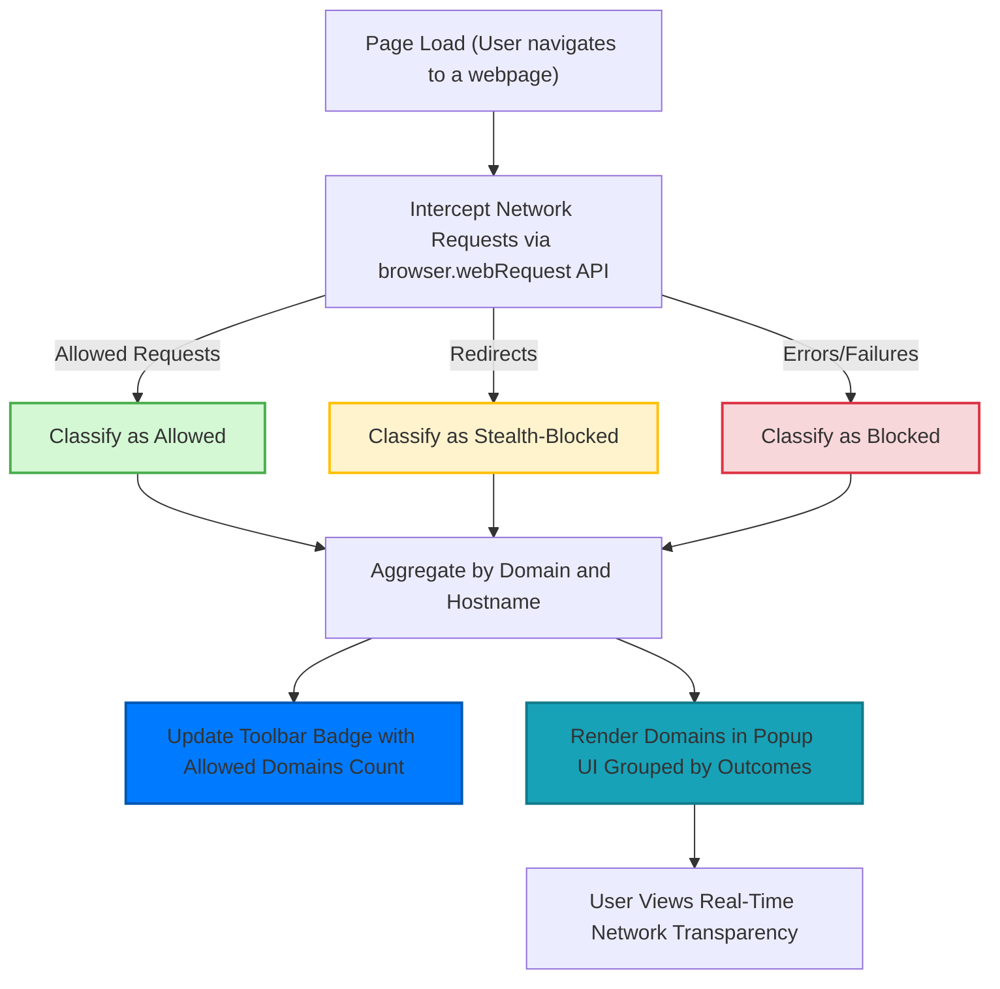

# What is uBO Scope?

## See Every Remote Server Your Browser Contacts

uBO Scope is a lightweight browser extension designed to reveal every attempted or successful connection your web pages make to remote servers. It brings unprecedented visibility into how many unique third-party servers are involved in loading a webpage, independent of which blockers or DNS filters you use. This transparency arms privacy-conscious users with actionable data to understand and control their browsing footprint.

### Why uBO Scope Matters

- Instantly discover how many distinct third-party domains your browser contacts on any webpage.
- See a clear breakdown of which connections were allowed, stealth-blocked, or blocked.
- Works alongside any content blocker or DNS filter to provide a consistent, independent network activity report.
- Offers real-world insight into actual network activity, beyond hearsay or misleading ad-blocker tests.
- Empowers users to validate the effectiveness of their privacy tools by looking at real connection data.

### Who Should Use uBO Scope

- Privacy advocates eager to quantify third-party relationships on websites.
- Users wanting to verify what their content blocker or DNS filter truly allows or blocks.
- Filter list maintainers needing reliable tools to audit network requests unaffected by blockers.
- Anyone curious about the network activity their browser performs behind the scenes.

---

## Introducing uBO Scope

At its core, uBO Scope is a companion browser extension that reports every network request your browser makes to remote servers when loading web pages. Unlike traditional content blockers that focus on blocking unwanted requests, uBO Scope focuses on reporting — it shows you the full landscape of connections attempted or completed.

### What Problem Does uBO Scope Solve?

Web browsers often connect to dozens of third-party servers when displaying a single webpage — from CDNs and analytics providers to advertising networks. Most users have no clear way to see how many distinct servers are actually touched, especially when multiple content blockers or DNS filters are involved. Existing tools can be inconsistent or incomplete because they rely on the blocker’s own data or use fabricated test sites.

uBO Scope provides a single source of truth by leveraging the browser’s `webRequest` API to report network requests regardless of which blockers are enabled. This guarantees a clear, unbiased view of what your browser is really doing.

### What Makes uBO Scope Unique?

- **Independent transparency:** It reports network requests no matter what blockers or filters are active.
- **Minimal and focused:** It’s purely a reporting tool — no filtering, no blocking — so it never interferes with your browsing experience.
- **Simple, actionable UI:** Provides an easy-to-understand popup summarizing domains contacted and their request outcomes.

### How uBO Scope Works at a High Level

Behind the scenes, uBO Scope listens to the browser's network requests using the `webRequest` API. It classifies connections as:

- **Allowed:** Requests completed successfully.
- **Stealth-blocked:** Requests that were redirected stealthily by other tools.
- **Blocked:** Requests that failed or were actively blocked.

This data is aggregated by domain and presented in the extension's popup, along with a badge count showing how many unique third-party domains have been contacted.

---

## Core Features & Capabilities

- **Real-Time Domain Tracking:** Monitors all outgoing connections from active tabs, updating counts dynamically.

- **Outcome Categorization:** Clearly separates allowed, stealth-blocked, and blocked domains to make understanding network activity intuitive.

- **Domain Aggregation:** Counts and groups requests by domain, helping users identify distinct third parties involved.

- **Toolbar Badge:** Displays a live count of allowed third-party domains contacted by the active tab, giving instant at-a-glance feedback.

- **Cross-Blocker Compatibility:** Works regardless of which content blocker or DNS filter is installed, ensuring consistent reporting.

- **Unicode Domain Support:** Converts punycode domains into user-friendly Unicode for easy reading.

---

## Why Should You Care?

### What Outcomes Can You Expect?

Using uBO Scope, you will:

- Gain clarity on exactly how many third-party servers your browsing involves.
- Understand if your content blocker is effective in reducing third-party connections.
- Detect stealthy redirects and blocked connections that you might otherwise miss.
- Debunk misleading claims about blocking effectiveness based on ad-blocker test sites.
- Make more informed decisions about privacy tools and filter lists.

### Common Use Cases

- **Privacy Auditing:** Spot excessive or unexpected third-party connections on websites you frequent.

- **Blocker Verification:** Check if your blocker truly reduces connections or just hides them.

- **Filter List Development:** Use precise data to improve or verify filter rules by seeing real network outcomes.

- **Educational Insight:** Learn about the complex web of third-party servers involved in everyday browsing.

### Before and After uBO Scope

Without uBO Scope, users rely on guesswork or insufficient tests to assess privacy. With uBO Scope, the mystery clears — you see exactly what your browser contacts each time.

### Measurable Benefits

- Save time by instantly seeing connection details without fiddly debugging tools.
- Improve privacy by identifying and minimizing unwanted third-party communication.
- Boost confidence in your blocking tools by validating network behaviors independently.

---

## Quick Preview: Getting Started with uBO Scope

To begin your journey to network transparency:

1. **Install uBO Scope** from your browser’s extension store.
2. **Activate the extension** and click its toolbar icon to open the popup.
3. **Browse as usual** and watch the badge show how many third-party domains are contacted.
4. **Open the popup** to see detailed lists of allowed, stealth-blocked, and blocked domains.

### Prerequisites

- Support for the browser `webRequest` API (modern Chromium-based browsers, Firefox, Safari with minimum versions).
- Permission to monitor active tabs and network requests (automatically requested on install).

### Next Steps

- Visit [Installing and Taking Your First Look](/guides/core-workflows/install-first-look) to see how to start monitoring.
- Explore [Monitoring Domain Connections in Real Time](/guides/core-workflows/monitor-domain-connections) for continuous insight.
- Learn about the toolbar badge with [Understanding and Using the Badge Count](/guides/core-workflows/understanding-the-badge-count).

---

## Visual Overview of uBO Scope's Core Workflow

---

## Troubleshooting & Tips

<AccordionGroup title="Common Questions and Issues">
<Accordion title="Why don't I see any data in the popup?">
Make sure the extension has permission to access your active tab. Verify that you have version 122 or higher on Chromium-based browsers, Firefox 128+, or Safari 18.5+. Also, ensure your browser supports the webRequest API fully.
</Accordion>
<Accordion title="Why does the badge count sometimes change unexpectedly?">
The badge count reflects the number of distinct domains contacted on the active tab. Navigating to new pages or reloading the tab resets counts. Background requests and redirects also adjust these numbers dynamically.
</Accordion>
<Accordion title="Are all network requests shown?">
uBO Scope reports all requests visible through the browser's webRequest API. However, some browser internals or connections made outside this API scope may not be captured.
</Accordion>
<Accordion title="How does uBO Scope handle internationalized domain names?">
Domains displayed in the popup are converted from punycode to Unicode for readability, ensuring international domain names appear in their proper form.
</Accordion>
</AccordionGroup>

---

## Learn More

To deepen your understanding and start using uBO Scope effectively, explore the related documentation:

- [Who Is uBO Scope For?](/overview/getting-started-core-overview/target-audience-use-cases)
- [Core Features at a Glance](/overview/getting-started-core-overview/quick-feature-overview)
- [Installing and Taking Your First Look](/guides/core-workflows/install-first-look)
- [Monitoring Domain Connections in Real Time](/guides/core-workflows/monitor-domain-connections)

For developers and filter list maintainers, advanced sections cover interpreting outcomes and debunking myths about content blockers.

---

## References

- [uBO Scope GitHub Repository](https://github.com/gorhill/uBO-Scope)
- [uBO Scope Chrome Web Store](https://chrome.google.com/webstore/detail/ubo-scope/bbdpgcaljkaaigfcomhidmneffjjjfgp)
- [uBO Scope Firefox Add-ons](https://addons.mozilla.org/firefox/addon/ubo-scope/)

---

Embrace transparency in web browsing and take control of your network data with uBO Scope today.