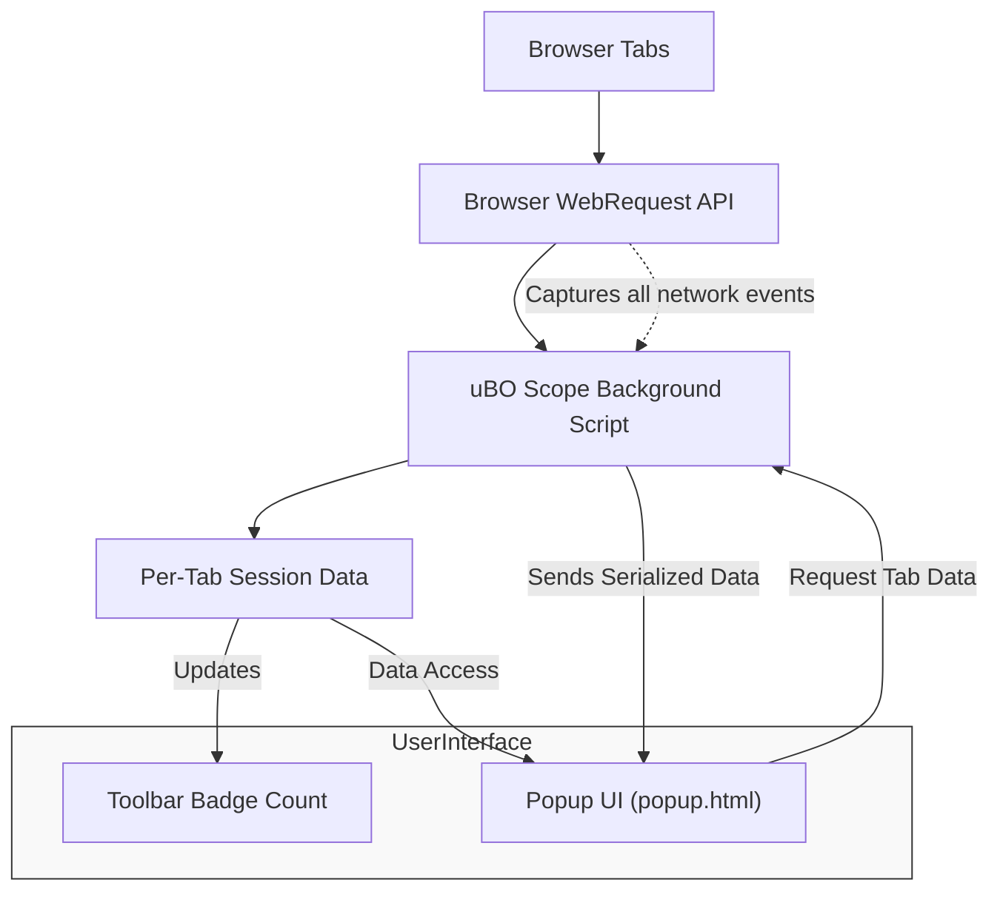

# Core Features at a Glance

uBO Scope gives you immediate insights into all network activity initiated by your browser, presenting it in a clear, easy-to-understand interface. This page reveals the essential capabilities that make uBO Scope a powerful yet lightweight extension for real-time network visibility and connection transparency.

---

## Instantly See All Connections Attempted or Established

At its core, uBO Scope listens to every network request your browser attempts—whether it succeeds, fails, or is stealthily redirected. It reports all these connection outcomes independently of any content blockers you may have installed, providing a comprehensive view that reflects the true network behavior occurring behind the scenes.

- **Benefit:** Know precisely which remote servers websites connect to, including those that may be obscured by other blockers.
- **Scenario:** If you suspect hidden trackers or third-party content, uBO Scope reveals every domain involved in your current browsing session.

## Real-Time Network Request Data Outside of Content Blockers

Unlike tools that rely on the content blocker’s internal data, uBO Scope taps directly into the browser’s `webRequest` API. This allows it to observe network requests independently and reliably without interference, even if your content blocker uses stealth or DNS-based blocking.

- **Benefit:** Trustworthy, unfiltered network monitoring that captures the lifecycle of requests—success, error, or redirect.
- **Scenario:** Identify if requests were blocked stealthily or if redirects altered connection targets behind your content blockers’ backs.

## Visual Per-Tab Badge Counts for Third-Party Domains

uBO Scope adds dynamic badge counts directly onto the browser toolbar icon reflecting the number of distinct third-party domains contacted by the active tab.

- **Benefit:** Immediate visual feedback about the complexity and third-party reach of the site you're visiting.
- **Scenario:** A low badge count indicates few external connections, often meaning better privacy and faster load times.

---

### How It Works

Each browser tab maintains detailed records categorized into **allowed (not blocked)**, **stealth-blocked**, and **blocked** third-party domains:

- **Allowed:** Domains from which network requests succeeded.
- **Stealth:** Domains involving redirects or nuanced blocking that can evade typical blockers.
- **Blocked:** Domains explicitly blocked by errors or failures.

You can explore these lists via the popup UI to get immediate insight into your active tab’s network environment.

---

## Lightweight and Hardware-Friendly Transparency

uBO Scope is engineered to be minimal-impact:

- It uses efficient data structures to keep session data per tab.
- Runs a modest event queue and batches network request processing, avoiding performance degradation.
- The extension’s architecture ensures it doesn’t overload your device’s resources while still delivering trustworthy real-time monitoring.

This design means you get powerful network transparency without sacrificing browser speed or battery life.

---

## Summary of Key Features

| Feature                                      | Description                                                    | User Benefit                                               |
|----------------------------------------------|----------------------------------------------------------------|------------------------------------------------------------|
| **Comprehensive Connection Monitoring**     | Tracks all attempted, successful, blocked, and redirected network requests | Complete and honest view of your network activity           |
| **Independent Outcome Categorization**      | Separates allowed, stealth, and blocked domains by connection outcome | Understand the true effect of content blocking              |
| **Per-Tab Domain Aggregation**               | Collects and counts distinct third-party domains contacted per browser tab | Pinpoint and analyze third-party network exposure per site  |
| **Dynamic Toolbar Badge Counts**             | Shows number of third-party domains connected in the current tab via toolbar icon badge | Visual, at-a-glance privacy indicator                        |
| **Popup UI with Categorized Domain Lists**  | Provides an easy-to-use popup displaying detailed domain lists by outcome | Quick access to detailed domain-level insights               |
| **Session Persistence & Lightweight Design**| Saves session data efficiently and maintains low resource usage | Seamless continuous monitoring without browser slowdowns    |

---

## Visual Overview of uBO Scope’s Network Flow

---

## Practical Example

Imagine you're on a news website and want to know all third-party connections:

1. **Toolbar Badge:** You notice the badge shows "8", indicating eight distinct third-party domains contacted.
2. **Popup UI:** Click the uBO Scope icon to open the popup.
3. **Domain Lists:** You see lists grouped by connection outcome:
   - **Not Blocked:** CDNs serving images and scripts.
   - **Stealth-Blocked:** Domains redirected or filtered quietly without obvious blocking.
   - **Blocked:** Known trackers or ad domains successfully blocked.
4. **Actionable Insight:** You can use this information to adjust your content blockers or filter lists to improve privacy or performance.

---

## Tips for Success

- **Regularly check the toolbar badge:** Use it as a quick privacy health indicator for your browsing session.
- **Analyze stealth connections:** These often reveal trackers or content escapes typical blocking.
- **Use the popup domains lists to inform your filter list updates:** Tailor blocking rules based on real network data.
- **Remember:** The count reflects distinct third-party domains; more is not necessarily malicious, but each additional third party may increase privacy risk.

---

## Common Pitfalls

- **Ignoring stealth-blocked domains:** These may be overlooked but can impact privacy.
- **Assuming high badge counts are always bad:** Some legitimate sites rely on multiple third-party services like CDNs.
- **Not updating filters based on network data:** Without action, network connections remain unchecked.

---

## Next Steps

After familiarizing yourself with this feature overview, proceed to:

- [Understand the Toolbar Badge Count](../../guides/core-workflows/understanding-the-badge-count) to learn how to interpret badge numbers.
- [Monitor Domain Connections in Real Time](../../guides/core-workflows/monitor-domain-connections) for hands-on network tracking.
- Explore [Interpreting Allowed, Blocked, and Stealth Outcomes](../../guides/advanced-usage-patterns/interpreting-network-outcomes) for in-depth understanding.

These steps help transform uBO Scope from a raw data source into a powerful privacy tool.
