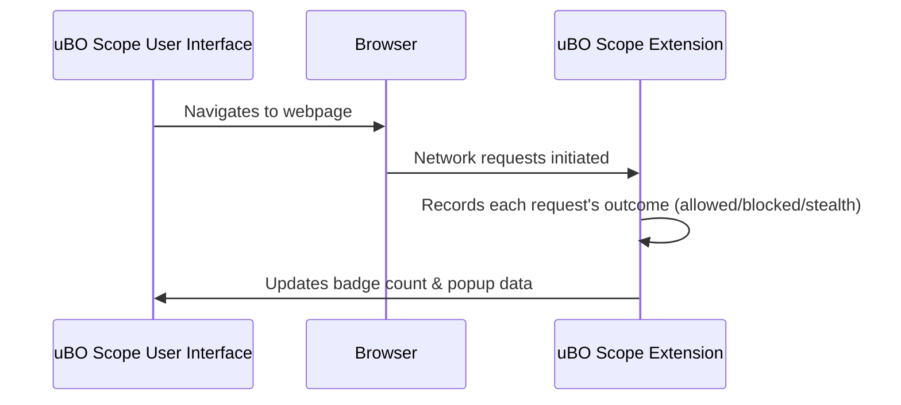

# What is uBO Scope?

## Unlocking Transparency for Your Web Connections

uBO Scope is a browser extension designed with a clear mission: to expose every attempted and successful connection your browser makes to remote servers when you visit any webpage. Regardless of which content blocker you use — or even if you use none — uBO Scope gives you an unbiased, real-time view into the network activity occurring behind the scenes.

By revealing third-party server connections, uBO Scope empowers you to understand exactly which external domains your browsing interacts with, helping you gain insight into privacy, security, and performance aspects that typical browsers or blockers tend to obscure.

---

### Why uBO Scope Matters

- **Complete visibility of all remote connections:** Know every third-party domain your browser tries to contact — whether the connection was allowed, blocked, or stealthily redirected.
- **Independent of other content blockers:** uBO Scope always reports actual network outcomes, even when other blockers modify or hide network activity.
- **Accurate representation of third-party domain count:** The badge on the toolbar icon shows the number of unique third-party servers contacted, presenting an easy metric to monitor privacy exposure.

---

## What Is uBO Scope?

In simple terms, uBO Scope is a companion extension that carefully listens to your browser's network events and logs what happens with each connection attempt your browser initiates. Using the browser's `webRequest` API, it tracks requests whether content blockers allow them, block them, or reroute them stealthily.

This data is then summarized in a clear, user-friendly interface, showing domains contacted, the number of times each domain is involved, and classification by outcome: allowed, stealth-blocked, or fully blocked.

### Core Purpose

- Provide a transparent, trustworthy record of network connections.
- Help privacy-conscious users scrutinize the extent of third-party tracking and servers involved.
- Debunk common myths and misconceptions around content blockers and network blocking efficacy.

### How uBO Scope Stands Out

- Unlike traditional ad blockers, it focuses on domain-level visibility rather than filtering content.
- It counts distinct third-party servers rather than raw network request totals, giving a meaningful privacy signal.
- It operates independently of DNS or any filtering methods, reporting the actual network requests reported by the browser.

---

## Key Features & Capabilities

- **Network Request Observation:** Intercepts all outgoing browser requests to detect connections to remote servers.
- **Outcome Categorization:** Distinguishes between "allowed", "stealth-blocked" (e.g., requests redirected or altered invisibly), and "blocked" connections.
- **Tab-Specific Data Aggregation:** Records network activity per browser tab, allowing users to view connection data specific to the current active tab.
- **User Interface Integration:** Displays domain counts and breakdowns directly via an accessible popup interface, enhancing situational awareness.
- **Badge Count Display:** The extension icon dynamically updates to indicate the distinct number of third-party domains contacted, serving as an at-a-glance privacy metric.

---

## Why Should You Care?

- **Real Privacy Insights:** Understand your browsing exposure by revealing third-party connections often hidden by other tools.
- **Myth Busting:** Uncover misconceptions such as equating block counts with effective blocking, or reliance on unreliable "ad blocker test" webpages.
- **Effective Monitoring Tool:** Keep tabs on sites that may contact numerous external domains, highlighting potential privacy risks.

### Common Use Cases

- Privacy-conscious users auditing third-party tracking and data leakage.
- Filter list maintainers who need accurate insights into network request outcomes.
- Developers interested in understanding how content blockers affect network flow in browsers.

### Typical Experience

| Without uBO Scope | With uBO Scope |
|-|-|
| No clear view of remote server connections | Clear visibility of all network connections broken down by domain and outcome |
| Rely on guesswork or external test pages to measure content blocker effectiveness | Direct, factual connection data independent of the blocking method |
| Badge counts or block numbers may mislead on privacy exposure | Meaningful badge count showing distinct third-party domains contacted |

---

## Getting Started Preview

Ready to see uBO Scope in action? Once installed, the extension immediately starts monitoring network requests 
for your active tabs. You can:

1. Click the toolbar icon to view a breakdown of all domains your current tab connected to.
2. See domains separated into categories: allowed, stealth-blocked, blocked.
3. Use the badge count as a quick privacy indicator.

### Prerequisites

- Modern browser supporting the `webRequest` API (e.g., Firefox, Chromium-based browsers, Safari).
- Permissions for webRequest and activeTab (granted at install).

### Next Steps

Explore the [Value Proposition & The Problems uBO Scope Solves](/overview/getting-started-introduction/value-proposition-and-problem-solved) to understand the impact in deeper detail, 
or jump into [Analyzing Allowed, Stealth, and Blocked Domains](/guides/core-workflows/analyzing-allowed-stealth-blocked) for hands-on usage guidance.

---

## Visualizing The Flow

