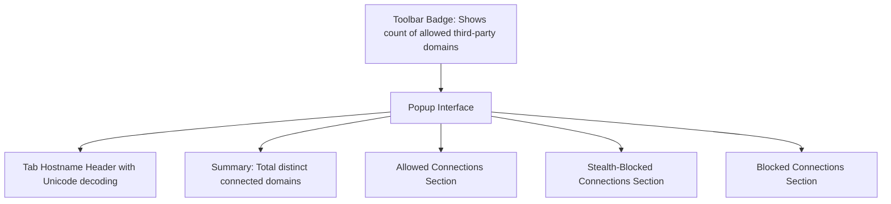

# What Does uBO Scope Do? (Feature Tour)

Discover the core features of uBO Scope in this concise tour designed to orient you quickly with the extension's key capabilities. Whether you're a privacy-conscious user, a filter list maintainer, or simply curious about the third-party connections your browser makes, this guide will help you understand what to look for in the user interface and how each feature enhances your browsing transparency.

---

## Real-Time Third-Party Connection Counting via Badge

At a glance, uBO Scope provides an intuitive badge on the browser toolbar icon indicating the number of distinct third-party domains currently connected to by the active tab.

- **What It Shows:** The badge number dynamically updates to reflect how many unique allowed third-party domains have established connections for the active browser tab.
- **Why It Matters:** This live count offers immediate insight into how many external servers your current webpage is contacting, empowering you to quickly gauge the privacy landscape without opening any complicated panels.

### Practical Example
When visiting a news site, the badge may show '8', indicating that eight distinct third-party domains (such as advertisers, social media trackers, or analytics providers) are connected. If you navigate to a simple blog page with fewer connections, the badge drops or may disappear entirely for none, providing instant feedback on connection activity.

---

## Per-Tab Connection Statistics

Clicking the extension icon reveals detailed connection data for the active tab.

- **Tab Hostname & Domain:** The top header shows the exact hostname of the page you’re viewing, split into its subdomain and registered domain components, presented in a Unicode-friendly format thanks to integrated Punycode decoding.
- **Outcome Sections:** Connections are categorized into three clear groups:
  - **Not Blocked:** Domains where connections were successful and allowed.
  - **Stealth-Blocked:** Domains where connections were silently blocked or redirected, without user notification.
  - **Blocked:** Domains where connections were explicitly blocked, preventing network communication.

Each category lists third-party domains involved, along with a badge indicating the number of connection attempts associated with each domain.

### User Flow
1. Open a webpage.
2. Click uBO Scope’s toolbar icon.
3. Instantly see a summary count of third-party domains and detailed breakdown of all connection outcomes.
4. Identify domains with frequent connection attempts to assess privacy impact.

---

## Reporting for Allowed, Stealth-Blocked, and Blocked Domains

uBO Scope classifies third-party connection attempts into three types of outcomes, each reflecting a critical privacy aspect:

- **Allowed Connections:** These are third-party domains that successfully connected, possibly providing tracking or advertising data.
- **Stealth-Blocked Connections:** These connections were intercepted and redirected or silently suppressed requiring no user intervention, representing a subtle form of blocking that keeps webpage functionality intact while limiting tracking.
- **Blocked Connections:** These are explicitly prevented connections, actively stopping data exchange with certain domains.

The extension’s popup UI horizontally segregates these groups with clear labels, so you can instantly discern which third parties are communicating freely, which are quietly blocked, and which are stopped outright.

### Why This Matters
Understanding all three outcomes helps you avoid blind spots. Sometimes connections appear "allowed" but have actually been redirected (stealth-blocked) or fully blocked. uBO Scope reveals the full spectrum to give you a transparent, trustworthy snapshot.

---

## Seamless Interoperability with Other Content Blockers

uBO Scope operates independently from any installed content blocker (including uBlock Origin itself), simply reporting network connection outcomes rather than enforcing blocking. This design means:

- **Unbiased Reporting:** It captures all remote server connections regardless of the blocking tool in use.
- **Compatibility:** Whether you use popular blockers or none at all, uBO Scope will still present accurate connection data.
- **Diagnostic Usage:** Privacy auditors and filter list maintainers can observe how other blockers affect network connections by comparing uBO Scope’s reports with expected behavior.

### Real-World Scenario
If you rely on another content blocker for ad blocking, uBO Scope will show you exactly which connection attempts were thwarted, stealth-blocked, or untouched, facilitating fine-tuning your filter lists or verifying blocker efficacy.

---

## What to Look for in the UI

Understanding the user interface elements helps you extract maximum value:

- **Toolbar Badge:** Monitors third-party domain count per active tab.
- **Popup Header:** Displays the tab’s hostname in decoded Unicode, splitting subdomain and domain for clarity.
- **Summary Section:** Total distinct connected third-party domains reported numerically.
- **Outcome Sections:** 
  - Each labeled section lists relevant domains with connection counts.
  - Domains are sorted to allow easy scanning of most frequently contacted remote servers.
- **Domain Count Badges:** Show connection attempt counts to spot persistent or suspicious domains.

### Pro Tips
- Use the badge count as an early warning of heavy third-party exposure on a page.
- Examine stealth-blocked domains to understand what trackers are being silently neutralized.
- Investigate blocked domains to confirm your content blocker’s rules are actively enforced.

---

## Summary
This feature tour highlights uBO Scope’s core functions: live third-party connection counting, detailed per-tab connection stats, clear reporting of allowed, stealth-blocked, and blocked domains, plus compatibility with existing content blockers. The UI is designed for clarity and speed, giving you actionable insights into your browser’s network behavior instantly.

For deeper dives on interpreting these features, including badge meaning and privacy diagnostics, explore complementary guides within the documentation.

---

## Related Documentation
- [What is uBO Scope?](../introduction-values/what-is-ubo-scope) — Understand the product’s purpose and how it empowers you.
- [Understanding Badge Counts and Connection Outcomes](../../core-workflows/understanding-badge-and-outcomes) — Learn how to interpret badge metrics and connection results.
- [Using uBO Scope Alongside Content Blockers](../../advanced-usage/integration-with-content-blockers) — Maximize your blocker’s effectiveness using uBO Scope’s insights.

---

## Next Steps
1. Try uBO Scope on several websites and observe badge changes.
2. Open the popup to explore the allowed, stealth-blocked, and blocked domain lists.
3. Use these insights to fine-tune your privacy settings or filter lists.
4. Visit related documentation for detailed workflows and troubleshooting tips.

---

# Appendix: User Interface Structure

Below is a simplified overview illustrating the popup layout elements encountered during your feature tour:

This representation emphasizes the division between summary information and the detailed, categorized connection outcomes, all accessible with a click from the browser toolbar.

---

# Troubleshooting Common UI Observations

<AccordionGroup title="Troubleshooting the uBO Scope Popup UI">
<Accordion title="Why does the badge sometimes show no number?">
The badge is empty when no allowed third-party domains have connected in the active tab. This indicates minimal or no external network connections.
</Accordion>
<Accordion title="What if I see 'NO DATA' in the popup header?">
This means uBO Scope hasn’t yet received connection information for the active tab, possibly because the page is still loading or your browser session just started.
</Accordion>
<Accordion title="Why are domains shown multiple times or in multiple sections?">
Domains are grouped by outcome types (allowed, stealth-blocked, blocked) based on connection results in the current tab. A domain may appear in more than one if it has mixed connection results due to redirects or errors.
</Accordion>
</AccordionGroup>

---

# Quick Reference: Meaning of Outcome Categories

| Outcome         | Meaning                                                  | User Impact                         |
|-----------------|----------------------------------------------------------|-----------------------------------|
| Allowed         | Successful connection allowed by browser and/or blockers| Potential tracking, standard loads|
| Stealth-Blocked | Connection silently redirected or suppressed             | Tracking mitigated without breakage|
| Blocked         | Connection actively prevented                            | Strong blocking, may affect functionality|

Using this framework, you can interpret your browsing connections with confidence.

---

# Final Note
Keep this feature tour handy as a quick orientation tool whenever you’re learning to analyze your browsing traffic with uBO Scope's transparent, user-focused interface.

---

<u>Ready to begin? Click the uBO Scope icon in your browser toolbar and start exploring your tab’s remote connections now.</u>