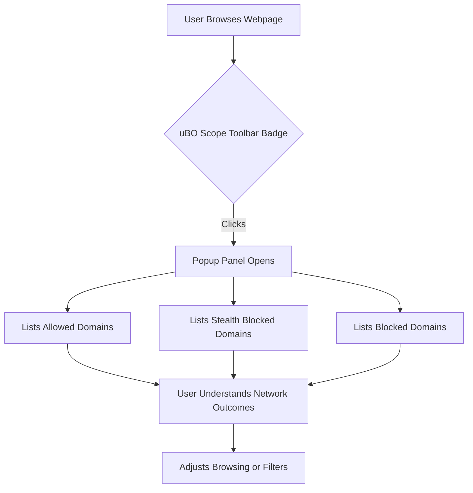

# Key Features at a Glance

Discover how uBO Scope gives you immediate, insightful visibility into the network connections your browser makes, empowering privacy-conscious browsing and deeper understanding of web tracking activities.

---

## At-a-Glance Overview

uBO Scope is designed with powerful but straightforward features that bring clarity to your browsing activity. This page highlights the tool's core components exposed directly within its user interface and toolbar, focusing on what you see and how it helps.

### Toolbar Badge: Distinct Third-Party Server Count
- **What it shows:** The toolbar icon badge displays the number of distinct third-party remote servers your current tab connects with.
- **Why it matters:** This count reflects actual network connections, not just blocked requests, giving you a true measure of external server interactions.
- **User impact:** A lower badge number means fewer external connections, signaling a cleaner, less tracked browsing session.

### Popup Panel: Detailed Domain Outcomes
- **Overview:** Clicking the toolbar icon opens a popup breakdown of all third-party servers involved in loading the page.
- **Three categories presented clearly:**
  - **Not Blocked:** Domains from which connections were successfully allowed.
  - **Stealth Blocked:** Domains where connections were redirected or stealthily blocked.
  - **Blocked:** Domains where connection attempts failed or were outright blocked.
- **Visual clarity:** Each category lists domains with counts showing how many requests per domain occurred.

### Robust Reporting Across Browsers and Blockers
- uBO Scope operates independently of your browser’s content blocking solutions.
- It detects connection outcomes regardless of whether blocking happens via extension filters, DNS blocking, or other mechanisms.
- This universality ensures reported data accurately represents real browsing network activity.

---

## User Journey: From Badge to Deep Insights

Imagine browsing a website and noticing the uBO Scope icon badge shows a high number, indicating many third-party connections. Curious, you click the icon to reveal the popup panel. Here you instantly see which domains were allowed, blocked, or stealth blocked, breaking down complex network behavior into clear categories.

This flow helps you:

- Quickly assess if a site is pulling data from many third parties — often a key privacy concern.
- Understand which domains are actively blocked to protect your experience.
- Identify stealth blocking in action, illuminating hidden behaviors missed by typical blockers.

The concise counts and domain lists give you actionable intelligence at a glance and facilitate informed decisions about your browsing habits or filter list adjustments.

---

## Practical Tips for Using uBO Scope Features

- **Monitor badge regularly:** Let the distinct domain count guide you toward safer browsing choices by minimizing unwanted third-party connections.
- **Investigate popup lists:** Use the categorized domain outcomes to identify suspicious or unexpected third parties.
- **Combine with content blockers:** Since uBO Scope reports network outcomes regardless of your blocker, it pairs well with existing privacy tools to cross-verify effectiveness.

---

## Common Pitfalls and How Features Help Avoid Them

- **Misinterpreting block counts:** Many users assume a higher block count means stronger blocking. uBO Scope's feature set shows why the actual allowed third-party connections matter more.
- **Ignoring stealth blocking:** Typical blockers can hide stealth blocking activity. The popup classification surfaces stealth blocked domains separately.
- **Browser limitations:** uBO Scope relies on browser `webRequest` APIs. If certain connections are invisible to the browser, they may not appear here — but the extension does its utmost to report comprehensively.

---

## Quick Illustrated User Flow

---

## Next Steps

To maximize your understanding and use of uBO Scope’s key features, proceed to:

- **Understanding the Extension Badge:** Detailed insight into how counts are calculated and what affects them.
- **Viewing & Interpreting Connection Data:** Deep dive into popup content and domain categorizations.
- **Analyzing Third-Party Connections on Any Webpage:** Tips and workflows for hands-on exploration.

These resources will enrich your mastery of the features outlined here.

---

## References & Related Documentation

- [What is uBO Scope?](https://example.com/overview/getting-started/introduction-product-value) — comprehensive product intro.
- [Who Should Use uBO Scope?](https://example.com/overview/getting-started/user-audience-usecases) — identifies user personas.
- [Understanding the Extension Badge](https://example.com/getting-started/first-steps-validation/understanding-the-extension-badge) — next logical reading on badge details.
- [Viewing & Interpreting Connection Data](https://example.com/getting-started/first-steps-validation/viewing-and-interpreting-connection-data) — zoom into popup reports.

---

Unlock the power of simple yet precise network insight. uBO Scope’s key features put control and awareness into your hands every time you browse.

