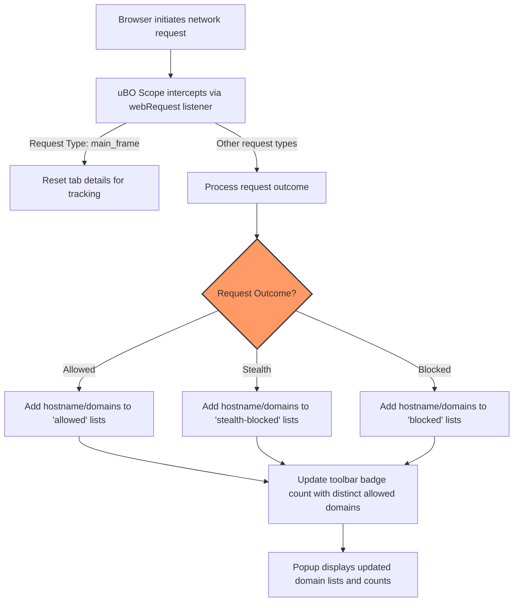

# How uBO Scope Works

Discover how uBO Scope reveals the true picture behind every remote connection your browser attempts. This guide explains the core monitoring mechanism, clarifies the meaning of connection outcomes—including allowed, stealth-blocked, and blocked—and decodes how the badge count on the toolbar icon represents the number of unique third-party servers contacted. Gain clarity on how uBO Scope works reliably alongside your content blockers and DNS protections to provide comprehensive network transparency.

---

## Understanding uBO Scope’s Measurement Approach

uBO Scope leverages your browser's native `webRequest` API to track and report all network requests made by webpages in real time. This means it listens to every attempt your browser makes to connect to remote servers, regardless of whether those requests are successful, blocked, or redirected stealthily.

### What Happens Under the Hood (From a User Perspective)

1. **Event Listening:** The extension registers listeners on the browser’s networking layer to observe requests to http(s) and websocket schemes.
2. **Request Outcomes:** Each network request is categorized into one of several outcomes:
   - **Allowed:** The connection was successful and responded.
   - **Stealth-blocked:** Connection attempts that were silently redirected or prevented in a way that doesn’t emit direct block signals to the requesting page.
   - **Blocked:** Requests explicitly blocked by the content blocker or other browser protections.
3. **Domain Aggregation:** uBO Scope collects and counts distinct third-party domains behind these requests to provide an aggregate view.

### Domains, Hostnames, and the Third-Party Focus

uBO Scope associates every network request with its corresponding hostname and further groups them by registered domain—this helps detect unique third parties. For example, subdomains like `cdn.example.com` and `ads.example.com` belong to the same root domain `example.com`. Counting at the domain level ensures an accurate measure of resource origins.

---

## Outcomes Explained: Allowed, Stealth, and Blocked

By differentiating request results, uBO Scope gives you a nuanced picture beyond simple "blocked vs allowed" views.

| Outcome        | Meaning                                                                                       | What You See in uBO Scope                     |
|----------------|-----------------------------------------------------------------------------------------------|-----------------------------------------------|
| **Allowed**    | Requests that completed successfully and loaded content from the corresponding domain.         | Displayed under "Not Blocked" domains.       |
| **Stealth-blocked** | Requests that were stopped or redirected silently (without triggering normal blocking signals), typically to avoid detection or breakage. | Shown under the "Stealth-blocked" domains.  |
| **Blocked**    | Requests explicitly blocked by content filters or browser protections, preventing any data retrieval.| Listed in the "Blocked" domains section.     |

### Why Does Stealth Blocking Matter?

Many content blockers use stealth techniques to avoid detection by webpages and to prevent breakage. These stealth blocks don't always generate visible error statuses or explicit network errors but still prevent loading. uBO Scope captures these stealth outcomes to show you exactly which domains were targeted but stealthily blocked.

---

## Deciphering the Toolbar Badge Count

The badge text you see on the uBO Scope toolbar icon is a live count of **distinct third-party domains that have allowed connections** in the active tab. Here’s why this matters:

- **Third-party focus:** It excludes first-party domains (the site you’re visiting) to highlight all external connections.
- **Lower count is better:** A smaller badge count means your browser fetched resources from fewer third-party servers, indicating stronger content blocking or fewer trackers.
- **Not a block count:** This number is distinctly about allowed connections, not how many were blocked.
- **Real-time updates:** It continuously updates as your browser loads or navigates to new pages.

This counting approach is key to debunking common misconceptions about blockers — the block count itself doesn't reflect blocking effectiveness, but rather how many unique third-party sources manage to send resources.

---

## How uBO Scope Tracks Requests Reliably Irrespective of Other Blockers

One of uBO Scope’s core strengths is its independence from any content blocker’s internal logic or DNS configurations. Because it listens directly to the native browser `webRequest` API, it can observe every network request outcome reported by the browser itself — even if a DNS-level block prevents the actual connection, or other content blockers modify requests stealthily.

This means:

- Network requests visible in your browser’s network layer are captured faithfully.
- Measurement is accurate regardless of what filtering or protection layers are installed.
- Certain DNS or external blocking methods might not be visible if they fully prevent the browser from reaching the network layer.

If a request is completely invisible to your browser’s internals, uBO Scope won’t report it — but for extension-based blocking and standard network requests, it offers unmatched transparency.

---

## Workflow: From Network Request to Domain Counting

This step-by-step example walks through what happens as you visit a website and how uBO Scope processes network requests.

<Steps>
<Step title="Page Load and Initial Request">
The browser starts loading a website (e.g., `https://news.example.com`). uBO Scope notes this main frame request and tracks its hostname and registered domain.
</Step>
<Step title="Third-Party Requests">
As the page loads, it requests resources from third parties like `cdn.imageservice.com` or `ads.tracker.io`. Each request fires events that uBO Scope listens to.
</Step>
<Step title="Request Outcome Evaluation">
Each request outcome is recorded as Allowed, Stealth, or Blocked based on network signals, redirects, or errors seen by the extension.
</Step>
<Step title="Domain Aggregation and Counting">
uBO Scope collects the domains behind these requests, counting how many distinct third-party domains connected successfully.
</Step>
<Step title="Toolbar Badge Update">
The badge on the toolbar updates to reflect the count of distinct allowed third-party domains.
</Step>
</Steps>

---

## Practical Tips for Using uBO Scope Effectively

- **Interpret badge carefully:** A lower badge count signals fewer third-party connections and typically better privacy.
- **Explore the popup:** Click the toolbar icon to see detailed lists of allowed, stealth-blocked, and blocked domains to understand your browsing profile.
- **Consider stealth-blocked domains:** These can hint at advanced blocking techniques or stealthy trackers.
- **Validate filter performance:** Cross-reference uBO Scope’s counts with your filter list activity to understand real privacy impact.
- **Remember DNS limits:** If blocking happens before browser networking (e.g., DNS-level), uBO Scope might miss it.

---

## Troubleshooting Common Confusions

<AccordionGroup title="Common Questions About How uBO Scope Works">
<Accordion title="Why doesn't the badge show blocked domains?">
The badge counts only allowed third-party domains to highlight effective connections. The blocked domains appear only in the popup detailed list.
</Accordion>
<Accordion title="What if my content blocker shows different block counts?">
Block counts can vary due to differences in measurement methods. uBO Scope focuses on distinct third-party domains allowed, not block event counts.
</Accordion>
<Accordion title="Can uBO Scope see connections made outside the browser?">
No. uBO Scope relies on the browser's network API and cannot observe network activity from other apps or outside the browser context.
</Accordion>
<Accordion title="Why are some stealth-blocked domains not reflected in network errors?">
Stealth blocking uses subtle redirection or interception techniques to avoid detection by webpages, so they might not manifest as explicit errors.
</Accordion>
</AccordionGroup>

---

## Visualizing How uBO Scope Processes Network Requests

---

## Next Steps

Continue your uBO Scope journey by exploring these related topics:

- [What is uBO Scope?](/overview/getting-started/what-is-ubo-scope) — Understand the product’s purpose and high-level value.
- [Core Concepts & Terminology](/overview/getting-started/core-concepts) — Learn important definitions for interpreting reports.
- [Interpreting the Toolbar Badge and Popup Panel](/guides/core-workflows/interpreting-badge-and-popup) — Get deeper insights into the interface.

This foundation will enable you to effectively monitor and analyze browser connection behaviors, ensuring transparency and better control over your browsing privacy.
