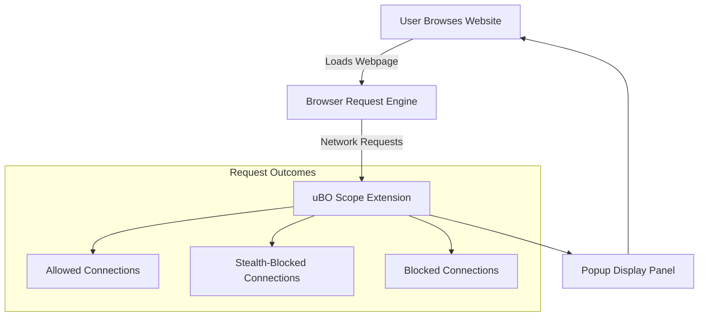

# What is uBO Scope?

## Discover Every Network Connection Your Browser Makes — Clearly and Transparently

uBO Scope is a lightweight, focused browser extension designed to reveal the often invisible network activities of websites. It uncovers **all attempted and successful remote server connections** initiated by the pages you visit, laying bare the paths your data travels and the servers your browser contacts — whether those connections are allowed by your content blockers, stealth blocked, or fully blocked.

### Why This Matters to You

Modern websites engage multiple servers beyond the main domain — content delivery networks, analytics platforms, trackers, advertising servers, and more — frequently unknown to users. uBO Scope makes these visible in real time, empowering you to:

- **See the true reach** of a website's network footprint, understanding exactly which third-party servers are contacted.
- **Evaluate content blockers** by observing which domains they allow versus stealth block or fully block.
- **Make informed privacy decisions** based on tangible data rather than guesswork or opaque blocker metrics.
- **Assist filter list maintainers** with precise insights into connection behaviors when traditional browser tools are insufficient.

### What Is uBO Scope? — Simply Put

uBO Scope is a browser extension that listens to your browser’s network activity and reports the distinct domains connected to by each webpage you visit. Unlike generic blocker counters or unreliable test pages, it provides a granular, factual view of real-world connections, regardless of which content blocker you use.

### How uBO Scope Uniquely Works

While many content blockers focus on blocking resources, uBO Scope focuses on **measurement and transparency**. It leverages the browser's `webRequest` API to track requests, capturing:

- **Allowed connections** — those successfully reaching external servers.
- **Stealth-blocked connections** — requests silently redirected or suppressed by blockers.
- **Blocked connections** — requests that failed due to active blocking.

This approach gives you unparalleled clarity into web traffic patterns that other tools hide or oversimplify.

### Key Benefits at a Glance

- **Complete and unfiltered visibility** into remote connections initiated by websites.
- **Badge icon count reflects distinct third-party domains connected to**, offering an easy privacy metric.
- **Works alongside any content blocker**, showing their real-world impact transparently.
- **No reliance on artificial test pages** — insights are based on genuine network activity.
- **Open source and lightweight**, ensuring privacy, security, and optimal performance.

### Visualizing uBO Scope’s Data

When activated, uBO Scope displays a clear, organized panel:

- The **number of distinct domains** connected to (not the raw number of requests).
- Lists of domains grouped by connection outcome:
  - **Allowed:** Domains successfully connected.
  - **Stealth-blocked:** Domains connections blocked in a hidden, non-disruptive way.
  - **Blocked:** Domains fully blocked, with requests failing.

This separation helps you quickly understand the effectiveness of your blockers and the true network footprint of websites.

### Real-World Scenario

Imagine visiting your favorite news site. Without uBO Scope, the site loads, but you have no visibility into how many tracking or advertising servers it contacts behind the scenes.

With uBO Scope enabled, you immediately see the domains your browser attempts to connect to, how many are allowed, and which were stealth blocked or outright blocked. You discover, for example, the site engages seven distinct third-party servers, three of which are stealth-blocked by your content blocker — an actionable insight to adjust your privacy tools.

---

## Getting Started Preview

To begin using uBO Scope, simply install the extension from your browser’s addon store (Chrome Web Store, Firefox Add-ons, Safari Extensions). Upon activation, uBO Scope tracks network activity on the active tab and displays connection details in its popup panel.

For detailed instructions, see the [Installing uBO Scope](https://github.com/gorhill/uBO-Scope#installation) guide and explore sections like [Understanding the Extension Badge](../getting-started/first-steps-validation/understanding-the-extension-badge).

---

<Callout title="Important">The toolbar badge count shows **distinct third-party domains contacted**, not the total number of network requests. A lower count indicates fewer connections, representing potentially higher privacy.</Callout>

---

## Common Misconceptions Debunked

- **Block counts alone don’t indicate blocker performance:** A content blocker reporting a high number of blocked requests might still allow connections to more distinct domains — a worse privacy outcome. uBO Scope shifts focus from request counts to domain counts.

- **'Ad blocker test' pages are unreliable:** These artificial test pages simulate blocking scenarios unrealistic in normal browsing, providing misleading results. uBO Scope evaluates real network traffic, eliminating such illusions.

---

## Summary

uBO Scope puts the power of network visibility in your hands, so you can confidently understand and manage your web privacy landscape. It’s a practical, no-nonsense tool that complements your content blockers by illuminating their real-world impact.

---

## See Also

- [Who Should Use uBO Scope?](../overview/getting-started/user-audience-usecases)
- [Key Features at a Glance](../overview/getting-started/feature-quicklook)
- [Understanding the Extension Badge](../getting-started/first-steps-validation/understanding-the-extension-badge)
- [Viewing & Interpreting Connection Data](../getting-started/first-steps-validation/viewing-and-interpreting-connection-data)

---

---

### Technical Diagram: High-Level Data Flow of uBO Scope

This flow illustrates how uBO Scope fits between your browser's network activity and your view, sorting connection attempts into actionable categories.

---

## Additional Tips & Best Practices

- Regularly check the extension popup during your browsing sessions to build awareness of third-party connections.
- Use uBO Scope in conjunction with content blockers to fine-tune and verify your privacy settings.
- Pay attention to stealth-blocked domains as these indicate hidden attempts at connection often invisible to websites.
- If you notice a surge in allowed domains unexpectedly, review your blocker settings or investigate the domains.

---

## Troubleshooting

If uBO Scope does not show data:

- Ensure the extension is enabled and has permissions as required by your browser.
- Confirm your browser supports the `webRequest` API fully — some browsers or versions have limitations.
- Reload the active tab or restart the browser to refresh the extension's data.

For advanced troubleshooting, see the [Quick Troubleshooting Scenarios](../getting-started/first-steps-validation/quick-troubleshooting) guide.

---

_Last updated with version 1.0.1 — For source code and detailed documentation, visit the [uBO Scope GitHub repository](https://github.com/gorhill/uBO-Scope)._
