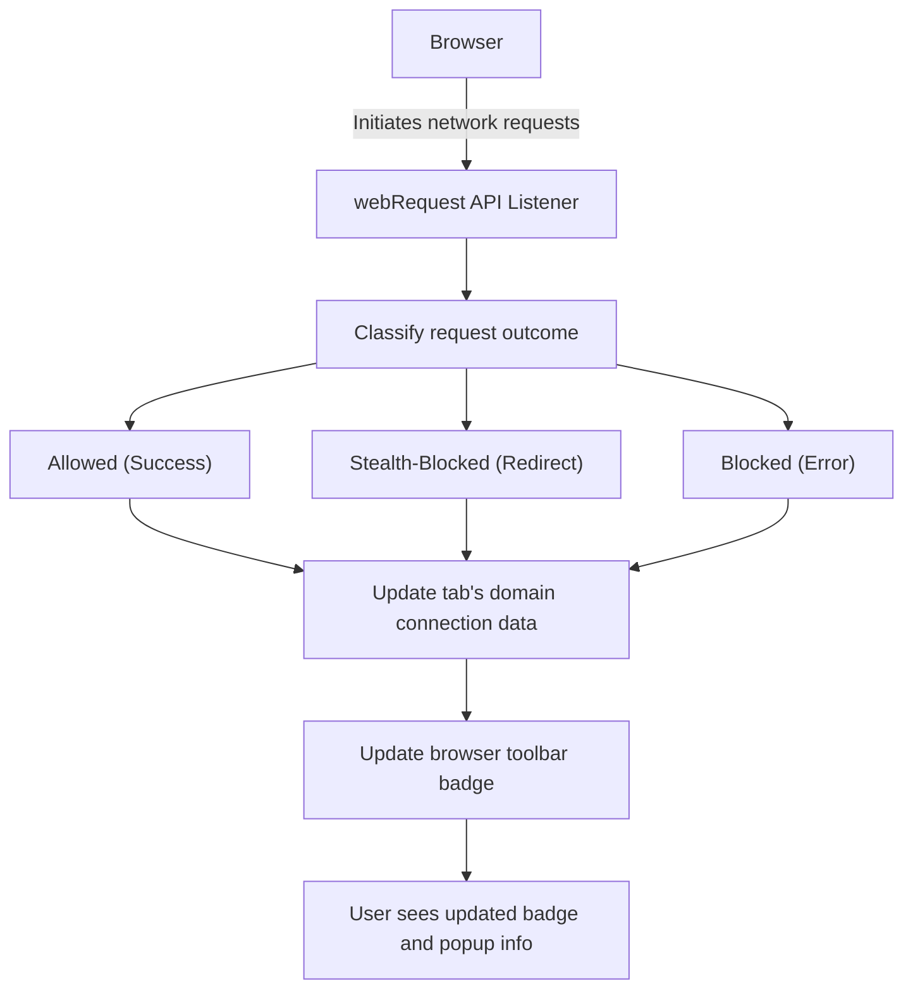

# What is uBO Scope?

## Seeing the Web's Hidden Connections

Imagine browsing the web with clear insight into every remote server your browser contacts—not just the obvious ones, but *all* connections initiated by webpages, whether allowed or blocked. This is exactly what **uBO Scope** delivers: a powerful browser extension that reveals every network request attempt made by your browser.

### Why uBO Scope Matters

- **Full Visibility:** Understand both successful and failed connections from the pages you visit.
- **Unbiased Reporting:** See connections independent of your content blocking settings.
- **Privacy Empowerment:** Identify third-party servers communicating behind the scenes.
- **Filter List Aid:** Perfect for filter authors who need precise data on network behavior.

This tool surfaces the raw truth about web requests, empowering users and developers to make smarter decisions about privacy and content blocking.

## What Exactly is uBO Scope?

uBO Scope is a lightweight browser extension that listens to your browser’s network activity and reports every connection attempt webpages make to remote servers. It works alongside content blockers but does not interfere with them—instead, uBO Scope provides an accurate map of what **actually happens on the network layer**.

### Key Benefits

- **Unfiltered Network Insights:** Even if a request is stealth-blocked or otherwise manipulated by your content blocker, uBO Scope tracks it.
- **Domain-Level Overview:** See the distinct third-party domains your browser connects to, helping you measure exposure to trackers and ad networks.
- **Badge Summary:** The toolbar icon shows a badge count—representing the number of distinct third-party servers connected per tab—giving a quick, actionable privacy metric.

### How uBO Scope Works

At its core, uBO Scope hooks into the browser's `webRequest` API, monitoring every network request your browser makes or attempts to make. It categorizes outcomes into:

- **Allowed:** Requests that succeeded.
- **Stealth-Blocked:** Requests that were redirected or blocked quietly.
- **Blocked:** Requests that failed outright.

Together, these outcomes paint a complete picture.

## Key Features & Capabilities

- **Real-time Network Request Capture:** Collects ongoing request data per browser tab, updating you instantly.
- **Outcome Classification:** Differentiates and tallies allowed, stealth-blocked, and blocked requests by domain.
- **Browser Badge Indicator:** Displays a numeric badge per tab reflecting connected third-party servers count.
- **Detailed Popup View:** Provides an organized breakdown of domains contacted, grouped by request outcome.
- **Persistence Across Sessions:** Retains session data for consistent tracking within browsing sessions.

> _For example, when visiting a news site, you can instantly see how many and which third-party domains are contacted, helping you assess privacy exposure beyond what your content blocker reports._

## Why Should You Care?

### Concrete Privacy Insights
Too often, users only see what content blockers block, not what connections are attempted or silently allowed. uBO Scope fills this blind spot by:

- Providing transparency on third-party server connections.
- Helping you identify unexpected or suspicious external requests.
- Demonstrating the actual impact of content blockers beyond block counts.

### Practical Use Cases

- **Privacy-Conscious Browsers:** Monitor and minimize exposure to trackers and ad servers.
- **Filter List Developers:** Validate the effectiveness and coverage of ad-blocking rules.
- **Security Analysts:** Detect unusual or stealthy outgoing connections from webpages.

### Before and After uBO Scope
Before: You may rely solely on block counts or anecdotal evidence of content blockers’ effectiveness.

After: You have clear, actionable data on all network requests, empowering smart decisions about privacy and security.

## Getting Started Preview

To start using uBO Scope:

- Install the extension corresponding to your browser.
- Observe the badge count on the toolbar as you browse.
- Click the extension icon to open the popup and see detailed request data grouped by allowed, stealth-blocked, and blocked domains.

### Prerequisites

- Supported browsers: Chromium-based browsers, Firefox (v128+), and Safari (v18.5+).
- Permissions enabled for webRequest monitoring and storage.

### Next Steps

Explore these parts of the documentation to deepen your understanding and make the most of uBO Scope:

- [Installing and Setting Up uBO Scope](../guides/getting-started/install-setup)
- [Understanding the Popup & Badge Count](../guides/getting-started/understand-popup-badge)
- [Validating Content Blocker Effectiveness](../guides/practical-use-cases/validate-content-blocker)

---

## How uBO Scope Tracks Network Requests — Simplified Flow

This represents the journey of a network request through uBO Scope, capturing its result and updating UI indicators accordingly.

## Practical Tips & Best Practices

- Regularly check the toolbar badge after visiting new websites to monitor exposure.
- Use the popup details to spot unexpected domains or high numbers of third-party connections.
- Remember: a lower badge count means fewer third-party connections and better privacy.
- Keep your browser updated to support all uBO Scope features and permissions.

## Troubleshooting Common Issues

- **No badge count appearing:** Ensure the extension has necessary permissions and your browser supports the `webRequest` API.
- **Popup shows 'NO DATA':** Refresh the active tab or open a new tab; uBO Scope tracks active tabs’ connections only.
- **Confusing domain names:** uBO Scope uses public suffix list and punycode translation for accurate domain display; occasionally, punycode can appear if domains use internationalized characters.

## Summary

uBO Scope uniquely reveals the full scope of network activity initiated by webpages, beyond what typical content blockers expose. Its clear categorization and tab-specific badge counting puts privacy insights at your fingertips.

Start your journey towards understanding your browser’s real network behavior—empower your privacy and filter development with uBO Scope.

---

For more details, visit the [GitHub repository](https://github.com/gorhill/uBO-Scope) or explore other sections in this documentation to set up and harness the full power of uBO Scope.

---

**End of Documentation for 'What is uBO Scope?'

