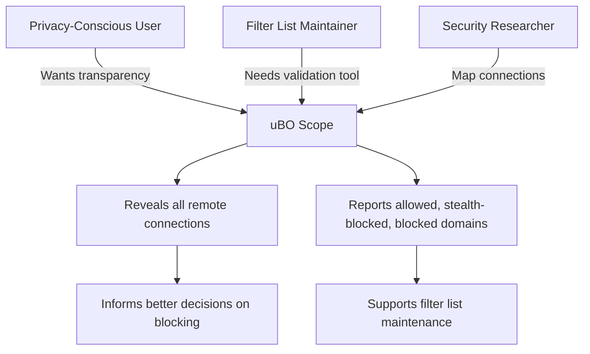

# Who Should Use uBO Scope?

Discover whether uBO Scope fits your needs. Whether you are a privacy-conscious web user, a filter list maintainer, or a researcher seeking clear insights into web connections, this guide explains typical scenarios where uBO Scope delivers unmatched transparency.

---

## Understanding Your Privacy Landscape

uBO Scope reveals all remote server connections a webpage attempts or establishes, going beyond what conventional content blockers display. For anyone concerned about unseen or stealthy connections that threaten privacy, this tool provides definitive visibility.

Imagine visiting your favorite news site and wondering which third-party servers it truly contacts behind the scenes. uBO Scope lifts the curtain by showing the actual network destinations involved—even those masked by other content blockers or network-level DNS filters.

---

## Who Benefits Most from uBO Scope?

### Privacy-Conscious Web Users
- **Control Your Exposure:** Know exactly how many and which third-party domains your browser connects to on each site.
- **Avoid False Assurances:** Reject misleading metrics like block counts or synthetic ad-block tests. Instead, understand real connections.
- **Stay Informed:** Use the badge count as a simple health indicator. Fewer third-party remote servers means less unintended exposure.

### Filter List Maintainers and Researchers
- **Fine-Tune Lists:** Identify all third-party domains involved in a page load, allowing meticulous crafting and verification of filter lists.
- **Validate Effectiveness:** Confirm which third-party connections remain unblocked and which are stealth-blocked or explicitly blocked by your lists.
- **Work Beyond Browser Limitations:** Especially on devices or environments lacking full dev tools access, uBO Scope offers a streamlined way to audit network requests.

### Developers and Security Analysts
- **Map Network Dependencies:** Gain insight into every external domain a web application interacts with.
- **Debug Complex Filtering Issues:** Detect unexpected redirects, errors, or stealth-block behaviors affecting resource loading.

---

## Typical Scenarios Where uBO Scope Excels

**Scenario 1: Verifying Content Blocker Performance**

You suspect your content blocker might falsely claim high blocking effectiveness based on block count alone. With uBO Scope, you see the true number of distinct third-party servers your browser contacts. This grounds your evaluation in transparency rather than superficial metrics.

**Scenario 2: Investigating Unknown Connections**

After visiting a website, you notice unusual resource loads or latency. Launching uBO Scope reveals remote domains contacted, helping uncover hidden tracking or ad networks.

**Scenario 3: Supporting Filter List Updates**

As a maintainer, you need to confirm that new filters successfully block unwanted domains while avoiding false positives. uBO Scope’s categorized domain lists—allowed, stealth-blocked, and blocked—assist in these validation tasks.

---

## What to Expect With and Without uBO Scope

| With uBO Scope                                              | Without uBO Scope                               |
|-------------------------------------------------------------|------------------------------------------------|
| See all remote server connections even those masked by blockers | Rely on partial or misleading block count metrics |
| Understand stealth blocking effects accurately              | Miss subtle blocking behaviors                   |
| Confidently validate your content blocking setup            | Difficult to verify actual network exposure       |

---

## Practical Tips

- Remember that not all third parties are harmful; CDNs often show as third-party domains.
- Use the badge count as a quick sanity check for exposure on each tab.
- Combine uBO Scope insights with filter list analysis for comprehensive privacy management.

---

## Getting Started

To explore how uBO Scope can clarify your web connections and enhance your privacy toolkit, install the extension for your preferred browser:

- [Chrome Web Store](https://chromewebstore.google.com/detail/ubo-scope/bbdpgcaljkaaigfcomhidmneffjjjfgp)
- [Firefox Add-ons](https://addons.mozilla.org/firefox/addon/ubo-scope/)

Then proceed to the [What is uBO Scope?](overview/getting-started/what-is-ubo-scope) page for an introduction.

<AccordionGroup title="Common Questions">
<Accordion title="Can uBO Scope tell me which third parties are safe?">
While uBO Scope shows every remote server connection attempted, it does not judge their safety. It helps you identify the scope of connections; assessing risk remains a user or filter list maintainer task.
</Accordion>
<Accordion title="Will uBO Scope slow down my browsing experience?">
uBO Scope efficiently listens to network events without blocking requests itself. It does not add noticeable delay but provides real-time insights into connections.
</Accordion>
<Accordion title="Does uBO Scope replace my content blocker?">
No. uBO Scope complements content blockers by revealing connections regardless of any blocking in place. It helps you understand what your blocker allows, blocks, or stealth blocks.
</Accordion>
</AccordionGroup>

---

## Related Documentation

To deepen your understanding of how to leverage uBO Scope, explore:

- [What is uBO Scope?](overview/getting-started/what-is-ubo-scope) — Learn what the extension is and its core functionality.
- [Core Concepts & Key Terms](overview/getting-started/core-concepts-and-terminology) — Understand terminology like ‘third-party remote servers’ and ‘badge count.’
- [Validating Content Blocker Effectiveness](guides/practical-use-cases/validate-content-blocker) — Learn practical applications of uBO Scope’s insights.

---

Unlock full transparency of your web browsing connections — see clearly with uBO Scope.

---

## Visual Summary: Where You Fit

---

Start your journey today to see beyond the visible and reclaim control over third-party connections with uBO Scope.

 

---

# Additional Resources

You can find the latest source code and updates on the [uBO Scope GitHub Repository](https://github.com/gorhill/uBO-Scope).

For installation and validation guidance, explore the Getting Started section of this documentation.

---