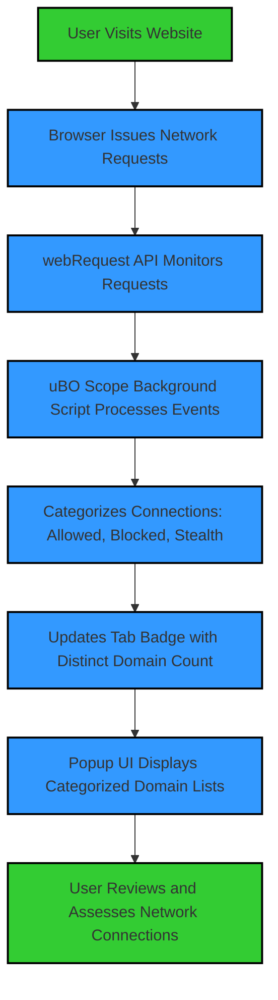

# Quick Feature Tour

Discover how uBO Scope brings transparent network monitoring right to your browser’s toolbar with real-time insights and actionable data. This guided walkthrough highlights the extension’s core features, explains their practical value, and maps them directly to everyday browser workflows so you can quickly assess your online privacy exposure.

---

## Badge Count: Your Instant Privacy Meter

At a glance, the badge count on uBO Scope’s toolbar icon shows the **number of distinct third-party remote servers** contacted by the active webpage.

- **What It Means:** Each unique third-party server represents a potential privacy boundary.
- **Why It Matters:** A lower count signals fewer external connections and a smaller attack or tracking surface.
- **Real Browser Workflow:** When you visit a site, check the badge. A surge in distinct servers alerted by the badge can indicate heavy third-party resource loading (ads, trackers, CDNs).

### Practical Tip
If you see an unexpectedly high count, investigate the popup UI (next section) to identify which domains are involved and whether connections are allowed, blocked, or stealth-blocked.

---

## Categorized Domain Lists: Clear Visibility into Connections

The popup UI presents domain names grouped by their connection outcome, making complex network activity understandable at a glance.

- **Allowed Domains (Green Section):** These are the third-party servers your browser successfully connected to and loaded resources from.
- **Blocked Domains (Red Section):** Third-party servers your browser attempted connections to but were explicitly blocked.
- **Stealth-Blocked Domains (Red Section):** Connections that were silently prevented or redirected, often to maintain stealth and reduce leak risks.

### How This Helps
By categorizing domains by their outcome, you can:
- Quickly confirm if your content blocker is effective.
- Identify stealth or partial blocking behavior.
- Spot unexpected or suspicious connections.

### Real-World Example
Opening a news website, you might see a handful of allowed CDN domains under the green section, a few blocked advertising domains under red, and some stealth-blocked trackers that your content blocker hides.

---

## Popup UI Summary: At-Your-Fingertips Network Reporting

Beyond the badge and lists, the popup offers a clean, actionable summary:

- **Tab Hostname Display:** Shows the current page’s hostname and its registered domain for context.
- **Dynamic Domain Counts:** Reflects real-time updates as network requests succeed or fail.
- **Clear Visual Sections:** Color-coded segments provide immediate clarity.

### User Flow
1. Click the uBO Scope icon in your browser toolbar.
2. View the number of distinct third-party domains connected.
3. Explore detailed domain lists under each outcome category.
4. Use domain counts to prioritize which connections deserve closer scrutiny.

---

## Typical Usage Scenario

Imagine you’re auditing a newly launched website:

1. You open the site and observe the badge count spike to 15.
2. Opening the popup, you find:
   - 10 domains in allowed, mostly CDNs.
   - 3 domains blocked — known ad servers.
   - 2 stealth-blocked domains — trackers hidden by your content blocker.
3. You quickly conclude the site uses a moderate number of third parties and your blocker protects you effectively.

This immediate feedback accelerates your privacy assessment with zero guesswork.

---

## Best Practices and Tips

- **Consider the Badge as a Starting Point:** A higher badge count isn’t inherently bad — some legitimate sites load resources from multiple CDNs.
- **Use Domain Groupings to Diagnose Issues:** If you see many blocked or stealth-blocked domains, it might impact site functionality.
- **Refresh and Monitor Across Browsing Sessions:** Network requests vary by page and time; keep an eye on patterns.

---

## Getting the Most out of uBO Scope

To maximize benefits:
- Regularly open the popup UI when visiting new or suspicious websites.
- Cross-check domains you don’t recognize with trustworthy domain lists.
- Use uBO Scope alongside your favorite content blocker to see what’s actually getting through.

---

## How uBO Scope Fits Into Your Browser Environment

This flow illustrates how the extension captures network activity and transforms it into actionable insights you see instantly.

---

## Troubleshooting Common Questions

<AccordionGroup title="Troubleshooting Quick Feature Tour">
<Accordion title="Why does the badge count show zero sometimes?">
The badge resets when no third-party connections are detected or when you switch tabs to a page that has none. It reflects the current active tab’s connections only.
</Accordion>
<Accordion title="What if I see allowed domains I don’t expect?">
Some legitimate services, like content delivery networks (CDNs), appear as allowed third parties. Review the domains carefully before taking action.
</Accordion>
<Accordion title="Does uBO Scope block connections itself?">
No. uBO Scope only monitors and reports on connections. Actual blocking is performed by your content blocker or browser settings.
</Accordion>
</AccordionGroup>

---

## Next Steps

- Explore [System Architecture Overview](/overview/how-it-works-and-architecture/system-architecture-overview) to understand the underlying data flows in detail.
- Review [Core Concepts & Terminology](/overview/product-intro-and-basics/core-concepts-and-terminology) to fully grasp the meaning of connection categories.
- Install and start using uBO Scope via platform-specific [Installation Guides](/getting-started/installation-and-setup).

---

By mastering these features, you gain a powerful lens into your browser’s network behavior, enabling smarter privacy decisions and real-time validation of your content blocking setup.

---