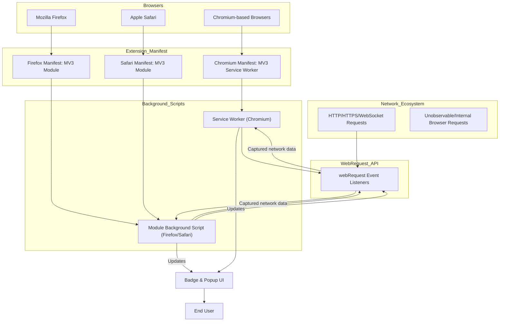

# Browser Integration & Compatibility

## Seamless Integration Across Major Browsers

uBO Scope leverages the power of the WebExtension API, integrating deeply with major browsers via the `webRequest` API to monitor and report network connections efficiently. This seamless integration ensures that you receive detailed insights into all remote server connections initiated by web pages, regardless of existing content blockers.

Unlike generic network tools, uBO Scope observes requests through the same API level as browser extensions, enabling it to capture a true picture of your browsing activity at the network layer.

### Why Cross-Browser Support Matters

Browser inconsistencies often complicate extension behavior, especially regarding background processes and event listeners. uBO Scope addresses these challenges with a manifest and background scripts tailored for each supported platform, ensuring consistent performance and user experience.

## What This Means for You

- **Consistent Monitoring**: Whether you're using Chromium, Firefox, or Safari, uBO Scope tracks network requests uniformly, helping you understand the landscape of remote connections from web pages.
- **Accurate Badge Counts**: The toolbar badge reliably reports the number of distinct third-party servers engaged per tab across supported browsers.
- **Robust Permissions Model**: By declaring necessary permissions explicitly in browser manifests, uBO Scope maintains transparency and security.

---

## How uBO Scope Integrates with Browsers

At its core, uBO Scope listens to network events using the `webRequest` API. This API allows extensions to observe, analyze, and act upon network requests initiated by pages.

### Background Script Context

- **Chromium** uses a [service worker](platform/chromium/manifest.json) background with manifest version 3.
- **Firefox** employs a module-type background script with manifest version 3.
- **Safari** runs a module-type background script under manifest version 3 with specific browser version constraints for compatibility.

Each manifest explicitly declares these backgrounds and permissions to match browser expectations, as seen in:

- [`platform/chromium/manifest.json`](platform/chromium/manifest.json)
- [`platform/firefox/manifest.json`](platform/firefox/manifest.json)
- [`platform/safari/manifest.json`](platform/safari/manifest.json)

### Permissions and Host Patterns

Across browsers, the extension requests these essential permissions:
- `activeTab` – To interact with the currently active tab.
- `storage` – To persist session data.
- `webRequest` – To observe network requests.

The allowed host permissions cover HTTP, HTTPS, WebSocket, and Secure WebSocket requests ensuring comprehensive monitoring of web traffic:
- `https://*/*`
- `http://*/*`
- `wss://*/*`
- `ws://*/*`

Note that Safari's manifest limits host permissions to HTTP and HTTPS protocols only due to API constraints.

## Manifest Manifestations: Cross-Browser Considerations

The manifest files demonstrate slight but critical differences tailored for browser compatibility:

| Browser  | Background Type      | Host Permissions Coverage              | Min Version Constraints       |
|----------|----------------------|---------------------------------------|------------------------------|
| Chromium | MV3 Service Worker    | HTTP/HTTPS/WSS/WS                     | Chrome 122+                  |
| Firefox  | MV3 Module Background | HTTP/HTTPS/WSS/WS                     | Firefox 128+                 |
| Safari   | MV3 Module Background | HTTP/HTTPS only                       | Safari 18.5+                 |

This cross-browser manifest setup ensures uBO Scope functions natively in each environment without sacrificing capabilities or user experience.

---

## Understanding Limitations: When Requests Escape API Coverage

While uBO Scope captures the vast majority of network activities through the `webRequest` API, there are inherent limitations:

- **External Requests Outside webRequest API Reach**: Some network requests initiated by browser components, plugins, or through non-standard APIs may not be observable. Examples include:
  - DNS-over-HTTPS requests handled internally by the browser.
  - Certain fetch/XHR requests made by extensions themselves.
  - Browser-internal prefetch or speculative connections.

- **Platform Restrictions**: On Safari, WebSocket monitoring is limited or unavailable due to the narrower host permissions scope.

These limitations mean that uBO Scope reports a highly accurate but not absolutely exhaustive set of remote connections. However, for practical web privacy and resource-awareness, the captured data is authoritative and actionable.

<Tip>
For the most comprehensive monitoring, use supported browsers like Chromium or Firefox where WebSocket and full protocol coverage are available.
</Tip>

## Putting It All Together: Your User Journey

1. **Install uBO Scope** on your preferred browser.
2. **Permissions granted**, including the crucial `webRequest` permission.
3. **Real-time monitoring** of network requests as you browse, powered by background scripts adapted for your browser.
4. **Badge updates** accurately reflect unique third-party domains connected.
5. **Popup insights** provide classified outcomes (allowed, stealth, blocked) for each remote server.

Your browser choice influences minor details but never the core experience. uBO Scope’s architecture abstracts these differences, delivering a reliable, privacy-focused insight tool.

---

## Example: Browser Manifest Snippet (Chromium)

```json
{
  "manifest_version": 3,
  "name": "uBlock Origin Scope",
  "permissions": ["activeTab", "storage", "webRequest"],
  "host_permissions": ["https://*/*", "http://*/*", "wss://*/*", "ws://*/*"],
  "background": {
    "service_worker": "/js/background.js",
    "type": "module"
  }
}
```

## Troubleshooting Common Integration Issues

<AccordionGroup title="Troubleshooting Browser Integration">
<Accordion title="Extension Fails to Monitor Requests">
Ensure the extension has been granted the `webRequest` and `host permissions`. In recent browser versions, these permissions must be explicitly accepted by the user.
</Accordion>
<Accordion title="Badge Count Not Updating">
Check that your browser supports service workers or module backgrounds as per extension requirements. Moreover, network requests made outside the API’s reach (e.g., internal DNS queries) won't affect the badge count.
</Accordion>
<Accordion title="Certain Requests Not Captured">
Understand that some protocols or browser internals are not exposed to extensions’ `webRequest` listeners. This is expected behavior, not an error.
</Accordion>
</AccordionGroup>

---

## Summary

uBO Scope’s browser integration blends sophisticated API usage with cross-platform manifests to deliver consistent, accurate network request visibility. While some requests may elude detection due to browser API limitations, the extension remains a powerful tool for understanding your real browsing network footprint.

For an architectural overview of the internal data flow and how requests are recorded and presented, see the [System Overview & Data Flow](./system-overview) documentation.


---

## References

- [Chromium Manifest](../../platform/chromium/manifest.json)
- [Firefox Manifest](../../platform/firefox/manifest.json)
- [Safari Manifest](../../platform/safari/manifest.json)
- [System Overview & Data Flow](../system-overview)
- [What is uBO Scope?](../../introduction-and-purpose/product-mission)


---

## Visual Diagram: Browser Integration and Data Flow



This diagram illustrates how uBO Scope’s different browser manifests and background contexts channel network requests through the webRequest API to provide unified insights regardless of platform.
