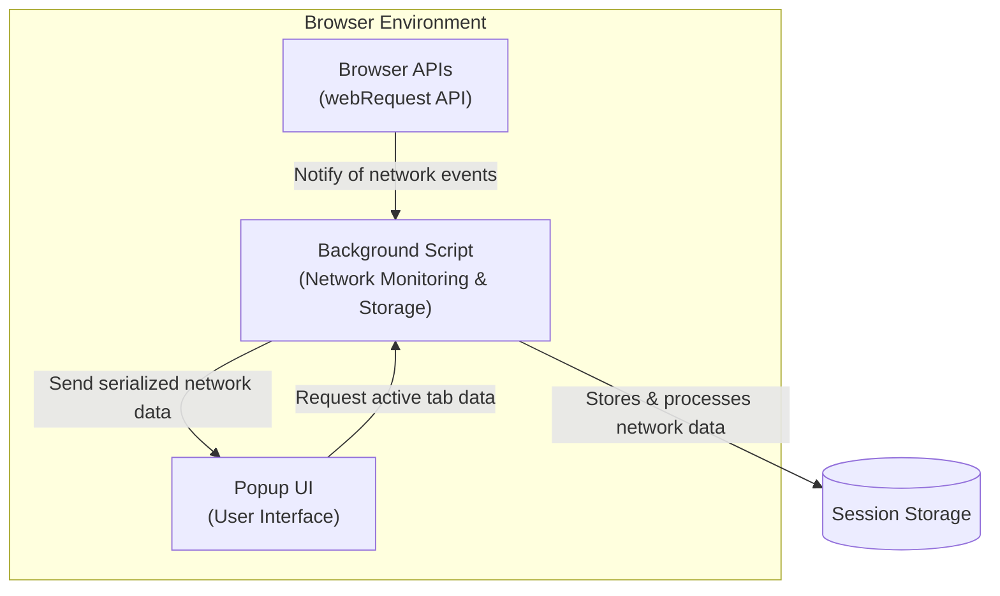

# System Architecture Overview

Welcome to the System Architecture Overview of uBO Scope — a visual guide mapping out the extension’s core components and their interplay. This page illuminates how uBO Scope operates seamlessly within your browser, independently from other content blockers, to transparently reveal all network connections initiated by your browsing activity.

---

## Understanding the Core Components

uBO Scope’s architecture is elegantly simple yet powerful. It primarily consists of three key components:

- **Background Script:** The heart of uBO Scope, responsible for monitoring, recording, and maintaining network request data.
- **Popup UI:** The interactive interface you access when clicking the toolbar icon, presenting summarized and detailed connection information.
- **Browser APIs:** The foundational browser mechanisms (notably the `webRequest` API) that allow the extension to observe network traffic.

Each plays a critical role, working together to capture, process, and display network activity in real time.

### Flow of Data

1. **Capturing Network Requests:**
   The background script listens to network events across all tabs via the `webRequest` API. It receives detailed notifications whenever a network request is initiated, redirected, completed successfully, or encounters an error.

2. **Analyzing and Logging Outcomes:**
   Each captured request is analyzed to determine its outcome — whether allowed, stealth-blocked (such as redirects that happen behind the scenes), or blocked. These outcomes, along with hosts and domains involved, are aggregated per-tab.

3. **Storing Session State:**
   The background script periodically persists this data securely within the browser’s session storage, ensuring continuity across tab reloads without overwhelming the system.

4. **User Interface Display:**
   When you open the popup UI, it sends a message to the background script requesting the current network activity summary for the active tab. The background script responds with the stored, serialized data.

5. **Rendering Information:**
   The popup UI then dynamically renders the connection details, categorizing them by connection outcome (allowed, stealth, blocked), and lists domains with request counts to give a clear snapshot of your browsing exposure.

### Independence and Transparency

It’s crucial to understand that uBO Scope functions independently of other content blockers or privacy tools you might have installed. It relies solely on the browser-reported network request events to provide a truthful view of remote server connections. This independence ensures that uBO Scope can expose the actual connections regardless of blocking mechanisms in place.

---

## Diagram: uBO Scope System Architecture

---

## Practical Scenario: How uBO Scope Works in Your Browser

Picture this: You’ve loaded a webpage, and behind the scenes, your browser initiates several network requests to render the page fully.

- As each request fires, uBO Scope’s background script captures the event — noting which domains are involved.
- If a request is redirected or blocked by other tools, uBO Scope tags them accordingly, giving you insight into stealthy or blocked connections.
- When you click uBO Scope’s toolbar icon, the popup UI fetches this data instantly.
- You see a clear and categorized list of all the third-party domains your browser is interacting with in real time.

This workflow empowers you to understand and audit your browsing footprint with unprecedented transparency.

---

## Best Practices & Tips

- **Refresh for Current Data:** Network conditions may change frequently. Reload the popup UI to get the most current network activity snapshot.
- **Use to Verify Content Blockers:** Since uBO Scope operates independently, it’s an ideal tool to verify which connections your content blockers allow or block.
- **Watch for Stealth Redirects:** Stealth-blocked entries may reveal quiet redirects or invisible trackers, giving you an early warning.

---

## Common Pitfalls & Troubleshooting

- **Empty or Missing Data:** If the popup shows 'NO DATA', ensure that you have the extension installed correctly and that you are browsing in a supported environment (see supported browsers).
- **Badge Count Not Updating:** Badge counts reflect unique third-party domains connected. Delays might occur if network traffic is sparse or if tab data has yet to be recorded.
- **Browser Updates or API Changes:** Some browser updates might affect how network requests are reported. Refer to integration and compatibility documentation for updates.

---

## Next Steps

- Explore the [Quick Feature Tour](/overview/how-it-works-and-architecture/feature-quickstart) to see uBO Scope’s key functionalities in action.
- Learn about [Integration and Compatibility](/overview/how-it-works-and-architecture/integration-and-compatibility) to understand browser support nuances.
- If new to uBO Scope, start with [What is uBO Scope?](/overview/product-intro-and-basics/what-is-ubo-scope) for foundational knowledge.

---