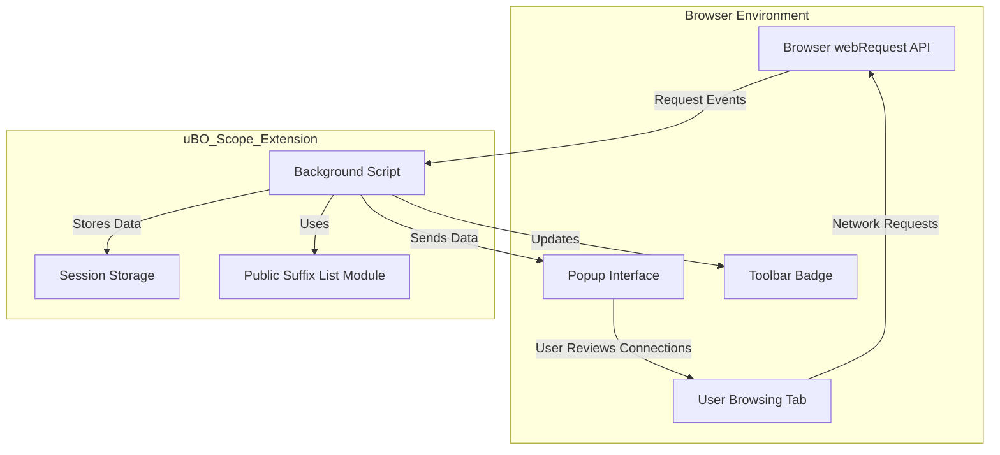

# System Overview & Data Flow

## Understand How uBO Scope Monitors and Categorizes Network Requests

When you activate uBO Scope, it immediately begins tracking all network requests your browser makes as you navigate the web. This page provides a high-level explanation of how the extension monitors these requests, classifies them, and presents key insights that help you grasp the nature of your online connections.

---

### Why This Matters to You

Modern websites often connect to numerous remote servers behind the scenes. Knowing which connections are attempted, allowed, or blocked is vital for understanding your online privacy and the effectiveness of your content blockers. uBO Scope reveals this hidden web of interactions transparently, empowering you to make informed decisions about your browsing.

---

## How uBO Scope Works: A User-Centric Data Flow

At its core, uBO Scope observes your browser's network activities to answer these questions:

- Which third-party servers is your browser attempting to connect to?
- Were these requests successful, blocked, or stealthily redirected?
- How many unique domains are involved?

The system can be broken down into three key stages:

### 1. Monitoring Network Requests

uBO Scope hooks into the browser's webRequest API, listening to every network request initiated during your browsing sessions. It captures detailed metadata about each request, including:

- The URL and type of resource (e.g., main page, image, script)
- Whether the request was successful, blocked, or redirected
- The browsing context (which tab and frame initiated the request)

### 2. Classifying Outcomes

Each network request is categorized into one of three outcomes:

- **Allowed:** The connection was successful and the resource was fetched.
- **Blocked:** The connection failed or was explicitly blocked by a content blocker.
- **Stealth:** Requests that resulted in redirects or inconspicuous blocking, which are harder to detect.

These outcomes are associated with both the specific hostname and its derived domain using the Public Suffix List, ensuring an accurate grouping of network destinations.

### 3. Summarizing and Presenting Data

The extension keeps organized records per browser tab, aggregating the domains and hostnames involved in each outcome category. This data is fed into the popup interface that you see when you click the extension button. Here, you can effortlessly review:

- The total number of unique domains connected to in the current tab
- Lists of domains grouped by allowed, stealth-blocked, and blocked outcomes
- Counts of occurrences per domain, helping you gauge activity frequency

This immediate summary lets you quickly assess your network connections without digging into complex logs.

---

## The Core Components Involved

| Component             | Responsibility                                                |
|-----------------------|---------------------------------------------------------------|
| **Browser webRequest API** | Provides real-time network request events for all URLs         |
| **Background Script**  | Listens to webRequest events, records and classifies outcomes |
| **Public Suffix List Module** | Converts hostnames to registrable domains for grouping           |
| **Session Storage**    | Persists session data between page reloads                     |
| **Popup UI**           | Displays summary information on allowed, stealth, and blocked domains |

---

## Typical User Flow

1. **Navigate to a Website:** You open a new tab and browse to a page.
2. **Requests Start Flowing:** The browser begins making network requests.
3. **Background Records Outcomes:** For each request, the background script updates the request outcomes grouped by domain.
4. **Active Tab Badge Updates:** The extension badge shows the count of distinct allowed third-party domains.
5. **Popup Display:** Clicking the extension icon brings up a categorized summary of those connections.

This flow ensures you have continuous visibility into your browsing network connections.

---

## Visualizing the System

---

## Practical Tips & Best Practices

- **Refreshing Data:** Data shown in the popup reflects the current tab’s network activity; switching tabs updates this context.
- **Interpreting the Badge:** A lower badge number indicates fewer allowed third-party domains, enhancing your privacy.
- **Handling Reloads:** Tab data persists during active sessions but resets when the tab is closed or refreshed with navigation.

## Troubleshooting Common Issues

- **No Data Appears in Popup:** Ensure that the page you are browsing is fully loaded and that uBO Scope has permission to observe web requests.
- **Badge Not Updating:** Sometimes browser background scripts may unload; switching tabs or refreshing should trigger updates.
- **Stealth Blocking Confusion:** Stealth refers to network request redirections and subtle blocks; these may need expert interpretation.

---

## Next Steps

To deepen your understanding or begin using uBO Scope, visit:

- [What is uBO Scope?](../introduction-and-purpose/product-mission) for the product’s mission
- [Badge & Popup: Immediate Insights](../core-concepts/badge-and-popup-overview) to learn about the UI
- [Browser Integration & Compatibility](../how-it-works-and-architecture/integration-and-browser-support) to check platform support and requirements

By mastering this overview, you unlock the ability to monitor your browser’s network footprint clearly and effectively.

---

<u>Explore how uBO Scope turns opaque network activity into transparent insights — empowering your privacy and control.</u>

---