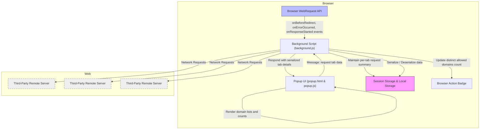

# Architecture Overview

Understand how uBO Scope tracks, processes, and presents third-party network connections through its internal architecture. This page provides a high-level explanation and a clear diagram illustrating the data flow from the browser's network events to the user interface you interact with in the popup.

---

## How uBO Scope Works Behind the Scenes

When you browse the web, your browser communicates with many servers, often beyond the first-party website you visit. uBO Scope reveals these network connections by leveraging the browser’s `webRequest` API to track every relevant network event, even those affected by content blockers or stealth blocking.

The core system is designed to efficiently monitor, process, and summarize network data per browser tab, making privacy exposure clear and actionable.

### The Main Components

- **Background Script**: The heart of uBO Scope, running as a persistent (or service worker in Chromium) script, listens to all network request events such as redirects, errors, and successful responses.
- **Session Data Storage**: The background script maintains a map of details per tab, recording domains contacted and classifying network request outcomes as allowed, stealth-blocked, or blocked.
- **Data Serialization**: To preserve state across sessions and manage communication, data is serialized and stored in the browser’s session storage.
- **Popup UI**: The user-facing popup fetches summarized data for the active tab via messages to the background script, rendering domain counts and classifications clearly.

---

## Data Flow Explained

Whenever a network request event occurs, the background script captures and queues the event. After brief batching (every ~1 second), it processes all network events, updating state for each tab. This process includes:

- Resolving hostnames and domains using the public suffix list
- Updating counts for allowed, stealth-blocked, and blocked domains
- Resetting tab state when main frame requests start a new browsing context
- Saving updated session data to persistent storage
- Updating the extension’s badge count to reflect distinct allowed domains per tab

When you open the popup, it requests the current tab’s summarized data, deserializes it, and presents it with detailed counts and domain lists segmented by outcome.

---

## Visual Architecture Diagram

---

## Key Takeaways

- **Centralized Tracking**: The background script listens to all network events across all tabs, ensuring no network connection is missed.
- **Per-Tab Context**: uBO Scope organizes data per browser tab to give accurate insight into which third-party domains each browsing context connects to.
- **Outcome Classification**: Connections are classified into allowed, stealth-blocked, and blocked, providing a comprehensive privacy snapshot.
- **Efficient Communication**: The popup UI retrieves only summarized data for the current tab on demand, minimizing resource usage.

---

## Practical Scenario

Imagine you are browsing a news site. The background script intercepts requests initiated by that tab:

1. The main page request is detected, tab details reset.
2. Third-party resources load: some are allowed, some are blocked by browser or other content blockers, and some are stealth-blocked.
3. The background script updates a running tally for each domain and outcome.
4. The badge count on the toolbar icon reflects distinct allowed third-party domains.
5. When you open the popup, the UI fetches this summarized data and presents a clear report:
   - Domains that successfully connected
   - Domains that were stealth-blocked
   - Domains blocked outright

This workflow ensures you have a real-time, transparent view of your browser’s network activity.

---

## Tips for Users

- **Understanding Badge Counts**: The badge shows the number of distinct third-party domains allowed. A lower number generally means better privacy.
- **Use the Popup**: Regularly open the popup to see detailed domain connection data for your current tab.
- **Track Tab Changes**: The system automatically clears data when tabs close or reload, ensuring accurate and up-to-date reporting.

---

For a deeper dive into how the data is handled, or if you want to contribute, see the source code at the [uBO Scope GitHub repository](https://github.com/gorhill/uBO-Scope).

---

# Related Documentation

- [What is uBO Scope?](../introduction-and-value/what-is-ubo-scope) — Introduction and value proposition
- [Core Benefits & Use Cases](../introduction-and-value/core-benefits) — How and why the extension helps
- [Integration & Compatibility](../how-it-works-architecture/integration-and-compatibility) — Technical context and supported environments

---