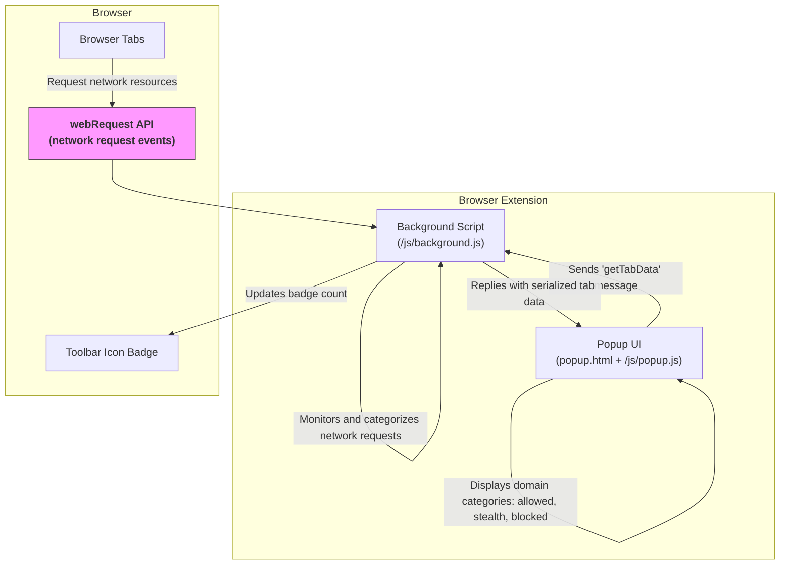

# System Architecture Overview

Explore the inner workings of uBO Scope through a clear explanation of its core components, the flow of data, and the interaction between the browser APIs and user interface. This overview demystifies how uBO Scope continuously monitors network requests and presents insights in a user-friendly popup.

---

## Introduction

uBO Scope is a browser extension designed to reveal all network connections initiated by your browser, giving you transparent visibility into the third-party resource requests on each webpage you visit. Understanding its system architecture is key to appreciating how it captures this network data while remaining non-intrusive to your browsing experience.

This page focuses on the main components supporting uBO Scope’s real-time monitoring and display of network requests:

- Background monitoring using the browser’s `webRequest` API
- Popup UI rendering and update
- The communication flow of network request data between the background and popup scripts

By walking through these elements, users will gain confidence in the extension's reliability and know what happens behind the scenes when they interact with uBO Scope.

---

## Core Components of uBO Scope

### 1. Background Monitoring (Background Script)

The backbone of uBO Scope’s operation is its background script (`background.js`). This component runs persistently or as a service worker (depending on browser platform) and listens to network activity:

- It registers listeners on browser events such as `onBeforeRedirect`, `onErrorOccurred`, and `onResponseStarted` via the `webRequest` API.
- As the browser initiates, redirects, completes, or fails network requests, these listeners capture details about those requests.
- The background script organizes requests per browser tab, categorizing them as **allowed**, **stealth-blocked**, or **blocked** based on the network outcome.

This process allows uBO Scope to create a comprehensive real-time map of the network connections your browser attempts or successfully makes.

**Key functions:**
- Continuous monitoring of network requests
- Categorization and storage of per-tab network outcome data
- Updates the toolbar badge showing the count of third-party domains contacted

### 2. Popup User Interface (Popup Script)

The popup, defined in `popup.html` and powered by `popup.js`, is the user-facing element that displays the collected network data.

- When a user clicks the browser action icon, the popup opens and immediately sends a message requesting the summarized network data for the active tab.
- The popup script receives this data, deserializes it, and dynamically renders the connection domains grouped into not blocked (allowed), stealth-blocked, and blocked categories.
- The UI is designed for readability and clarity, using domain counts and Unicode-aware domain name rendering to enhance comprehension.

### 3. Communication Flow

Because the popup needs up-to-date information but cannot listen to network events directly, uBO Scope implements a message-passing mechanism:

- The popup script sends a request message (`getTabData`) to the background script asking for the current tab’s network details.
- The background script replies with the serialized session data for that tab.
- On receipt, the popup updates the displayed summary and domain lists, providing users immediate insight.

This messaging model ensures instant, consistent data presentation whenever the popup is activated.

---

## How Network Request Data Flows

The high-level workflow of network data within uBO Scope is straightforward but effective:

1. **Network requests occur** whenever browsing a page.
2. The **background script intercepts requests** through `webRequest` event listeners.
3. Each request outcome (success, redirect, error) is recorded and categorized in session data tied to the specific browser tab.
4. **Badge count updates** on the extension icon inform users about the number of distinct remote third-party domains contacted.
5. When the user opens the **popup**, it sends a message to retrieve the current tab’s data.
6. The **background script replies** with serialized, detailed outcome data.
7. The **popup decodes and displays** allowed, stealth-blocked, and blocked connections with domain counts.

---

## Visualizing the Architecture

---

## Practical Tips for Users

- The badge on the extension icon reflects the **number of distinct allowed third-party domains** per active tab — a low count means fewer remote connections.
- You can open the popup anytime to explore details of which servers your browser connected to, including those connections stealth-blocked or blocked.
- This architecture ensures **accurate reporting regardless of other content blockers or DNS filtering** because it relies on the browser’s own `webRequest` events.

## Common Pitfalls to Avoid

- The extension cannot detect network requests completely invisible to the browser’s `webRequest` API (e.g., certain background system-level requests).
- If the popup seems empty or outdated, refreshing the tab or reopening the popup triggers fresh data retrieval from the background.

---

## Getting Started Preview

To experience the architecture in action:

1. Install uBO Scope (see Installation Instructions).
2. Open your browser and browse any website.
3. Notice the badge count on the toolbar updates to show the number of third-party domains contacted.
4. Click the extension icon to open the popup and explore detailed domain data categorized by allowed, stealth-blocked, or blocked.

For a deeper dive into feature specifics and usage, proceed to the [Feature Overview](/overview/feature-glimpse-quickstart/feature-overview) and [Using the Toolbar Badge Count Effectively](/guides/getting-started-essentials/using-the-badge-count) documentation.

---

## Summary

This System Architecture Overview lays out the clear separation of concerns in uBO Scope:

- The **background script** listens and categorizes all network requests in the browser.
- The **popup interface** retrieves and visualizes this data per active tab.
- Communication between these components ensures real-time, accurate insights into your browser’s network connections.

Understanding this architecture empowers users to trust and leverage uBO Scope for enhanced privacy awareness and network transparency.

---

## Additional Resources

- [What is uBO Scope?](/overview/intro-core-value/what-is-ubo-scope) — product introduction
- [Feature Overview](/overview/feature-glimpse-quickstart/feature-overview) — explore capabilities
- [Using the Toolbar Badge Count Effectively](/guides/getting-started-essentials/using-the-badge-count) — practical usage guidance
- [Installation Instructions](/getting-started/installation-and-setup/installation-instructions) — setup your environment
- GitHub repository: [https://github.com/gorhill/uBO-Scope](https://github.com/gorhill/uBO-Scope)
