# Core Concepts & Terminology

Understanding the terminology behind uBO Scope is essential to interpreting its output with confidence and precision. This page establishes the foundational language related to how uBO Scope identifies, categorizes, and reports network requests from your browser.

---

## Why These Concepts Matter

When you browse the web, your browser interacts not only with the sites you visit but also with many other servers in the background. uBO Scope sheds light on these network connections, revealing the true scope of your browser's third-party communications. Grasping key terms like "third-party servers," "allowed," "blocked," and "stealth-blocked" empowers you to accurately read the extension's data, assess your privacy exposure, and make informed decisions.

---

## 1. Third-Party Servers

**Definition:** Third-party servers are remote servers different from the website you are actively visiting (the first-party). For example, if you visit example.com and your browser requests resources from analytics.com or ads-network.net, those are third-party servers.

**User Perspective:** You want to know which external domains your browser contacts, especially because these third parties often track your activity or serve ads.

**Key Points:**
- uBO Scope identifies distinct third-party domains by extracting the *registered domain* (a.k.a. "eTLD+1") from hostnames.
- The extension uses an up-to-date public suffix list (from publicsuffix.org) to accurately determine domain boundaries, avoiding misclassification.

---

## 2. Outcome Categories: Allowed, Blocked, and Stealth-Blocked

These categories describe how uBO Scope detects the result of each network request:

- **Allowed:** Requests that successfully completed or connected to a third-party server.

- **Blocked:** Requests that the content blocker or browser prevented from reaching the server, resulting in an error.

- **Stealth-Blocked:** Requests that were redirected silently or manipulated to prevent detection by the webpage or third party, often appearing allowed but effectively blocked.

### Why This Matters

Typical content blockers display block counts, but these counts do not give the full picture. uBO Scope focuses on distinct third-party servers contacted per tab, revealing:

- The true number of allowed network connections.

- Differentiation between outright blocked and stealth-blocked requests, helping you identify content blockers’ evasion techniques.

### Example Scenario

Imagine you visit a site loading 15 third-party domains;

- 10 domains are allowed (content loaded successfully).
- 3 are blocked explicitly by uBlock Origin.
- 2 are stealth-blocked, using redirection tricks to avoid detection.

uBO Scope reports these categories distinctly, letting you see the real network activity behind the scenes.

---

## 3. Distinction Between Attempted and Successful Requests

- **Attempted Requests:** All network requests your browser initiates towards third-party servers.

- **Successful Requests:** Requests that actually receive a response or establish a connection.

### How uBO Scope Uses This

uBO Scope listens to the browser's `webRequest` API to observe all network events, tracking:

- Redirects
- Errors
- Successful responses

It classifies outcomes based on these events, ensuring accurate representation of third-party communication regardless of content blocker behavior.

---

## 4. Badge Counts and Their Meaning

The badge count visible on the toolbar icon represents **the number of distinct third-party domains with allowed connections** in the current tab.

### User Takeaway

- Lower badge counts mean fewer distinct third-party connections were made, generally reflecting higher privacy.

- Because the badge reflects **allowed connections only**, the count is a clear indicator of the number of third-parties your browser actually reached.

---

## Practical Tips for Users

- **Use badge counts to assess privacy exposure:** A high badge number means many distinct third parties connected, increasing potential tracking risks.

- **Check all three outcome lists in the UI:** The extension separates allowed, blocked, and stealth-blocked domains, making it easier to understand how effectively connections are controlled.

- **Understand stealth-blocking:** If you see stealth-blocked listed, it means some connections were hidden or redirected, which might not be evident with other tools.

- **Distinguish domains, not just URLs:** uBO Scope aggregates requests by domain to give a higher-level view, avoiding overwhelming details from many individual URLs.

---

## Summary Diagram: Conceptual Flow of Request Outcomes

```mermaid
flowchart TD
    A[Browser Initiates Network Request] --> B{Is Request
Third-Party?}
    B -- No --> C[Not Tracked by uBO Scope]
    B -- Yes --> D{What is the Outcome?}
    D -- Success --> E[Allowed Connection]
    D -- Redirect --> F[Stealth-Blocked Connection]
    D -- Error --> G[Blocked Connection]

    style C fill:#eef5ff,stroke:#2a5d9f,stroke-width:1px,color:#2a5d9f
    style E fill:#d0f0c0,stroke:#3a9d23,stroke-width:1px,color:#3a9d23
    style F fill:#f0e68c,stroke:#b5a42e,stroke-width:1px,color:#b5a42e
    style G fill:#f4cccc,stroke:#bb3b3b,stroke-width:1px,color:#bb3b3b

    click A 'https://github.com/gorhill/uBO-Scope/blob/main/js/background.js#L100-L150' "See request processing"
    click B 'https://publicsuffix.org/' "Public Suffix List source"

```

This diagram illustrates how uBO Scope evaluates each network request, sorting it by its third-party status and eventual outcome.

---

## How This Fits Within uBO Scope Documentation

This page builds the conceptual foundation necessary to interpret data seen in the popup UI and architecture details:
- Links directly from the [Architecture Overview](../how-it-works-architecture/architecture-overview) page
- Provides terminology referenced in the [What is uBO Scope?](../introduction-and-value/what-is-ubo-scope) introduction
- Supports understanding of core benefits explained in the [Core Benefits & Use Cases](../introduction-and-value/core-benefits) page

---

## Troubleshooting Common Terminology Confusions

<AccordionGroup title="Common Questions About Terms">
<Accordion title="Why do some third-party domains appear in multiple categories?">
Sometimes, the same third-party domain may have multiple requests with different outcomes during a browsing session (e.g., some requests blocked, others allowed or stealth-blocked). uBO Scope tracks all, categorizing accordingly to provide a complete picture.
</Accordion>
<Accordion title="What exactly does 'stealth-blocked' mean?">
Stealth-blocking involves subtle interception, such as silently redirecting requests or altering responses to prevent third-party tracking without triggering an explicit 'blocked' error. This lets content blockers be less detectable and avoid breaking webpages.
</Accordion>
<Accordion title="Can allowed connections still be privacy risks?">
Yes. Allowed connections mean your browser successfully communicated with that third party. Some allowed connections may serve essential content, while others could be trackers or advertising domains. The badge count indicates network exposure, not a guarantee of safety.
</Accordion>
</AccordionGroup>

---

## Key Takeaway

Mastering these terms enables you to confidently analyze uBO Scope's data, distinguish between network request outcomes, and make informed decisions about your browsing privacy.

---

For further exploration, see:

- [Architecture Overview](../how-it-works-architecture/architecture-overview) — How requests flow through uBO Scope’s components
- [What is uBO Scope?](../introduction-and-value/what-is-ubo-scope) — Overall features and purpose
- [Core Benefits & Use Cases](../introduction-and-value/core-benefits) — Practical implications
- [Integration & Compatibility](../how-it-works-architecture/integration-and-compatibility) — Technical environment details

---

# Additional Resources

- Public Suffix List: [https://publicsuffix.org/](https://publicsuffix.org/)
- GitHub Repository: [https://github.com/gorhill/uBO-Scope](https://github.com/gorhill/uBO-Scope)

---

_Last updated: 2024_

---

