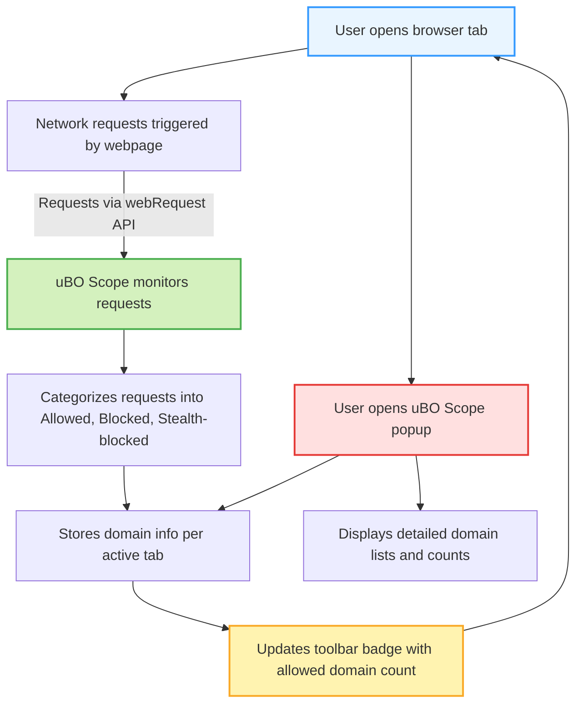

# Features at a Glance

Explore what makes uBO Scope an indispensable tool for users seeking transparent and accurate insights into their web browsing connections. This page highlights the core features of uBO Scope, each designed with your privacy and clarity of information in mind.

---

## Clear, Distinct Third-Party Counting

At the heart of uBO Scope lies its ability to precisely count distinct third-party remote servers that your browser connects to during a browsing session. Unlike traditional blockers that often emphasize raw blocking counts, uBO Scope focuses on the **number of unique third-party domains contacted**, delivering a more meaningful measure of your real privacy exposure.

This approach helps you:

- See exactly which external domains your active tab communicates with.
- Understand the scope of third-party resource loading beyond simple request blocks.
- Avoid common misconceptions tied to block counts that might misrepresent blocker effectiveness.

## Dynamic Toolbar Badge Updates

The badge on the browser toolbar icon is your quick visual summary:

- It dynamically displays the **number of distinct third-party domains allowed** to connect on the active tab.
- A **lower badge number means a cleaner network footprint**, helping you assess the real impact of your content blockers and privacy settings at a glance.
- As you browse, this count updates seamlessly, reflecting live tab activity.

## Compatibility with All Major Content Blockers

uBO Scope operates **independently of content blockers in use**, providing reliable visibility into network connections even when blockers employ advanced stealth or DNS-level filtering.

- It captures network requests reported by the browser's `webRequest` API, irrespective of the blocker’s underlying technology.
- Works alongside uBlock Origin, Adblock Plus, and others without interference.
- Provides an **objective, content-agnostic perspective** that complements your existing privacy tools.

## Robust Content-Agnostic Monitoring

uBO Scope monitors network traffic purely from the browser’s network layer without relying on webpage content or scripts.

- It reports on network requests and their outcomes — whether allowed, blocked, or stealth-blocked — regardless of how the filtering is implemented.
- This ensures that **even requests blocked at DNS level or via external filter lists appear correctly in your reports**.
- Empowers you to validate claims about blocker performance and dissect real-world connection behavior.

## Real-Time Categorization of Network Requests

The extension classifies network connections based on their outcome:

- **Allowed**: Connections that succeeded and fetched content.
- **Blocked**: Requests that were actively blocked by your content blocker or browser.
- **Stealth-blocked**: Requests that disappeared silently due to redirection or stealth techniques by blockers.

This breakdown helps you:

- Quickly understand how different third-party domains are treated.
- Detect stealthy connections or blocking strategies.
- Analyze which domains might require further attention or filter tuning.

## Intuitive User Workflow

The user experience centers around your current active tab:

1. **Open uBO Scope via the toolbar icon** to see live counts and domain lists.
2. **Review categorized domain lists under allowed, blocked, and stealth-blocked headings**.
3. Use the information to verify blocker effectiveness or debug network activity.

This straightforward workflow enables privacy-conscious users and filter maintainers to make informed decisions efficiently.

---

## Practical Example

Imagine visiting your favorite news site:

- As the page loads, uBO Scope counts 12 distinct third-party domains allowed, 4 blocked, and 2 stealth-blocked.
- You notice a CDN domain in the allowed list which you expect, along with a surprising analytics domain showing stealth-blocked.
- This insight guides you to review your filter lists or privacy settings to adjust for your comfort and security.

---

## Tips and Best Practices

- **Focus on the badge count** rather than raw block numbers to judge blocker effectiveness.
- Use uBO Scope alongside your primary content blocker for a layered understanding.
- Remember that some third parties like CDNs are essential for site performance and typically show as few domains.
- Update your public suffix list (PSL) if needed — uBO Scope manages this automatically but understanding its role clarifies domain grouping.

---

## Troubleshooting Common Issues

- If the badge does not update, ensure that uBO Scope has permission and that the active tab is correctly recognized.
- Network requests outside the browser’s `webRequest` API scope (e.g., browser extensions or apps) are not reported.
- If domain counts seem unexpectedly high, verifying which third-party domains are involved via the popup can clarify unexpected connections.

---

uBO Scope's feature set is engineered for transparency, user control, and real-world utility. Navigate to the [Getting Started guides](/getting-started/installation-and-prerequisites/installing-ubo-scope) next to install and configure the extension effortlessly.

Unlock a clearer view of your web's hidden network landscape — one domain at a time.

---

### Diagram: How Features Work Together in Your Browsing Session

