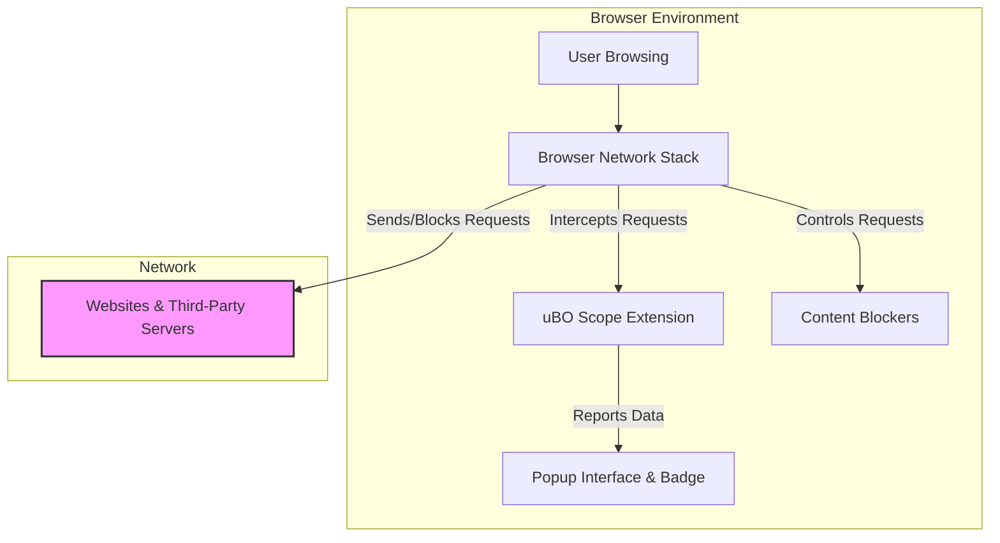

# Integration & Compatibility

## Aligning uBO Scope with Your Browser and Content Blockers

uBO Scope seamlessly integrates with your browser environment to provide unparalleled visibility into all third-party network connections—whether those connections succeed, fail, or are stealth-blocked. This page explains how uBO Scope works alongside any content blocker without interfering with your privacy defenses, outlines supported browsers, and clarifies the boundaries of what the extension can and cannot observe based on browser capabilities.

---

## How uBO Scope Integrates with the Browser

uBO Scope leverages the browser’s `webRequest` API to listen to every outgoing network request initiated by webpages you visit. This approach enables it to record connections attempted to remote servers regardless of the blocking decisions made by other content blockers you may have installed.

### Key aspects of this integration:

- **Browser-Level Observation:** By hooking into the browser’s network request lifecycle, uBO Scope gains a comprehensive view of all HTTP(S) and WebSocket connections as they are processed.
- **Non-Intrusive Monitoring:** uBO Scope does not alter, block, or interfere with these network requests. It operates purely in a monitoring capacity, allowing your content blocker to function as configured.
- **Dynamic Session Tracking:** It maintains per-tab data on connection outcomes, enabling real-time and granular insights displayed in the popup interface.

This design ensures that uBO Scope is compatible with any content blocker or DNS-based filtering solution, delivering accurate reporting without disrupting your browsing experience.

---

## Compatibility with Content Blockers

One of uBO Scope’s fundamental strengths is its ability to work transparently alongside any content blocker. Here’s what that means for you:

- **No Conflicts or Overlaps:** Because uBO Scope only observes network events rather than influencing them, there’s no risk of it interfering with blocking rules set by extensions like uBlock Origin or others.
- **Comprehensive Visibility:** It detects connection results including "allowed" (successful), "blocked", and "stealth-blocked" outcomes. This is crucial because stealth-blocking techniques can hide blocking activity from webpages but are still reported by uBO Scope.
- **Cross-Verification:** Use uBO Scope to validate the effectiveness of your chosen content blockers by comparing the actual third-party connections made.

This makes uBO Scope an ideal companion tool that complements your privacy setup rather than complicates it.

---

## Supported Browsers and Platform Nuances

uBO Scope is built to function consistently across major modern browsers that support the required APIs, with explicit platform considerations:

| Browser    | Minimum Version / Notes                         | Key Permissions                                     |
|------------|-----------------------------------------------|----------------------------------------------------|
| Chromium   | Version 122.0 or higher                        | `webRequest`, `storage`, `activeTab`               |
| Firefox    | Version 128 or higher (including Android)     | `webRequest`, `storage`, `activeTab`               |
| Safari     | Version 18.5 or higher                         | `webRequest`, `storage`, `activeTab`               |

### Permissions Overview

- **webRequest:** Essential for monitoring all network requests.
- **storage:** For saving session data and public suffix list information.
- **activeTab:** Enables the extension to detect the currently active tab for context-sensitive reporting.

These permissions ensure that uBO Scope can effectively observe network events without compromising security.

---

## What uBO Scope Can and Cannot Monitor

Understanding the scope of what uBO Scope observes helps set expectations for your monitoring experience.

### What uBO Scope Can Monitor:

- **All HTTP, HTTPS, WS, and WSS Requests:** The extension listens to all network schemes that the browser routes through its webRequest API.
- **Connection Outcomes:** Includes allowed (successful), blocked (failed), or stealth-blocked (hidden block) requests.
- **Third-Party Domains and Subdomains:** Tracks connections by domain and hostname to give a detailed view.
- **Per-Tab Aggregation:** Collects connection data scoped to each browser tab for contextual analysis.

### What uBO Scope Cannot Monitor:

- **Network Activity Outside Browser WebRequest API:** Any network requests bypassing the browser's webRequest API (e.g., some internal browser processes or native applications) remain invisible.
- **Pure DNS Filtering at the OS Level:** DNS-based blocking upstream of the browser is not directly reported if requests never reach the browser’s networking stack.
- **Requests Made by Other Browser Extensions:** Only requests triggered by webpage content or browser tabs are reported.

<Warning>
Because uBO Scope relies exclusively on the browser's webRequest API, any network communication outside this scope cannot be tracked. This design prioritizes reliability and accuracy for in-browser events.
</Warning>

---

## Real-World Integration Workflow

Here's how uBO Scope fits into your browsing session ecosystem:

1. **Page Load Initiation:** When you navigate to a webpage, the browser begins issuing HTTP/S and WebSocket requests.
2. **Monitoring by uBO Scope:** The extension captures each request event via registered webRequest listeners, noting its URL, tab context, and connection outcome.
3. **Concurrent Content Blocking:** Other content blockers receive the same requests and may allow, block, or stealth-block them.
4. **Outcome Categorization:** uBO Scope classifies each connection based on network events into allowed, blocked, or stealth-blocked results.
5. **Data Aggregation:** These connection details accumulate per tab, updating the toolbar badge count and popup UI with accurate metrics.

This process ensures you gain transparent, unfiltered insights into your third-party network exposure.

---

## Insights for Users and Filter List Maintainers

By keeping its role strictly observational and supporting all major browsers, uBO Scope enables users and filter maintainers to:

- Validate the effectiveness of content blocking strategies.
- Detect "stealth" blocking effects which are otherwise invisible on webpages.
- Identify the exact domains involved in third-party communications.
- Tailor privacy configurations with actionable data.

This integration and compatibility layer thus becomes the backbone of informed privacy control.

---

## Troubleshooting Compatibility Issues

If uBO Scope does not reflect expected network connections:

- **Verify Browser Compatibility:** Ensure your browser version meets the minimum requirements.
- **Check Permissions:** Confirm the extension was granted necessary permissions (`webRequest`, `storage`, `activeTab`).
- **Content Blocker Impact:** Understand that some network requests may never reach the browser's webRequest API if blocked at a deeper level (e.g., upstream DNS or host file).
- **Restart Browser:** Sometimes, extension reload or browser restart is needed to flush stale session data.

If issues persist, consult the [Troubleshooting Common Setup Issues](https://your-docs-url/getting-started/getting-up-and-running/common-setup-issues) page.

---

## Summary Diagram of Integration

---

## Next Steps

To begin leveraging uBO Scope’s insights:

- Visit the [Quick Feature Overview](../feature-quicktour) to understand how to interpret the data in the toolbar badge and popup.
- Follow the [Extension Installation](../../getting-started/installation-setup/installation-instructions) guide to set up uBO Scope in your browser.
- Dive into the [Core Concepts & Terminology](../core-concepts-terminology) to decode the connection outcome categories.

Together, these resources will empower you to master the integration of uBO Scope into your privacy toolkit.

---

## References

- [What is uBO Scope?](../introduction-and-value/what-is-ubo-scope) - Understand the extension’s purpose in detail.
- [Core Benefits & Use Cases](../introduction-and-value/core-benefits) - Explore practical applications.
- [API Permissions and Browser Requirements](platform/chromium/manifest.json, platform/firefox/manifest.json, platform/safari/manifest.json) - View detailed manifest files for permissions and platform support.
- [Background Script Architecture](../architecture-overview) - Deep dive into how the extension processes network events.

---

If you want to explore the code and contribute, visit the GitHub repository: [uBO-Scope](https://github.com/gorhill/uBO-Scope)

---