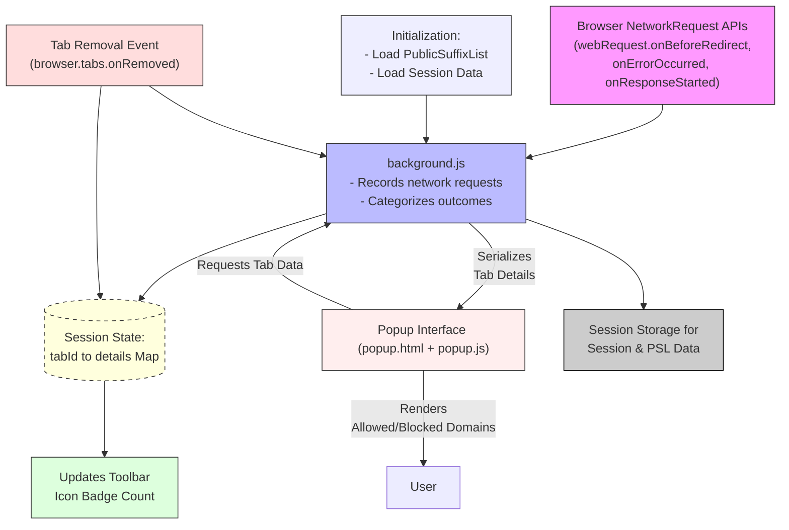

# System Architecture & Data Flow

uBO Scope operates through a streamlined architecture centered on modern browser extension APIs. This page unpacks the core components and data flow enabling uBO Scope to monitor, record, and report network connections efficiently and transparently. Through this explanation and a detailed diagram, users will understand how background scripts, session state, badge visuals, and the popup interface function together.

---

## High-Level Architecture Overview

uBO Scope is built as a browser extension leveraging the WebExtensions API. The heart of the system is its background script (`background.js`), which listens to and processes real-time network requests. It maintains session state about domains connected during browsing sessions and updates the icon badge count that reflects the current number of distinct third-party remote servers allowed.

When users open the extension popup, it queries this session data from the background context to render detailed lists of network request outcomes.

---

## Component Details

### Background Script (`background.js`)

The background script listens to network events using the browser's `webRequest` API. It captures all outgoing web requests matching permitted host patterns, classifies them by outcome (`success`, `redirect`, `error`), and associates them with the current tab context.

Key responsibilities:

- **Monitoring:** Listening to network request lifecycle events.
- **Recording:** Tracking which domains are connected to during each tab session.
- **Classification:** Categorizing domains as allowed, stealth-blocked, or blocked.
- **Session Management:** Maintaining structured session data mapping tab IDs to detailed domain connection information.
- **Badge Update:** Adjusting the toolbar icon badge to reflect the count of allowed third-party domains per tab.
- **Session Persistence:** Saving session data and the public suffix list to persistent session storage to survive extension reloads.

### Session State

Session data is held in memory and organized in a map keyed by the browser tab ID. Each tab’s data includes:

- The main document’s hostname and domain.
- Sets and counts of allowed, stealth-blocked, and blocked domains and hostnames.

This structured approach enables efficient aggregation and quick retrieval for UI updates.

### Public Suffix List (PSL)

uBO Scope integrates a Public Suffix List parser to accurately deduce the registrable domain from hostnames. The PSL is loaded during initialization either from session cache or fetched anew. This allows proper grouping and counting of third-party domains, ensuring domain calculations align with industry standards.

### Toolbar Badge Updater

Based on the number of distinct allowed third-party domains for the active tab, the extension updates the browser action badge. This badge shows a concise count indicating network exposure to remote servers, helping users quickly assess third-party connection volume.

### Popup Interface (`popup.html` and `popup.js`)

The popup presents a detailed breakdown of the network requests associated with the active tab:

- Shows the tab’s main domain and hostname.
- Displays categorized lists of domains by their network request outcome (allowed, stealth-blocked, and blocked).
- Fetches serialized session data by sending messages to the background script.
- Present information with user-friendly domain names using Punycode decoding.

This interface empowers users to make informed privacy decisions by correlating the aggregated network data with the domains involved.

---

## User Workflow: From Request Capture to UI Display

1. **Page Loads and Makes Network Requests**
   - Browser emits network events intercepted by the background script.
   - Each network request is queued and processed asynchronously to minimize performance impact.

2. **Background Script Processes Requests**
   - Determines the outcome and the associated tab.
   - Updates session state, categorizing the request’s domain accordingly.

3. **Badge Updated in Toolbar**
   - Badge text is refreshed to display the count of allowed domains for current tabs.

4. **Popup Opens and Queries Session Data**
   - Sends a message to background requesting details for the active tab.
   - Receives serialized data, deserializes it, and renders domain lists.

5. **User Reviews Network Activity**
   - Engages with the popup to understand which domains were contacted and their request outcomes.

---

## Practical Tips & Best Practices

- The extension only reports requests accessible via the browser's `webRequest` API. Requests outside this scope (e.g., DNS-level blocking) will not appear.
- The badge count reflects **distinct allowed third-party domains** — a lower count means fewer third parties reached.
- Domains considered "allowed" indicate successful connections; "blocked" reflect denied requests; "stealth" indicates redirected or stealth-blocked requests.
- Clearing session data happens automatically when tabs close, ensuring up-to-date reporting and avoiding stale data.
- If exploring the data programmatically, use the message passing interface to request detailed tab data.

---

## Troubleshooting Common Issues

<AccordionGroup title="Troubleshooting Network Monitoring and Session Data">
<Accordion title="Why does the badge count show zero even on busy sites?">
Ensure that the site is matching the extension's host permissions and that browsing activity includes network requests observable by the `webRequest` API. Some private browsing modes or restrictive browser settings may limit visibility of requests.
</Accordion>
<Accordion title="Why are some domains not appearing in the popup?">
The popup only shows data associated with the active tab and only domains recorded since the tab’s load. Navigating between tabs or opening the popup immediately after page load can affect visible data.
</Accordion>
<Accordion title="The badge count does not update after some tabs close."
>
Tab closure events are handled to clear session state but in rare conditions may delay. Refreshing the browser or toggling uBO Scope extension can reset session tracking.
</Accordion>
</AccordionGroup>

---

uBO Scope’s architecture optimizes clear, accurate insight into network connections by leveraging browser APIs, session state management, and a responsive UI. This approach ensures users see meaningful third-party connection information in real time.

---

## Related Documentation

- [What is uBO Scope?](/overview/introduction-core-value/what-is-ubo-scope)
- [Feature Overview](/overview/how-it-works-architecture/feature-overview)
- [Interpreting the Icon Badge Count](/guides/core-usage/interpreting-badge-count)
- [Quick Start & Validation](/getting-started/getting-aware/quick-validation)

---

For detailed developer insight, refer to the source code at the [GitHub repository](https://github.com/gorhill/uBO-Scope).