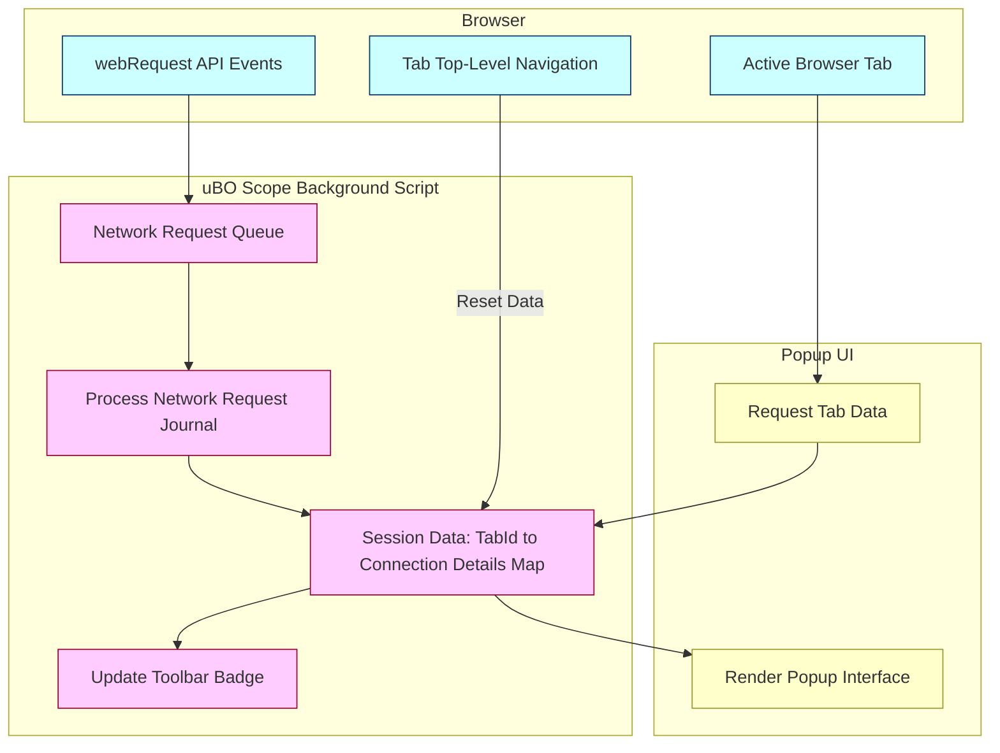

# How uBO Scope Works (with Diagram)

Understanding how uBO Scope captures, processes, and presents network connection data is essential to unlock its full potential. This page walks you through uBO Scope’s internal workflow—from listening to browser network events, organizing detailed connection outcomes, up to displaying clear summaries in the popup interface. You’ll also find a visual diagram illustrating these interactions.

---

## Introduction: Capturing Every Network Connection

As you browse, your browser initiates numerous network requests to various servers. uBO Scope’s mission is to reveal every distinct third-party remote server your browser interacts with, regardless of whether connections were allowed, stealth-blocked, or blocked outright.

This transparency is made possible by the browser’s `webRequest` API, a powerful interface that reports network request lifecycle events. uBO Scope leverages this API to observe requests in real time, categorize connection outcomes, and tally unique hostnames and domains for each open tab.

Understanding this flow clarifies how uBO Scope’s popup interface presents a trustworthy picture of your browsing network connections.

---

## Workflow Overview: From Network Event to Popup Display

### 1. Monitoring Network Requests

uBO Scope continuously listens to three critical browser webRequest events for each active tab:

- **On Redirect**: When a request is redirected to another URL.
- **On Error Occurred**: When a request fails (blocked or network error).
- **On Response Started**: When a request successfully receives a server response.

Each event is queued and processed in batches to maintain efficiency and performance.

### 2. Categorizing Connection Outcomes

For each network event, uBO Scope analyzes the request:

- Identifies the originating tab and the exact URL requested.
- Determines the hostname (e.g., `ads.example.com`) and its base domain (e.g., `example.com`).
- Categorizes the connection based on the event:
  - **Allowed** for successful requests.
  - **Stealth-blocked** for redirects that hide blocking.
  - **Blocked** for failed connections or errors.

Hostnames and their associated domains are recorded in distinct maps for these categories per tab. This differentiation allows you to see not just counts, but which exact servers were contacted or blocked.

### 3. Tab Context Initialization and Reset

When a top-level navigation occurs (e.g., typing a new URL or refreshing), uBO Scope resets that tab’s connection data to reflect the new browsing context accurately.

### 4. Updating the Toolbar Badge

Periodically, after processing the batch of network events, uBO Scope updates the toolbar icon badge number. This number reflects the count of distinct domains for which connections are **allowed** (i.e., successfully made). A lower badge count generally indicates fewer third-party connections.

### 5. Rendering the Popup Interface

When you open the uBO Scope popup, it queries the current active tab for its collected connection data. This data is deserialized and rendered into three clear sections:

- **Not Blocked** (Allowed): lists domains and hostnames of connections made.
- **Stealth-Blocked**: connections that were redirected covertly to block tracking.
- **Blocked**: outright failed or blocked connection attempts.

Counts accompany each domain, helping you quickly identify the volume of connections per server.

---

## Practical Example

Imagine visiting a news website with embedded third-party ads and content delivery networks (CDNs):

- Requests to the site’s own domain show up in the **Not Blocked** list.
- Requests silently redirected to block trackers appear under **Stealth-Blocked**.
- Known ad-serving domains blocked by your filters appear in the **Blocked** section.

This breakdown highlights how many and which external servers your browser is interacting with, assisting you in privacy auditing and verifying content blocker effectiveness.

---

## Mermaid Diagram: uBO Scope Architecture and Data Flow

---

## Tips and Best Practices

- **Interpret the badge number** as the count of unique domains with allowed connections — a lower number often means better privacy.
- **Review all three categories** in the popup to understand which connections are allowed, stealthily blocked, or explicitly blocked.
- Use uBO Scope to **audit the effectiveness of your content blockers**, making sure fewer third-party domains are contacted.
- Keep in mind that **some third-party servers** such as CDNs are generally benign and necessary for web performance.
- When you **open a new tab or navigate**, expect uBO Scope to reset its counts for accuracy.

---

## Troubleshooting Common Issues

<AccordionGroup title="Common Issues and Solutions">
<Accordion title="Popup Shows 'NO DATA' or Empty Lists">
Ensure the popup is opened on an active tab where network requests have been processed. Tabs with no activity or private/incognito pages may show no data.
</Accordion>
<Accordion title="Toolbar Badge Not Updating">
Network requests are processed with a slight delay. Reload the page or wait a few seconds for updates. Also, verify permissions are granted to allow webRequest monitoring.
</Accordion>
<Accordion title="Counts Seem Higher or Lower Than Expected">
Understand that counts represent distinct domains, not total requests. Multiple requests to the same domain increment counts internally but reflect as a single domain in the badge.
</Accordion>
</AccordionGroup>

---

## Next Steps

- To start using uBO Scope, visit the [Getting Started guide](https://github.com/gorhill/uBO-Scope/blob/main/docs/overview/getting-started-intro/product-overview.mdx).
- Learn how to interpret the popup results effectively in [First Look: Interpreting the Popup](https://github.com/gorhill/uBO-Scope/blob/main/docs/guides/getting-started/first-look-interpreting-the-popup.mdx).
- Explore more on related architecture concepts in [Essential Concepts & Terminology](/overview/how-it-works/core-terms-concepts).

---

For detailed underlying implementation insight, please refer to the [background.js source code](https://github.com/gorhill/uBO-Scope/blob/main/js/background.js) and [popup.js](https://github.com/gorhill/uBO-Scope/blob/main/js/popup.js).
