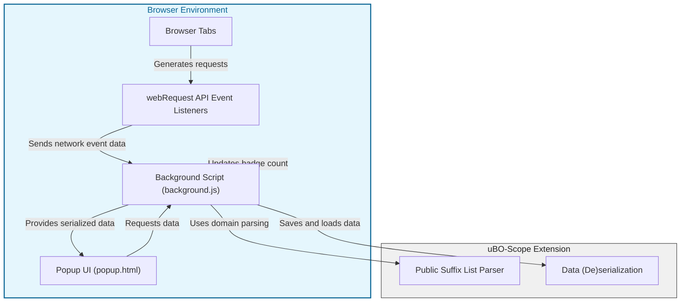

# Architecture at a Glance

## Understanding uBO Scope's Technical Architecture

Discover how uBO Scope achieves transparent and accurate network connection reporting through an efficient browser extension architecture. This page provides a clear visual summary and narrative of the key components involved—from capturing network events to processing and presenting data—helping you gain a real-world understanding of how uBO Scope operates under the hood.

---

### Why This Matters to You

When using uBO Scope, you want confidence that you’re seeing an accurate and comprehensive picture of all third-party network connections originating from your browser. This architecture overview shows how uBO Scope leverages browser APIs and internal data structures to efficiently collect, classify, and store network request outcomes. Understanding this flow helps you appreciate the accuracy of the insights uBO Scope provides as you analyze web page connections.

---

## Core Architecture Components and Flow

uBO Scope’s architecture rests on three main pillars:

1. **Browser Event Listeners using the webRequest API**
2. **Background Processing and Data Management**
3. **Popup UI Rendering for User Presentation**

### 1. Event Listeners – Transparent Network Observation

- uBO Scope hooks into the browser's `webRequest` APIs (e.g., `onResponseStarted`, `onErrorOccurred`, `onBeforeRedirect`) to monitor network requests.
- These event listeners capture detailed information about each network request initiated by any web page/tab.
- Each network request is classified based on its outcome: whether it succeeded, was blocked, or was stealthily redirected or blocked.

### 2. Background Processing – Intelligent Data Aggregation

- The background script (`background.js`) acts as the extension’s core engine.
- It maintains in-memory session data mapping tab identifiers to detailed network connection statistics.
- Each network request event is queued and processed asynchronously to avoid performance impacts.
- Hostnames and domains are parsed and normalized using the Public Suffix List to group network requests properly by domain.
- The extension aggregates counts for each of three connection outcomes (`allowed`, `blocked`, and `stealth-blocked`), grouping requests by domain and hostname.
- This module also manages badge updates on the browser toolbar, showing the count of distinct allowed third-party domains for the active tab.

### 3. Popup UI – Clear, Actionable Data Presentation

- When users click the extension icon, a lightweight HTML popup (`popup.html`) renders a summary of the active tab’s network connections.
- It displays connection counts in three categories: **not blocked**, **stealth-blocked**, and **blocked**.
- Details are presented by domain, with counts of successful and blocked connections, helping you instantly identify third-party exposure.
- The popup fetches serialized session data from the background script and decodes it for display.

---

## Visual Architecture Overview

---

## Step-by-Step User-Centric Flow

1. **Page Load and Network Activity**
   - When you load or interact with any webpage, the browser initiates multiple network requests.
   - uBO Scope's background script listens to these requests via the webRequest API, capturing details about each request’s destination, status, and outcome.

2. **Classification and Aggregation**
   - The background script analyzes each request’s URL to extract hostnames and domains, using the Public Suffix List to tackle complex domain structures correctly.
   - Each request outcome is classified as `allowed` (successful connections), `blocked` (failed or denied), or `stealth-blocked` (requests blocked without typical notification).
   - Counts and domain groupings are accumulated per browser tab, ensuring a scoped and accurate view of network exposure per page.

3. **Badge Update Reflecting Third-Party Exposure**
   - The extension updates the toolbar badge with the count of distinct allowed third-party domains associated with the current tab.
   - A lower badge number means fewer active connections to third parties, indicating more effective privacy protection or cleaner web traffic.

4. **Visualizing Data in the Popup UI**
   - Clicking the uBO Scope icon opens the popup panel.
   - The UI queries the background script for the current tab’s aggregated data, deserializes it, and presents it in a clean, categorized format.
   - You see at a glance the number of not blocked, stealth-blocked, and blocked connections, along with detailed domain counts.

---

## Practical Tips for Users

- **Understand the Badge**: The badge does not count total requests but distinct allowed third-party domains. Use it to quickly assess network exposure.
- **Use the Popup for Details**: The popup breaks down blocked and stealth-blocked domains separately, helping diagnose if any trackers or ads are slipping through.
- **Background Efficiency**: uBO Scope batches and queues network events before processing, ensuring it doesn’t impact your browsing speed.
- **Domain Parsing Accuracy**: The Public Suffix List integration ensures domains are grouped properly, so you’re not misled by subdomain noise.

---

## Troubleshooting Common Issues

- If the badge count doesn't update, try switching tabs or refreshing the page, as data updates are triggered by network events and tab changes.
- In rare cases where network requests happen outside the webRequest API's scope, uBO Scope cannot report them.
- If popup shows 'NO DATA', it could indicate no network activity detected for the current tab or the tab is not active.

---

## Next Steps

Now that you understand how uBO Scope captures and processes data under the hood, explore how to interpret the popup UI in detail and how to get started with installation:

- [What is uBO Scope?](/overview/product-intro/what-is-uboscope)
- [Interpreting Badge Counts and the Popup UI](/overview/concepts-terminology/interpreting-badge-and-popup)
- [Installing uBO Scope](/getting-started/setup-overview/installing-ubo-scope)

---

For an in-depth dive into the data flow and connection tracking, see [Data Flow: How Connection Tracking Works](/overview/how-it-works/data-flow-connection-tracking).

---

🔗 [Official GitHub Repository](https://github.com/gorhill/uBO-Scope)

---