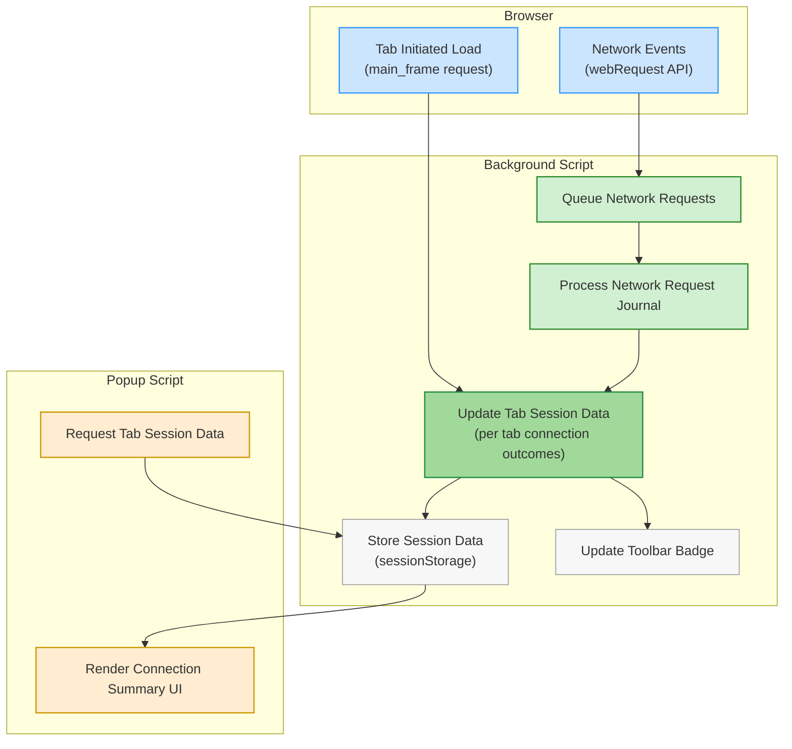

# Data Flow: How Connection Tracking Works

## Introduction

Understanding exactly how uBO Scope tracks network requests unlocks the full value of the extension. This page walks you through the journey of connection data as it flows through the extension's core components, spotlighting how requests from different tabs are detected, classified, aggregated, and finally presented in a way that gives you clear insight into what remote servers your browser interacts with.

By following this step-by-step explanation, you'll see how uBO Scope transitions raw browser network activity into meaningful connection summaries, empowering you to confidently assess your network footprint.

---

## How uBO Scope Tracks Connections

uBO Scope listens to network events from the browser to capture every remote server interaction in near real-time. It methodically classifies each network request for every browser tab, updating internal session states, and surfaces aggregated insights via the UI.

This data flow involves two primary scripts:

- **Background script** (`background.js`) — Listens for network events, processes connection outcomes, and maintains session data per tab.
- **Popup script** (`popup.js`) — Queries session data for the active tab and dynamically renders the connection details.

### Step 1: Capturing Network Events

The extension uses the browser's `webRequest` API to monitor specific network lifecycle events:

- **onBeforeRedirect:** Triggered when a request is redirected
- **onErrorOccurred:** Triggered when a request fails
- **onResponseStarted:** Triggered when a request starts receiving a response

Each event is captured through listeners defined in the background script and queued for batch processing.

<Tip>
Using these network hooks ensures that every requested connection is accounted for, regardless of whether it was successfully fetched, blocked, or redirected.
</Tip>

### Step 2: Queuing and Processing Network Requests

Captured events are queued in a journal managed by the background script. This queue batches requests and processes them every second to efficiently update connection statuses.

During processing, the extension:

- Skips irrelevant or invalid entries (tab ID `-1` or non-network URLs)
- Categorizes each request outcome as `allowed`, `blocked`, or `stealth` (redirected but not transparently visible)
- Updates per-tab connection details accordingly
- Saves session state persistently for continuity

### Step 3: Tab-Specific Connection State

The extension maintains a detailed session map (`tabIdToDetailsMap`) keyed by browser tab IDs. Each tab's details track:

- The main domain and hostname of the loaded page
- Three outcome categories for connected domains and hostnames:
  - **Allowed:** Connections the browser successfully fetched
  - **Blocked:** Connections that resulted in errors or were blocked
  - **Stealth:** Redirected connections that evade explicit detection

When a tab's main frame loads a new page (observed on requests with `frameId = 0` and type `main_frame`), its connection summary resets. This prevents data from prior pages polluting the current session.

<Tip>
The domain extraction uses the Public Suffix List via the included PSL module to accurately parse hostnames to their registrable domains, avoiding misclassification of subdomain connections.
</Tip>

### Step 4: Aggregating Outcome Counts

As network events are processed, uBO Scope counts occurrences per domain and hostname. This count gives you an indication of how often a connection is attempted or successfully made through the lifetime of each page load.

Each new event increments domain and hostname tallies in the respective outcome buckets.

### Step 5: Updating the User Interface

The per-tab connection counts are reflected on the extension toolbar icon as a badge showing the number of distinct allowed domains connected to by the active tab.

When you open the popup panel, the popup script retrieves the session data for the active tab and renders:

- The top-level hostname and domain
- Tables of connected domains grouped by outcome: Allowed, Stealth, and Blocked
- Counts of connections per domain

The UI dynamically translates domains from punycode to Unicode, improving readability.

## Detailed User Flow Summary

<Steps>
<Step title="Network Request Captured">
Browser captures a request event (`redirect`, `error`, or `success`) and pushes it into the journal.
</Step>
<Step title="Network Request Journal Processing">
Every second, the journal is processed, updating connection outcomes for each relevant tab.
</Step>
<Step title="Tab Details Updated">
Connection domain and hostname counts are incremented in allowed, stealth, or blocked buckets inside the tab's session record.
</Step>
<Step title="Toolbar Badge Reflects Active Tab">
The extension badge updates to show the number of distinct allowed connection domains for the active tab.
</Step>
<Step title="Popup UI Renders Tab Data">
When the popup opens, it fetches the current tab’s session data and displays detailed connection counts grouped by outcome.
</Step>
</Steps>

---

## Practical Tips & Best Practices

- **Understanding badge counts:** The badge shows the count of distinct allowed domains connected to, not the total number of requests. Fewer distinct domains generally mean less third-party exposure.
- **New page load detection:** The extension resets tracking when a tab navigates, so the data always represents the current page's connections.
- **Stealth classification:** Redirects that don’t appear as direct allowed or blocked requests are tracked separately, helping you identify hidden or stealthy third-party connections.

<Tip>
Refreshing the popup after significant browsing activity ensures you see the latest connection data.
</Tip>

<Tip>
For accurate domain parsing, uBO Scope uses the official Public Suffix List. This avoids mistakenly grouping subdomains from unrelated registrable domains.
</Tip>

## Troubleshooting Common Issues

<AccordionGroup title="Connection Data Not Showing or Badge Not Updating">
<Accordion title="Issue: No connection data for active tab">
Ensure you have loaded a page that makes network requests and that the extension has host permissions for the domains. Switching tabs before data populates might show empty data initially.
</Accordion>
<Accordion title="Issue: Badge remains blank after page load">
The badge only shows counts for allowed (non-blocked) distinct domains. If a page does not connect to external servers or all connections are blocked, the badge will be blank.
</Accordion>
<Accordion title="Issue: Counts do not match expectation">
Remember the badge counts distinct domains, not individual requests, and stealth-blocked connections are tracked separately from allowed/blocked.
</Accordion>
</AccordionGroup>

---

## Data Flow Diagram

---

## Summary

This page detailed how uBO Scope captures and tracks network requests on a per-tab basis, processes connection outcomes, maintains session persistence, updates UI badges, and surfaces results in the popup panel. Understanding this flow helps users trust and interpret the data they see.

For a broader understanding of the product architecture, see the [Architecture at a Glance](../how-it-works/architecture-overview) page.

For practical advice on reading connection data, see [Interpreting Badge Counts and the Popup UI](../../concepts-terminology/interpreting-badge-and-popup).

Next, consider exploring how uBO Scope integrates with browsers and content blockers on the [Integration with Browsers and Content Blockers](../how-it-works/integration-with-other-systems) page.

---

## Related Resources

- [uBO Scope GitHub Repository](https://github.com/gorhill/uBO-Scope)
- [Public Suffix List](https://publicsuffix.org/list/)

---

## How to Get Started

1. Install uBO Scope on your preferred browser (Chrome, Firefox, Safari) via their extension stores.
2. Load webpages and observe the extension badge updating in real time.
3. Click the badge to open the popup and review detailed connection summaries.

Understanding this data flow gives you confidence in the data uBO Scope presents, enabling better web privacy and connection auditing.

---