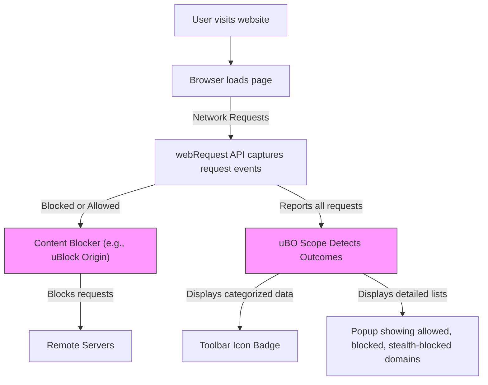

# Integration and Ecosystem Fit

## Unlocking uBO Scope's Synergy Within the Browser Privacy Ecosystem

When you install uBO Scope, you’re not just adding another browser extension—you're gaining a powerful companion that fits seamlessly with your existing privacy tools without interference or conflict. This page unveils how uBO Scope integrates harmoniously with other content blockers and browser extensions across Chromium, Firefox, and Safari. You'll discover why uBO Scope stands out as a flexible, independent tool that complements and supports your privacy workflows.

---

## Why uBO Scope's Ecosystem Compatibility Matters

Privacy tools often come in packs—ad blockers, tracker blockers, DNS-level filters, and more. Managing conflicts or gaps between them can be tough, especially when each claims to block or allow certain network connections differently. uBO Scope cuts through this confusion by positioning itself as an independent observer rather than a content blocker itself.

This independence unlocks compelling benefits:

- **Non-intrusive operation:** uBO Scope never interferes or competes with other content blockers, ensuring smooth coexistence.
- **Accurate network visibility:** It reports network connection outcomes irrespective of which blockers are installed or how they operate.
- **Unified cross-browser experience:** Whether you use Chromium-based browsers, Firefox, or Safari, uBO Scope provides consistent insights without losing functionality or compatibility.

---

## What Makes uBO Scope Independent and Compatible?

### Independence From Specific Content Blockers

Unlike extensions designed primarily to block or restrict content, uBO Scope's core role is to reveal network connections that actually occur. It listens to the browser's `webRequest` API to observe outgoing requests and their outcomes.

This approach means:

- uBO Scope does **not** rely on or need other blockers to work.
- It tracks connections regardless of blocking method—whether the blocking is done by uBlock Origin, another extension, or DNS-level filters.
- It is also immune to the idiosyncrasies and stealth mechanisms some blockers use to avoid detection by webpages.

### Universal Compatibility Across Browsers

uBO Scope is designed with modern cross-browser extension standards, supporting:

- **Chromium browsers (Chrome, Edge, Brave, etc.)** with manifest v3 service workers.
- **Firefox**, leveraging `webRequest` permissions and supporting its unique extension architecture.
- **Safari**, compatible with its restricted but capable extension environment starting at version 18.5.

Manifest files and scripts are tailored to each environment, assuring reliable operation without requiring user adjustments for browser-specific quirks.

---

## How uBO Scope Supports and Supplements Privacy Workflows

### Empowering Users To Validate Blocking Effectiveness

Because uBO Scope reports the outcome for **all** network requests (allowed, stealth-blocked, blocked), privacy-conscious users gain comprehensive visibility into what's really happening behind the scenes. For example:

- You can verify whether your content blocker truly prevents connections to third-party domains.
- You can detect stealth blocking methods that don't show up as traditional blocked requests.
- You can compare different blockers or configurations against actual network behavior instead of relying on potentially misleading scorecards.

### Enhancing Filter List Maintenance and Audits

For filter list maintainers or technical auditors working on privacy tools:

- uBO Scope provides valuable data even on devices or browsers with limited developer tools.
- It highlights distinct third-party domains contacted, helping refine filter efficiency.
- Its unbiased reporting helps debunk myths and clarify blocker impacts.

---

## Practical Examples of Integration with Other Blockers

Consider a scenario where you run uBlock Origin or another popular content blocker alongside uBO Scope:

1. **Real-time observation:** While your content blocker enforces rules to block unwanted requests, uBO Scope independently records all requests and their outcomes.
2. **Popup report:** The uBO Scope popup categorizes domains as "allowed," "blocked," or "stealth blocked," clearly emphasizing the third-party connections that actually succeeded or were blocked invisibly.
3. **Toolbar badge:** Shows the count of distinct connected domains regardless of blocker origin.

This layered insight lets you analyze how your content blocker performs in the wild without guesswork or interference.

---

## Tips for Getting the Most Out of uBO Scope in Your Privacy Setup

- **Use alongside your favorite blocker:** There's no need to disable or uninstall existing blockers.
- **Observe stealth blocking:** Pay attention to the "stealth-blocked" section in the popup which can reveal subtle blocking at play.
- **Cross-browser consistency:** Try uBO Scope on different browsers for consistent transparency.
- **Leverage reports:** Use the detailed domain counts to guide filter list adjustments or troubleshoot privacy leaks.

---

## Common Pitfalls and How uBO Scope Avoids Them

- **Not depending on detected block count:** Unlike some blockers whose UI may inflate or under-report blocks, uBO Scope focuses on distinct domains, providing a clearer picture.
- **Working despite stealth methods:** Many blockers employ stealth to avoid detection by websites or tests. uBO Scope fully observes outcomes without being fooled.
- **Avoiding browser limitations where possible:** uBO Scope uses standardized APIs supported in major browsers, minimizing compatibility issues.

<Note>
Ensure your browser supports the `webRequest` API reporting for uBO Scope to work correctly. In rare cases where the browser restricts this, uBO Scope's visibility will be limited.
</Note>

---

## Summary

uBO Scope acts as a transparent, independent observer of web connections, designed to fit harmoniously with your existing content blockers and privacy tools. Its wide browser support and non-intrusive operation mean you can rely on it to gain accurate insights across Chromium, Firefox, and Safari environments. By supporting comprehensive visibility into allowed, blocked, and stealth-blocked requests, uBO Scope elevates your privacy workflows, making it invaluable for users, evaluators, and maintainers alike.

---

## Next Steps

- Start by installing uBO Scope alongside your current content blocker—no configuration changes needed.
- Use the [What is uBO Scope?](../product-introduction/what-is-uboscope) page to understand core functionality.
- Explore [Making Sense of the Badge Count and Pop-up](../../guides/interpreting-results/understanding-badge) for detailed result interpretation.
- Visit [Using uBO Scope for Filter List Maintenance](../../guides/interpreting-results/filter-list-maintainers) if you maintain filter lists.

---

## Further Reading & Resources

- Official Repository: [github.com/gorhill/uBO-Scope](https://github.com/gorhill/uBO-Scope)
- Browser Compatibility: 
  - Chromium Manifest: `platform/chromium/manifest.json`
  - Firefox Manifest: `platform/firefox/manifest.json`
  - Safari Manifest: `platform/safari/manifest.json`
- Core Concepts: [Core Concepts & Terminology](../how-it-works/core-concepts-terminology)
- System Architecture: [System Architecture & Data Flow](../how-it-works/system-architecture-data-flow)

---

## Example: Typical User Flow with uBO Scope and a Content Blocker

This flow highlights how uBO Scope passively listens alongside your blocker, offering an unobstructed view of connection results.

---