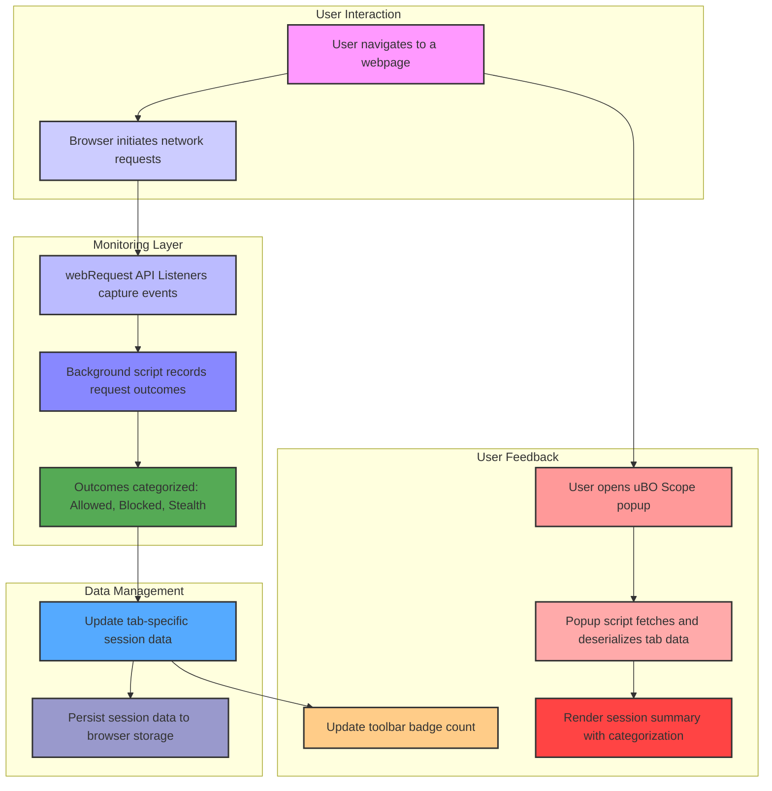

# System Architecture & Data Flow

## Understanding How uBO Scope Works Behind the Scenes

When you activate uBO Scope, you gain more than just a privacy monitoring tool—you get a powerful insight engine that tracks and reports every network interaction your browser makes with remote servers. This page unpacks the system's inner workings so you understand exactly how uBO Scope tracks network requests, processes their outcomes, updates the toolbar badge counts, and organizes session summaries in a clear, actionable manner.

---

## How uBO Scope Monitors Network Activity

At its core, uBO Scope leverages the browser's `webRequest` APIs to observe all network requests triggered by web pages you visit. Unlike many content blockers that only tally blocks, uBO Scope reveals the full spectrum of connections—including allowed, blocked, and stealth-blocked requests—giving you a complete and transparent view.

### Key Monitoring Points:

- **Listening to Network Events**: The background script sets listeners for crucial network events:
  - `onBeforeRedirect`
  - `onErrorOccurred`
  - `onResponseStarted`

  Each event captures the network request's status and categorizes it.

- **Domain and Hostname Analysis**: Using a public suffix list and punycode libraries, uBO Scope extracts meaningful domains and hostnames from URLs. This processing ensures identifications of third-party remote servers are accurate and comprehensive.

- **Tab-specific Session Tracking**: The system maintains detailed records per browser tab, mapping each tab to its network request outcomes. This enables precise badge counts and popup summaries for active browsing sessions.

---

## Processing Outcomes: Allowed, Blocked, and Stealth

Network requests can finish in one of three key states that uBO Scope captures:

- **Allowed**: Requests that succeeded without obstruction. These represent active third-party connections your browser established.
- **Blocked**: Requests that failed due to direct blocking (e.g., by content blockers).
- **Stealth**: Requests that were redirected quietly or suppressed in a way that typical blocking counts might miss.

The system tallies these by domains and hostnames to provide a nuanced picture of remote connections.

---

## Visual Feedback via Badge Counts and Popup Summaries

### Real-time Badge Updates

As network requests complete, uBO Scope updates the toolbar badge on a per-tab basis, reflecting the count of *distinct allowed third-party domains*. This instant feedback helps you monitor the extent of external connections without opening the popup.

### Popup Interface Session Summary

Opening uBO Scope's popup reveals a detailed session summary organized into three sections:

- **Not Blocked (Allowed)**: Lists all domains with successful connections.
- **Stealth-Blocked**: Shows domains of stealthily blocked requests.
- **Blocked**: Records all explicitly blocked domains.

For each section, domains are displayed along with counts of network requests, helping you quickly assess the browsing session’s network behavior.

<Callout>
For a detailed walk-through of interpreting these results, see [Making Sense of the Badge Count and Pop-up](https://yourdocs.example.com/guides/interpreting-results/understanding-badge).
</Callout>

---

## The Lifecycle of a Network Request in uBO Scope

Below is a step-by-step user navigation-to-report lifecycle illustrating how uBO Scope processes network requests under the hood:

1. **User Navigates to a Webpage**
   - The network listener initializes tracking for the active tab, resetting previous session data.

2. **Network Requests Firing**
   - Webpages and embedded scripts generate network requests (e.g., images, scripts, XHRs).

3. **Request Events Captured**
   - `onBeforeRedirect`, `onErrorOccurred`, and `onResponseStarted` capture each request's progress and outcome.

4. **Outcomes Recorded**
   - Requests are categorized as allowed, blocked, or stealth.
   - Outcome details update the tab-specific map storing domains and hostnames with counts.

5. **Badge Count Updated**
   - Toolbar icon quickly reflects the number of allowed third-party domains.

6. **Popup Data Rendered**
   - Upon opening the popup, the session data for the active tab is read and deserialized.
   - The popup dynamically displays domain lists under allowed, stealth-blocked, and blocked categories.

7. **Session Persistence**
   - Session data is stored persistently so that information survives page reloads or temporary browser interruptions.

---

## System Architecture Mermaid Diagram

---

## Practical Tips & Best Practices

- **Stay aware of the distinction between third-party domains and requests:** uBO Scope's badge reflects unique third-party domains contacted, not the total number of requests.
- **Remember stealth blocking reflects subtle network behaviors:** It includes redirects and requests that bypass typical block signaling; this helps reveal hidden tracking.
- **Clear session data if tab behavior looks inconsistent:** Closing tabs automatically clears session info, but reloading problematic pages can sometimes cause stale data.
- **Use the popup for granular insights:** The popup breaks down network connections for precise auditing and troubleshooting.

---

## Troubleshooting Common Issues

<AccordionGroup title="Common Issues and Solutions">
  <Accordion title="Badge Not Updating">
  The badge count depends on successful network event listening. Ensure:
  - The browser supports `webRequest` APIs.
  - No conflicting extensions interfere with request monitoring.
  - The tab is active and session data is not corrupted.
  </Accordion>

  <Accordion title="Popup Shows No Data or Errors">
  - Confirm the tab has network activity.
  - Wait a moment for session data to sync.
  - Reload the page or restart the browser to refresh data.
  </Accordion>

  <Accordion title="Unexpected Stealth or Blocked Counts">
  - Some requests may redirect servers or be blocked by external means, such as DNS blocking.
  - This is expected behavior and indicates a more comprehensive insight into network connections.
  </Accordion>
</AccordionGroup>

---

## Getting Started Preview

To quickly get a feel for uBO Scope's system in action:

- **Open a new tab and visit your favorite website.**
- Observe the badge count update in real-time, reflecting the number of allowed third-party domains.
- Click the toolbar icon to open the popup and explore detailed session summaries.

For detailed installation and onboarding steps, see the [Getting Started Guide](https://yourdocs.example.com/guides/getting-started/installation-setup).

---

## Conclusion

This page demystifies the lifecycle of network request monitoring within uBO Scope. Understanding this process unlocks the full power of this tool, empowering you to track and analyze web connections precisely. With this knowledge, you can confidently interpret the badge counts and popup reports, leading to better-informed privacy and security decisions.

---

### External References
- [Making Sense of the Badge Count and Pop-up](https://yourdocs.example.com/guides/interpreting-results/understanding-badge)
- [What is uBO Scope?](https://yourdocs.example.com/overview/product-introduction/what-is-uboscope)
- [Core Concepts & Terminology](https://yourdocs.example.com/overview/how-it-works/core-concepts-terminology)
- [Installation & Setup Guide](https://yourdocs.example.com/guides/getting-started/installation-setup)
