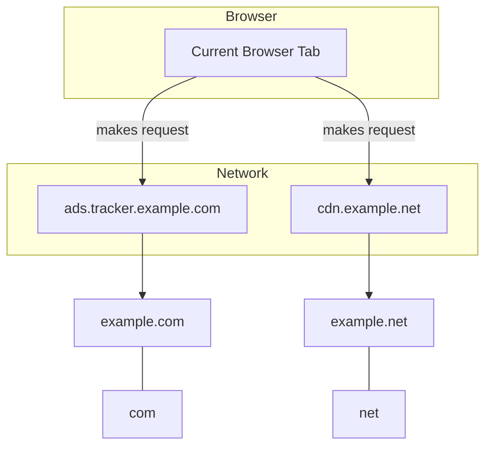

# Key Concepts & Terminology

Understanding the core terms and concepts used by uBO Scope is essential for interpreting the data the extension provides and deriving meaningful insights about your browser's network activity. This section breaks down key terminology such as 'third-party server', 'allowed', 'blocked', 'stealth', and explains how uBO Scope defines, observes, and represents connection outcomes.

---

## What You Will Learn

- How uBO Scope identifies and categorizes remote servers your browser interacts with
- Definitions and distinctions of connection outcomes: allowed, blocked, and stealth-blocked
- The meaning and significance of badge counts shown on the browser toolbar
- The relationship between domain, hostname, and registrable domain as used internally

---

## Defining Terms

### Third-Party Server

A *third-party server* is any remote server your browser connects to that is different from the main site you are visiting. For example, if you visit `example.com` and the page loads resources from `cdn.example.net`, that `cdn.example.net` is considered a third-party server because its domain differs from the main site.

uBO Scope surfaces these distinctions clearly by categorizing and grouping connection data based on domains and hostnames.

### Allowed

An *allowed* connection is a network request initiated by your browser that successfully reached its intended third-party server without being blocked by any content blocking mechanism. This means the remote server was contacted and data was retrieved or exchanged.

In uBO Scope, allowed connections are reported under the “not blocked” outcome in the popup panel, and the toolbar badge count reflects distinct allowed domains currently observed.

### Blocked

A *blocked* connection refers to a network request that was explicitly prevented from completing by your content blocking configurations or extensions (such as uBlock Origin). These requests never reached their target server, and thus the data exchange did not happen.

Within uBO Scope, blocked connections are listed in the “blocked” outcome category, providing transparency about what was prevented.

### Stealth (Stealth-Blocked)

*Stealth-blocked* connections are a special category where requests were intercepted or stopped in a way that the initiating web page or scripts do not detect the block. This stealthiness helps avoid breaking websites or letting scripts detect that blocking is occurring.

This is distinct from outright blocking and is shown separately in uBO Scope under the “stealth-blocked” outcome. It captures those connections where the extension or blocking system operated silently.

### Badge Counts

The badge count on uBO Scope’s toolbar icon reveals **the number of distinct third-party domains from which your browser has successfully fetched content** (i.e., the allowed category).

Key points about the badge count:

- It measures distinct domains, not just the number of requests.
- A lower badge count generally implies less exposure to third-party servers, which aligns with privacy and security goals.
- It does not count blocked or stealth-blocked hosts.
- Misinterpretation of badge counts can lead to incorrect conclusions about content blocker efficacy — see the Value Proposition & Misconceptions page for detailed explanations.

## How uBO Scope Observes and Displays Outcomes

### Domain and Hostname Relationships

- **Hostname:** A fully qualified domain name (FQDN) including subdomains, e.g., `ads.tracker.example.com`
- **Registered/Registrable Domain (Domain):** The main domain name users register and typically recognize, e.g., `example.com`. This is determined using the Public Suffix List (PSL).

uBO Scope uses the PSL to reliably extract the registered domain from hostnames so that connections are grouped by domain. This allows users to see higher-level summaries rather than overwhelming low-level hostname data.

### Outcome Tracking

uBO Scope classifies each recorded network request into one of three outcomes:

- **Allowed:** Successful network request; recorded counts increase for both hostname and domain.
- **Blocked:** The request was blocked; counts maintained separately.
- **Stealth:** The request was stealth-blocked; counts tracked similarly.

These counts track how many times connections have been attempted or succeeded during the current browsing session and are displayed in the popup panel under corresponding outcome sections.

## Practical Example

Imagine you visit `news.example.com`:

- uBO Scope detects outgoing network requests.
- Resources fetched from `cdn.example.net` and `tracker.adservice.com` are recorded.
- If `cdn.example.net` connections succeed, it is added under allowed.
- If `tracker.adservice.com` requests are stealth-blocked, they would appear under stealth-blocked.
- If `analytics.adservice.com` requests are blocked outright, they appear under blocked.
- The badge count would display “1” if only one distinct third-party domain (`example.net`) was allowed.

This organization helps you quickly assess your exposure to third-party servers while clarifying what is blocked or silently stopped.

## Best Practices & Tips

- Interpret the badge count as a measure of distinct third-party domains successfully contacted, not total requests.
- Pay attention to the stealth category for connections that may evade detection by websites.
- Use the domain grouping to focus on entities rather than numerous low-level hostnames.
- Understand that third-party connections are not inherently malicious but represent potential privacy exposures — legitimate CDNs or service providers may show here.

## Common Pitfalls

- Assuming a higher badge count means your content blocker is less effective. Many allowed requests could stem from necessary services.
- Confusing stealth-blocked with allowed; stealth-blocked means the browser prevented the request silently.
- Neglecting to consider the registered domain versus hostname distinctions, which may cause misleading domain counts.

## Internal Handling Summary

- uBO Scope uses the browser's `webRequest` API to intercept network request lifecycle events.
- For each tab, it maintains detailed counts of allowed, blocked, and stealth connections grouped by hostname and domain.
- The Public Suffix List (PSL) determines domain boundaries to group hostnames logically.
- Badge counts and popup data are updated asynchronously reflecting this classification.

---

For a visual understanding of the relationship between hostname, domain, and public suffix, consider the following simplified structure:

---

Explore related topics such as how uBO Scope works internally by reviewing the [Extension Mechanics & Architecture](../../overview/how-ubo-scope-works/mechanics-and-architecture) and learn about interpreting statistics on the [Interpreting Badge Counts and Domain Statistics](../../guides/analyzing-network-connections/interpreting-badge-and-popup-stats) page.

---

### Next Steps

- Review the [Product Introduction & Purpose](../../overview/about-ubo-scope/introduction-and-purpose) to get context on why these terms matter.
- Visit the [Value Proposition & Misconceptions](../../overview/about-ubo-scope/value-proposition-and-misconceptions) page to understand common misunderstandings about blocking and badge counts.
- Begin using uBO Scope and refer to the [Popup Panel Documentation](../../guides/getting-started/understanding-the-ui) to see these concepts in action.

---

This foundational understanding will empower you to use uBO Scope effectively, ensuring clear visibility into your browser's connection behavior and third-party exposure.  