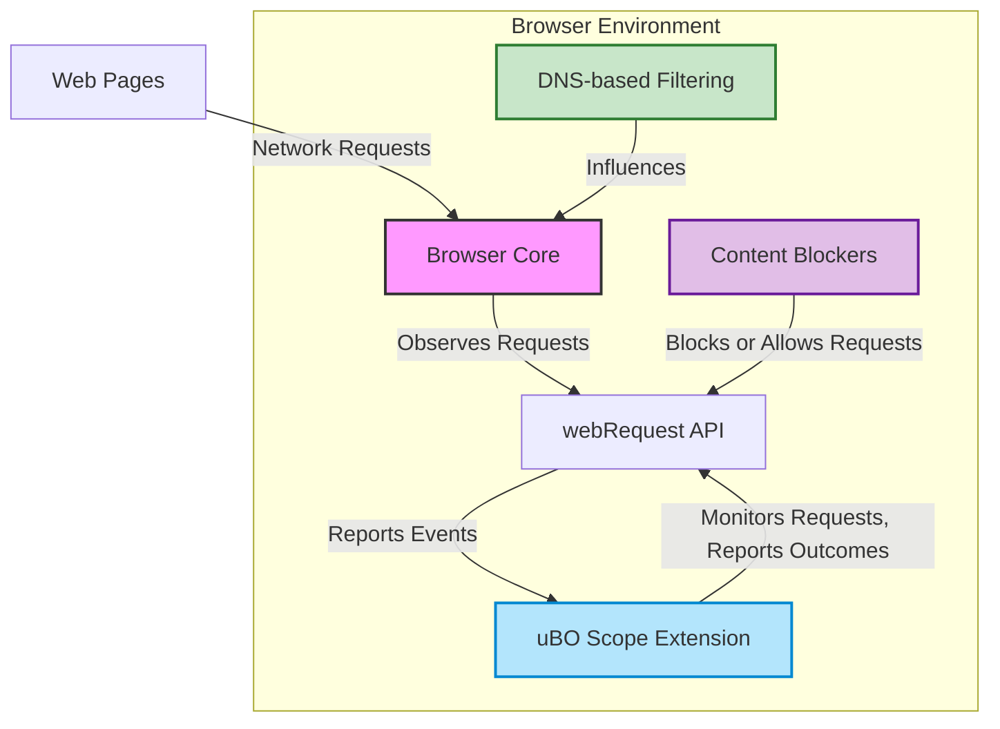

# Compatibility & Integration Points

Understanding how uBO Scope fits within your browser environment and coexists with other tools is essential for effectively monitoring network connections. This guide clarifies the supported browsers, integration with content blockers and DNS filtering, and the known limits imposed by browser APIs, ensuring you get the most valuable and accurate insights from uBO Scope.

---

## Supported Browsers

uBO Scope is designed to work seamlessly with major modern browsers that support the necessary WebExtension APIs. This ensures broad accessibility and consistent behavior across platforms.

- **Chromium-based Browsers** (e.g., Google Chrome, Microsoft Edge)
- **Mozilla Firefox** (desktop and Android)
- **Safari** (version 18.5 and above)

### Installation Sources

You can obtain uBO Scope easily from official browser extension stores:

| Browser   | Installation Link                                                                                         |
|-----------|---------------------------------------------------------------------------------------------------------|
| Chromium  | [Chrome Web Store](https://chromewebstore.google.com/detail/ubo-scope/bbdpgcaljkaaigfcomhidmneffjjjfgp) |
| Firefox   | [Firefox Add-ons](https://addons.mozilla.org/firefox/addon/ubo-scope/)                                   |

> **Note:** Safari's version requires at least macOS version supporting Safari 18.5 or higher.

## Coexistence with Other Content Blockers and DNS-based Filtering

Many users rely on content blockers or DNS filtering to reduce unwanted network traffic. uBO Scope complements these without interference by focusing exclusively on connection reporting rather than blocking.

### How uBO Scope Integrates

- **Independent Monitoring:** uBO Scope uses the browser's `webRequest` API to monitor network requests regardless of which content blocker is active.
- **Reporting Over Blocking:** It reports outcomes of connection attempts (allowed, blocked, stealth-blocked) but does not intercept or block requests itself.
- **Dns-based Filtering Compatibility:** Even when DNS servers filter or block connections, uBO Scope still reports requests if represented in the `webRequest` API events.

### Implications for Users

- You can run uBO Scope alongside your preferred content blockers like uBlock Origin, AdGuard, or built-in browser blockers.
- The extension helps verify and validate how other blockers or filters affect network connections.
- It debunks myths, such as equating higher block counts in blocking extensions to better privacy or blocking efficacy (see [Core Value & Common Myths](../../overview/about-ubo-scope/value-proposition-and-misconceptions)).

## Operational Limits

While uBO Scope provides comprehensive visibility into network activity, it is bound by the capabilities and restrictions of the browser environment.

- **webRequest API Scope:** uBO Scope tracks only requests observable via the `webRequest` API.
- **Requests Outside API Scope:** Certain network requests initiated by browsers or system components may bypass this API, such as requests by browser internals, prefetching in some browsers, or via network protocols not covered.
- **Impacted Connection Types:** For instance, connections that do not use standard HTTP/S or WebSocket protocols, or those encrypted or tunneled at levels hidden to extensions, won't be tracked.

### What This Means

- The extension reports all connections initiated by web pages to third-party remote servers as visible through the API.
- You may occasionally see connections that are unreported if they occur outside the `webRequest` coverage — these are not faults but inherent browser limitations.

## Summary Diagram of Integration

## Practical Tips for Compatibility

- **Verify Browser Version Support:** Ensure you use supported versions of browsers to leverage all extension functionalities.
- **Check Permissions:** The extension requires permissions like `webRequest` and `storage` for full operation; verify during installation.
- **Understand Limitations in Reporting:** Do not expect connection reports for every possible network activity, especially system or browser internal connections.
- **Combine with Other Tools:** Use uBO Scope to audit or validate the effectiveness of your content blockers rather than replace them.

## Common Pitfalls

- Assuming uBO Scope blocks traffic: uBO Scope Reports but does not block.
- Confusing high block count in other extensions with better blocking; use uBO Scope to verify third-party exposure accurately.
- Expecting all network requests to be visible; API limitations can hide some.

## Next Steps

- Explore [Extension Mechanics & Architecture](../../overview/how-ubo-scope-works/mechanics-and-architecture) to understand under-the-hood behavior.
- Learn to interpret badge counts and popup statistics via the [Quick Feature Walkthrough](../../overview/how-ubo-scope-works/feature-overview).
- Review [Core Concepts & Terminology](../../overview/how-ubo-scope-works/core-concepts-and-terminology) for detailed connection outcome definitions.

<Tip>
Keep your browser updated and review permissions carefully for uBO Scope to function reliably alongside your existing privacy and filtering tools.
</Tip>

<Warning>
uBO Scope cannot report network requests made outside the browser's `webRequest` API scope (including some DNS or protocol-level filtering), so some connection activity may not appear.
</Warning>

---

For source and manifest details, see the [GitHub repository](https://github.com/gorhill/uBO-Scope).

---